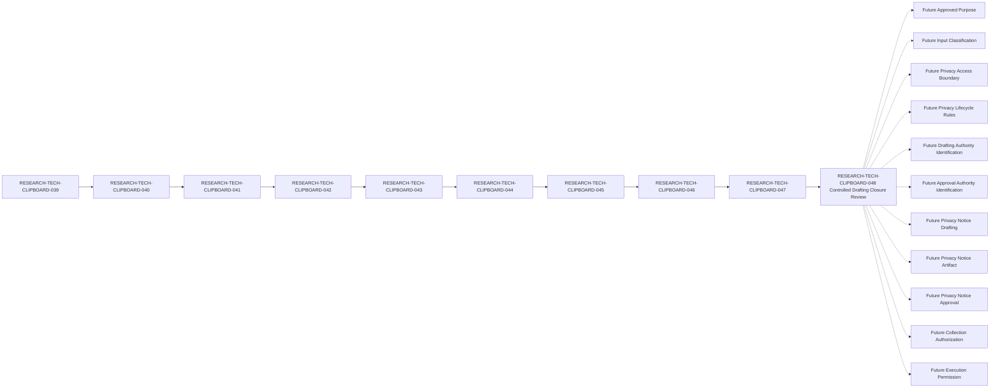

# Clipboard Integration D1 Privacy Notice Artifact Controlled Drafting Closure Review Specification

## Document Control

| Field | Value |
| --- | --- |
| Document ID | RESEARCH-TECH-CLIPBOARD-048 |
| Title | Clipboard Integration D1 Privacy Notice Artifact Controlled Drafting Closure Review Specification |
| Status | Draft |
| Parent Document | RESEARCH-TECH-CLIPBOARD-047 |
| Document Type | Privacy Notice Artifact Controlled Drafting Closure Review Specification |
| Traceability chain | RESEARCH-TECH-CLIPBOARD-039 → RESEARCH-TECH-CLIPBOARD-040 → RESEARCH-TECH-CLIPBOARD-041 → RESEARCH-TECH-CLIPBOARD-042 → RESEARCH-TECH-CLIPBOARD-043 → RESEARCH-TECH-CLIPBOARD-044 → RESEARCH-TECH-CLIPBOARD-045 → RESEARCH-TECH-CLIPBOARD-046 → RESEARCH-TECH-CLIPBOARD-047 → RESEARCH-TECH-CLIPBOARD-048 |
| Closure Review Conclusion | Not ready to authorize actual Privacy Notice drafting |
| Content Drafting Gate | Not ready to draft actual Privacy Notice Artifact |
| Privacy Notice Draft | Not created |
| Privacy Notice Artifact | Not created |
| Privacy Notice Approval | Not provided |
| Request Submitted | No |
| Collection Authorization | Not provided |
| Collection-start Permission | No |
| Execution Permission | Not provided |
| Owner | TBD |
| Last reviewed | Not reviewed |

## 1. Purpose and Review Boundary

This document performs a controlled drafting closure review of RESEARCH-TECH-CLIPBOARD-047. It reviews the parent Content Drafting Controls, Placeholder Controls, Content Drafting Gate, fixed roles, exclusions, prohibited transitions, and safety states for documentary completeness and traceability.

This is a documentary closure review only. It does not draft, write, generate, simulate, approve, transmit, deliver, or acknowledge an actual Privacy Notice. It does not identify or assign a drafter, reviewer, approver, recipient, or role holder; select a Channel or Platform; create a Submission Instruction; submit a Request; collect Human Input; authorize collection; distribute a Worksheet; or permit execution.

The review result `Yes` means that the parent control is documented and preserved. It does not mean that drafting is ready or authorized.

## 2. Document Traceability Review

| Traceability item | Expected value | Current value | Documentary conformance | Review result | Reason |
| --- | --- | --- | --- | --- | --- |
| Current document | RESEARCH-TECH-CLIPBOARD-048 | RESEARCH-TECH-CLIPBOARD-048 | Yes | Yes | Identifies this review |
| Status | Draft | Draft | Yes | Yes | Prevents operational interpretation |
| Parent | RESEARCH-TECH-CLIPBOARD-047 | RESEARCH-TECH-CLIPBOARD-047 | Yes | Yes | Preserves direct parent |
| Prior drafting-control document | RESEARCH-TECH-CLIPBOARD-047 | RESEARCH-TECH-CLIPBOARD-047 | Yes | Yes | Provides review source |
| Full chain | 039 → 040 → 041 → 042 → 043 → 044 → 045 → 046 → 047 → 048 | 039 → 040 → 041 → 042 → 043 → 044 → 045 → 046 → 047 → 048 | Yes | Yes | Preserves documentary lineage |
| Closure conclusion | Not ready to authorize actual Privacy Notice drafting | Not ready to authorize actual Privacy Notice drafting | Yes | Yes | Keeps authorization closed |

## 3. Thirteen Content Drafting Control Reviews

Each review row verifies one parent control. `Review result=Yes` records documentary conformance only; every parent drafting readiness value remains `Not ready`.

| Review ID | Parent Control ID | Notice content section | Documentary source status | Allowed drafting input status | Actual-value exclusion status | Parent drafting readiness | Review criterion | Documentary conformance | Review result | Blocking condition | Reason |
| --- | --- | --- | --- | --- | --- | --- | --- | --- | --- | --- | --- |
| CLIP-D1-DRAFTREVIEW-001 | CLIP-D1-DRAFTCTRL-001 | Collection purpose | Traceable to 044–047 | Placeholder reference only | Preserved | Not ready | No actual purpose may be present | Yes | Yes | Purpose unresolved | Prevents invented purpose |
| CLIP-D1-DRAFTREVIEW-002 | CLIP-D1-DRAFTCTRL-002 | Role-identification scope | Traceable to 043–047 | Fixed-role reference only | Preserved | Not ready | Scope remains bounded to five roles | Yes | Yes | Future confirmation absent | Prevents scope expansion |
| CLIP-D1-DRAFTREVIEW-003 | CLIP-D1-DRAFTCTRL-003 | Required and Optional input distinction | Traceable to 044–047 | Classification reference only | Preserved | Not ready | Classification is not supplied as an actual value | Yes | Yes | Classification incomplete | Prevents uncontrolled requests |
| CLIP-D1-DRAFTREVIEW-004 | CLIP-D1-DRAFTCTRL-004 | Explicit data exclusions | Traceable to 043–047 | Exclusion rule reference only | Preserved | Not ready | Excluded data remains absent | Yes | Yes | Future confirmation absent | Preserves minimization |
| CLIP-D1-DRAFTREVIEW-005 | CLIP-D1-DRAFTCTRL-005 | Data-minimization boundary | Traceable to 044–047 | Minimum-data reference only | Preserved | Not ready | No actual data field is added | Yes | Yes | Boundary confirmation absent | Prevents over-collection |
| CLIP-D1-DRAFTREVIEW-006 | CLIP-D1-DRAFTCTRL-006 | Access boundary | Traceable to 044–047 | Placeholder reference only | Preserved | Not ready | No access holder is present | Yes | Yes | Access unresolved | Prevents access invention |
| CLIP-D1-DRAFTREVIEW-007 | CLIP-D1-DRAFTCTRL-007 | Retention boundary | Traceable to 044–047 | Placeholder reference only | Preserved | Not ready | No retention period is present | Yes | Yes | Retention unresolved | Prevents lifecycle invention |
| CLIP-D1-DRAFTREVIEW-008 | CLIP-D1-DRAFTCTRL-008 | Correction process | Traceable to 044–047 | Placeholder reference only | Preserved | Not ready | No actual process value is present | Yes | Yes | Correction unresolved | Prevents process invention |
| CLIP-D1-DRAFTREVIEW-009 | CLIP-D1-DRAFTCTRL-009 | Withdrawal or replacement process | Traceable to 044–047 | Placeholder reference only | Preserved | Not ready | No actual process value is present | Yes | Yes | Withdrawal unresolved | Preserves future control |
| CLIP-D1-DRAFTREVIEW-010 | CLIP-D1-DRAFTCTRL-010 | No appointment implication | Traceable to 043–047 | Separation reference only | Preserved | Not ready | Review cannot appoint a role | Yes | Yes | Appointment remains prohibited | Preserves role separation |
| CLIP-D1-DRAFTREVIEW-011 | CLIP-D1-DRAFTCTRL-011 | No request-submission implication | Traceable to 044–047 | Separation reference only | Preserved | Not ready | Review cannot submit a request | Yes | Yes | Submission remains prohibited | Preserves request separation |
| CLIP-D1-DRAFTREVIEW-012 | CLIP-D1-DRAFTCTRL-012 | No authorization implication | Traceable to 044–047 | Separation reference only | Preserved | Not ready | Review cannot authorize collection | Yes | Yes | Authorization remains prohibited | Preserves authorization separation |
| CLIP-D1-DRAFTREVIEW-013 | CLIP-D1-DRAFTCTRL-013 | No execution-permission implication | Traceable to 043–047 | Separation reference only | Preserved | Not ready | Review cannot permit execution | Yes | Yes | Execution remains prohibited | Preserves execution separation |

## 4. Six Placeholder Control Reviews

Each placeholder remains a specification token and cannot be replaced by an actual value.

| Placeholder Review ID | Parent Placeholder ID | Placeholder form | Applicable section | Actual value permitted | Replacement authority | Current state | Format conformance | Actual-value absence | Review result | Failure response |
| --- | --- | --- | --- | --- | --- | --- | --- | --- | --- | --- |
| CLIP-D1-PLACEHOLDERREVIEW-001 | CLIP-D1-PLACEHOLDER-001 | `<FUTURE_APPROVED_PURPOSE>` | Collection purpose | No | Not identified | Unresolved | Yes | Yes | Yes | Stop and reject actual value |
| CLIP-D1-PLACEHOLDERREVIEW-002 | CLIP-D1-PLACEHOLDER-002 | `<FUTURE_INPUT_CLASSIFICATION>` | Required and Optional input distinction | No | Not identified | Unresolved | Yes | Yes | Yes | Stop and reject actual value |
| CLIP-D1-PLACEHOLDERREVIEW-003 | CLIP-D1-PLACEHOLDER-003 | `<FUTURE_ACCESS_BOUNDARY>` | Access boundary | No | Not identified | Unresolved | Yes | Yes | Yes | Stop and reject actual value |
| CLIP-D1-PLACEHOLDERREVIEW-004 | CLIP-D1-PLACEHOLDER-004 | `<FUTURE_RETENTION_RULE>` | Retention boundary | No | Not identified | Unresolved | Yes | Yes | Yes | Stop and reject actual value |
| CLIP-D1-PLACEHOLDERREVIEW-005 | CLIP-D1-PLACEHOLDER-005 | `<FUTURE_CORRECTION_PROCESS>` | Correction process | No | Not identified | Unresolved | Yes | Yes | Yes | Stop and reject actual value |
| CLIP-D1-PLACEHOLDERREVIEW-006 | CLIP-D1-PLACEHOLDER-006 | `<FUTURE_WITHDRAWAL_PROCESS>` | Withdrawal or replacement process | No | Not identified | Unresolved | Yes | Yes | Yes | Stop and reject actual value |

## 5. Content Drafting Gate Review

All sixteen parent gate rows are reviewed. `Parent conclusion` remains `Not ready`; no gate is Open, Ready, or Authorized.

| Gate Review ID | Parent Gate ID | Gate condition | Parent current state | Gate effect | Parent conclusion | Review result | Remains blocking | Reason |
| --- | --- | --- | --- | --- | --- | --- | --- | --- |
| CLIP-D1-DRAFTGATEREVIEW-001 | CLIP-D1-DRAFTGATE-001 | Thirteen content controls are defined | Documentarily satisfied | Necessary but not sufficient | Not ready | Yes | Boundary preserved | Controls alone do not authorize drafting |
| CLIP-D1-DRAFTGATEREVIEW-002 | CLIP-D1-DRAFTGATE-002 | Future approved purpose is provided | Not provided | Blocks drafting | Not ready | Yes | Yes | Purpose remains unresolved |
| CLIP-D1-DRAFTGATEREVIEW-003 | CLIP-D1-DRAFTGATE-003 | Required and Optional classification is complete | Not completed | Blocks drafting | Not ready | Yes | Yes | Classification remains unresolved |
| CLIP-D1-DRAFTGATEREVIEW-004 | CLIP-D1-DRAFTGATE-004 | Access boundary is complete | Not completed | Blocks drafting | Not ready | Yes | Yes | Access remains unresolved |
| CLIP-D1-DRAFTGATEREVIEW-005 | CLIP-D1-DRAFTGATE-005 | Retention and deletion boundary is complete | Not completed | Blocks drafting | Not ready | Yes | Yes | Lifecycle remains unresolved |
| CLIP-D1-DRAFTGATEREVIEW-006 | CLIP-D1-DRAFTGATE-006 | Correction process is complete | Not completed | Blocks drafting | Not ready | Yes | Yes | Correction remains unresolved |
| CLIP-D1-DRAFTGATEREVIEW-007 | CLIP-D1-DRAFTGATE-007 | Withdrawal or replacement process is complete | Not completed | Blocks drafting | Not ready | Yes | Yes | Withdrawal remains unresolved |
| CLIP-D1-DRAFTGATEREVIEW-008 | CLIP-D1-DRAFTGATE-008 | Privacy approval authority is identified | Not identified | Blocks approval | Not ready | Yes | Yes | Approval authority remains unresolved |
| CLIP-D1-DRAFTGATEREVIEW-009 | CLIP-D1-DRAFTGATE-009 | Notice Recipient remains unresolved | Not identified | Preserves boundary | Not ready | Yes | Boundary preserved | Recipient is not identified |
| CLIP-D1-DRAFTGATEREVIEW-010 | CLIP-D1-DRAFTGATE-010 | Delivery Channel remains unresolved | Not selected | Preserves boundary | Not ready | Yes | Boundary preserved | Channel is not selected |
| CLIP-D1-DRAFTGATEREVIEW-011 | CLIP-D1-DRAFTGATE-011 | Actual Platform remains unresolved | Not identified | Preserves boundary | Not ready | Yes | Boundary preserved | Platform is not identified |
| CLIP-D1-DRAFTGATEREVIEW-012 | CLIP-D1-DRAFTGATE-012 | Collection Authorization remains absent | Not provided | Blocks collection | Not ready | Yes | Yes | Authorization remains absent |
| CLIP-D1-DRAFTGATEREVIEW-013 | CLIP-D1-DRAFTGATE-013 | Collection-start Permission remains No | No | Blocks collection | Not ready | Yes | Yes | Start permission remains No |
| CLIP-D1-DRAFTGATEREVIEW-014 | CLIP-D1-DRAFTGATE-014 | Execution Permission remains absent | Not provided | Blocks execution | Not ready | Yes | Yes | Execution permission remains absent |
| CLIP-D1-DRAFTGATEREVIEW-015 | CLIP-D1-DRAFTGATE-015 | Drafting Authority is identified by a future governance process | Not identified | Blocks drafting | Not ready | Yes | Yes | Drafting authority remains unresolved |
| CLIP-D1-DRAFTGATEREVIEW-016 | CLIP-D1-DRAFTGATE-016 | Privacy Notice Artifact remains not created | Not created | Blocks artifact-dependent stages | Not ready | Yes | Yes | Artifact remains absent |

## 6. Fixed Role State

| Role ID | Functional Role | Actual Holder | Appointment | Acceptance | Authorization implication |
| --- | --- | --- | --- | --- | --- |
| CLIP-D1-ROLE-001 | Request Preparer | Not identified | Not performed | Not collected | None |
| CLIP-D1-ROLE-002 | Technical Scope Reviewer | Not identified | Not performed | Not collected | None |
| CLIP-D1-ROLE-003 | Decision Authority | Not identified | Not performed | Not collected | None |
| CLIP-D1-ROLE-004 | Execution Operator | Not identified | Not performed | Not collected | None |
| CLIP-D1-ROLE-005 | Observation and Evidence Custodian | Not identified | Not performed | Not collected | None |

The review does not assign a drafter, reviewer, approver, recipient, or any actual role holder.

Additional unresolved authority states:

| Authority item | Required state |
| --- | --- |
| Drafting Authority | Not identified |
| Approval Authority | Not identified |
| Notice Recipient | Not identified |

## 7. Input Reference Review

The twelve input classes from RESEARCH-TECH-CLIPBOARD-043 remain documentary references in the parent controls.

| Input ID | Required input class | Actual value | Drafting use | Human Input | Authorization implication | Review result |
| --- | --- | --- | --- | --- | --- | --- |
| CLIP-D1-ROLEINPUT-001 | Role ID | Not provided | Reference only | Not collected | None | Yes |
| CLIP-D1-ROLEINPUT-002 | Functional Role | Not provided | Reference only | Not collected | None | Yes |
| CLIP-D1-ROLEINPUT-003 | Governance identity reference requirement | Not provided | Reference only | Not collected | None | Yes |
| CLIP-D1-ROLEINPUT-004 | Eligibility requirement | Not provided | Reference only | Not collected | None | Yes |
| CLIP-D1-ROLEINPUT-005 | Conflict-disclosure requirement | Not provided | Reference only | Not collected | None | Yes |
| CLIP-D1-ROLEINPUT-006 | Separation-of-duty requirement | Not provided | Reference only | Not collected | None | Yes |
| CLIP-D1-ROLEINPUT-007 | Appointment prerequisite | Not provided | Reference only | Not collected | None | Yes |
| CLIP-D1-ROLEINPUT-008 | Acceptance prerequisite | Not provided | Reference only | Not collected | None | Yes |
| CLIP-D1-ROLEINPUT-009 | Decision-authority prerequisite | Not provided | Reference only | Not collected | None | Yes |
| CLIP-D1-ROLEINPUT-010 | Privacy and minimization requirement | Not provided | Reference only | Not collected | None | Yes |
| CLIP-D1-ROLEINPUT-011 | Validation requirement | Not provided | Reference only | Not collected | None | Yes |
| CLIP-D1-ROLEINPUT-012 | Stop-condition requirement | Not provided | Reference only | Not collected | None | Yes |

## 8. Fifteen Explicit Exclusion Reviews

Each exclusion remains prohibited and may not be converted into a placeholder, example, or test value.

| Exclusion ID | Excluded category | Required state | Placeholder conversion permitted | Example/test-data conversion permitted | Review result | Failure response |
| --- | --- | --- | --- | --- | --- | --- |
| CLIP-D1-ROLEEX-001 | Actual name | Not collected | No | No | Yes | Stop and reject |
| CLIP-D1-ROLEEX-002 | Email address | Not collected | No | No | Yes | Stop and reject |
| CLIP-D1-ROLEEX-003 | Department | Not collected | No | No | Yes | Stop and reject |
| CLIP-D1-ROLEEX-004 | Job title | Not collected | No | No | Yes | Stop and reject |
| CLIP-D1-ROLEEX-005 | Account | Not collected | No | No | Yes | Stop and reject |
| CLIP-D1-ROLEEX-006 | SID | Not collected | No | No | Yes | Stop and reject |
| CLIP-D1-ROLEEX-007 | Computer name | Not collected | No | No | Yes | Stop and reject |
| CLIP-D1-ROLEEX-008 | Credential | Not collected | No | No | Yes | Stop immediately |
| CLIP-D1-ROLEEX-009 | Token | Not collected | No | No | Yes | Stop immediately |
| CLIP-D1-ROLEEX-010 | Private key | Not collected | No | No | Yes | Stop immediately |
| CLIP-D1-ROLEEX-011 | Clipboard content | Not collected | No | No | Yes | Stop immediately |
| CLIP-D1-ROLEEX-012 | Screenshot content | Not collected | No | No | Yes | Stop immediately |
| CLIP-D1-ROLEEX-013 | Desktop content | Not collected | No | No | Yes | Stop immediately |
| CLIP-D1-ROLEEX-014 | Operational Observation | Not created | No | No | Yes | Stop and do not persist |
| CLIP-D1-ROLEEX-015 | Persistent Evidence | Not created | No | No | Yes | Stop and do not persist |

## 9. Separation Rules

| Separation ID | Separation rule | Current state | Automatic transition |
| --- | --- | --- | --- |
| CLIP-D1-CLOSURESEP-001 | Controlled Drafting Closure Review ≠ Actual Privacy Notice Drafting | Documentarily satisfied | Prohibited |
| CLIP-D1-CLOSURESEP-002 | Review Result ≠ Drafting Readiness | Documentarily satisfied | Prohibited |
| CLIP-D1-CLOSURESEP-003 | Content Drafting Control Specification ≠ Privacy Notice Artifact | Documentarily satisfied | Prohibited |
| CLIP-D1-CLOSURESEP-004 | Drafting Readiness ≠ Content Drafting | Documentarily satisfied | Prohibited |
| CLIP-D1-CLOSURESEP-005 | Placeholder Definition ≠ Actual Value | Documentarily satisfied | Prohibited |
| CLIP-D1-CLOSURESEP-006 | Content Drafting ≠ Artifact Creation | Documentarily satisfied | Prohibited |
| CLIP-D1-CLOSURESEP-007 | Artifact Creation ≠ Artifact Approval | Documentarily satisfied | Prohibited |
| CLIP-D1-CLOSURESEP-008 | Artifact Approval ≠ Notice Delivery | Documentarily satisfied | Prohibited |
| CLIP-D1-CLOSURESEP-009 | Notice Delivery ≠ Notice Acknowledgement | Documentarily satisfied | Prohibited |
| CLIP-D1-CLOSURESEP-010 | Notice Acknowledgement ≠ Human Input Collection | Documentarily satisfied | Prohibited |
| CLIP-D1-CLOSURESEP-011 | Notice Acknowledgement ≠ Role Acceptance | Documentarily satisfied | Prohibited |
| CLIP-D1-CLOSURESEP-012 | Privacy Notice Artifact ≠ Submission Instruction | Documentarily satisfied | Prohibited |
| CLIP-D1-CLOSURESEP-013 | Privacy Notice Artifact ≠ Request Submission | Documentarily satisfied | Prohibited |
| CLIP-D1-CLOSURESEP-014 | Human Governance Input ≠ Execution Permission | Documentarily satisfied | Prohibited |

## 10. Validation Rules

Every current evaluation is `Not evaluated`.

| Validation ID | Validation rule | Current evaluation | Failure response |
| --- | --- | --- | --- |
| CLIP-D1-CLOSUREVAL-001 | All thirteen parent Control IDs are present and unique | Not evaluated | Stop and reject |
| CLIP-D1-CLOSUREVAL-002 | All six parent Placeholder IDs are present and unique | Not evaluated | Stop and reject |
| CLIP-D1-CLOSUREVAL-003 | All sixteen parent Gate IDs are present and unique | Not evaluated | Stop and reject |
| CLIP-D1-CLOSUREVAL-004 | Every parent drafting readiness remains Not ready | Not evaluated | Stop and preserve state |
| CLIP-D1-CLOSUREVAL-005 | All placeholder actual values remain absent | Not evaluated | Stop and reject |
| CLIP-D1-CLOSUREVAL-006 | Drafting Authority remains not identified | Not evaluated | Stop and preserve state |
| CLIP-D1-CLOSUREVAL-007 | Approval Authority remains not identified | Not evaluated | Stop and preserve state |
| CLIP-D1-CLOSUREVAL-008 | No actual Notice wording is present | Not evaluated | Stop and remove |
| CLIP-D1-CLOSUREVAL-009 | No actual purpose is present | Not evaluated | Stop and remove |
| CLIP-D1-CLOSUREVAL-010 | No retention period is present | Not evaluated | Stop and remove |
| CLIP-D1-CLOSUREVAL-011 | No access holder is present | Not evaluated | Stop and remove |
| CLIP-D1-CLOSUREVAL-012 | No recipient, Channel, or Platform is present | Not evaluated | Stop and reject |
| CLIP-D1-CLOSUREVAL-013 | All fifteen exclusions remain excluded | Not evaluated | Stop and reject |
| CLIP-D1-CLOSUREVAL-014 | Fixed role count remains five | Not evaluated | Stop and reject |
| CLIP-D1-CLOSUREVAL-015 | Review completion does not imply drafting authorization | Not evaluated | Stop and preserve separation |

## 11. Stop Conditions

| Stop ID | Stop condition | Current trigger state | Required response |
| --- | --- | --- | --- |
| CLIP-D1-CLOSURESTOP-001 | The review is treated as a drafting instruction | Not evaluated | Stop |
| CLIP-D1-CLOSURESTOP-002 | A parent Control ID is missing or duplicated | Not evaluated | Stop and reject |
| CLIP-D1-CLOSURESTOP-003 | A parent Placeholder ID is missing or duplicated | Not evaluated | Stop and reject |
| CLIP-D1-CLOSURESTOP-004 | A parent Gate ID is missing or duplicated | Not evaluated | Stop and reject |
| CLIP-D1-CLOSURESTOP-005 | Parent drafting readiness is not Not ready | Not evaluated | Stop and preserve state |
| CLIP-D1-CLOSURESTOP-006 | A placeholder contains an actual value | Not evaluated | Stop and reject |
| CLIP-D1-CLOSURESTOP-007 | Drafting Authority is identified | Not evaluated | Stop and reject |
| CLIP-D1-CLOSURESTOP-008 | Approval Authority is identified | Not evaluated | Stop and reject |
| CLIP-D1-CLOSURESTOP-009 | Actual Notice wording, purpose, or retention value is added | Not evaluated | Stop and remove |
| CLIP-D1-CLOSURESTOP-010 | A recipient, Channel, or Platform is identified | Not evaluated | Stop and reject |
| CLIP-D1-CLOSURESTOP-011 | Excluded personal or machine data is present | Not evaluated | Stop and reject |
| CLIP-D1-CLOSURESTOP-012 | Clipboard, Screenshot, or Desktop content is present | Not evaluated | Stop immediately |
| CLIP-D1-CLOSURESTOP-013 | Observation or Evidence is requested | Not evaluated | Stop and do not persist |
| CLIP-D1-CLOSURESTOP-014 | Review result is treated as drafting readiness or authorization | Not evaluated | Stop and preserve separation |
| CLIP-D1-CLOSURESTOP-015 | Collection-start or Execution Permission is absent | Not evaluated | Stop; never collect or execute |

## 12. Prohibited Transitions

Every rule is preserved, no transition has been performed, and no result is granted by this closure review.

| Transition ID | Complete transition meaning | Rule preserved | Transition performed | Result |
| --- | --- | --- | --- | --- |
| CLIP-D1-CLOSURETRANS-001 | Controlled Drafting Closure Review → Actual Privacy Notice Draft | Yes | No | No |
| CLIP-D1-CLOSURETRANS-002 | Review Result → Drafting Readiness | Yes | No | No |
| CLIP-D1-CLOSURETRANS-003 | Control Conformance → Drafting Authority Identified | Yes | No | No |
| CLIP-D1-CLOSURETRANS-004 | Placeholder Review → Actual Value Supplied | Yes | No | No |
| CLIP-D1-CLOSURETRANS-005 | Gate Review → Drafting Gate Opened | Yes | No | No |
| CLIP-D1-CLOSURETRANS-006 | Drafting Readiness → Content Drafting | Yes | No | No |
| CLIP-D1-CLOSURETRANS-007 | Content Drafting → Privacy Notice Artifact Created | Yes | No | No |
| CLIP-D1-CLOSURETRANS-008 | Privacy Notice Artifact Created → Artifact Approved | Yes | No | No |
| CLIP-D1-CLOSURETRANS-009 | Artifact Approved → Notice Delivered | Yes | No | No |
| CLIP-D1-CLOSURETRANS-010 | Notice Delivered → Notice Acknowledged | Yes | No | No |
| CLIP-D1-CLOSURETRANS-011 | Notice Acknowledged → Human Input Collected | Yes | No | No |
| CLIP-D1-CLOSURETRANS-012 | Notice Acknowledged → Role Accepted | Yes | No | No |
| CLIP-D1-CLOSURETRANS-013 | Privacy Notice Artifact → Submission Instruction | Yes | No | No |
| CLIP-D1-CLOSURETRANS-014 | Privacy Notice Artifact → Request Submitted | Yes | No | No |
| CLIP-D1-CLOSURETRANS-015 | Privacy Notice Artifact → Collection Authorized | Yes | No | No |
| CLIP-D1-CLOSURETRANS-016 | Human Input → Execution Permission | Yes | No | No |

## 13. Unresolved-value Ledger Review

The ledger review preserves the sixteen unique future values from RESEARCH-TECH-CLIPBOARD-047. No duplicate name or actual value is added.

| Ledger Review ID | Parent unresolved value | Current state | Review criterion | Unique value | Review result | Failure response |
| --- | --- | --- | --- | --- | --- | --- |
| CLIP-D1-LEDGERREVIEW-001 | Approved purpose | Not provided | Future value remains unresolved | Yes | Yes | Stop and preserve state |
| CLIP-D1-LEDGERREVIEW-002 | Drafting Authority | Not identified | One unique authority row exists | Yes | Yes | Stop and preserve state |
| CLIP-D1-LEDGERREVIEW-003 | Approval Authority | Not identified | One unique authority row exists | Yes | Yes | Stop and preserve state |
| CLIP-D1-LEDGERREVIEW-004 | Input classification | Not completed | Future classification remains unresolved | Yes | Yes | Stop and preserve state |
| CLIP-D1-LEDGERREVIEW-005 | Access boundary | Not completed | Future boundary remains unresolved | Yes | Yes | Stop and preserve state |
| CLIP-D1-LEDGERREVIEW-006 | Retention rule | Not completed | Future lifecycle rule remains unresolved | Yes | Yes | Stop and preserve state |
| CLIP-D1-LEDGERREVIEW-007 | Correction process | Not completed | Future process remains unresolved | Yes | Yes | Stop and preserve state |
| CLIP-D1-LEDGERREVIEW-008 | Withdrawal process | Not completed | Future process remains unresolved | Yes | Yes | Stop and preserve state |
| CLIP-D1-LEDGERREVIEW-009 | Privacy Notice Draft | Not created | No draft exists | Yes | Yes | Stop and preserve state |
| CLIP-D1-LEDGERREVIEW-010 | Privacy Notice Artifact | Not created | No artifact exists | Yes | Yes | Stop and preserve state |
| CLIP-D1-LEDGERREVIEW-011 | Privacy Notice Approval | Not provided | No approval exists | Yes | Yes | Stop and preserve state |
| CLIP-D1-LEDGERREVIEW-012 | Notice Recipient | Not identified | No recipient exists | Yes | Yes | Stop and preserve state |
| CLIP-D1-LEDGERREVIEW-013 | Delivery Channel | Not selected | No channel exists | Yes | Yes | Stop and preserve state |
| CLIP-D1-LEDGERREVIEW-014 | Actual Platform | Not identified | No platform exists | Yes | Yes | Stop and preserve state |
| CLIP-D1-LEDGERREVIEW-015 | Collection Authorization | Not provided | No authorization exists | Yes | Yes | Stop and preserve state |
| CLIP-D1-LEDGERREVIEW-016 | Execution Permission | Not provided | No permission exists | Yes | Yes | Stop and preserve state |

## 14. Submission, Authorization, and Execution Separation

| Stage | Current state | Automatic transition prohibited | Required prior artifact | Effect |
| --- | --- | --- | --- | --- |
| Controlled drafting closure review | Draft review | Yes | RESEARCH-TECH-CLIPBOARD-048 | Reviews documentation only |
| Privacy Notice Draft | Not created | Yes | Parent controls and future values | No draft exists |
| Privacy Notice Artifact | Not created | Yes | Future controlled drafting process | No artifact exists |
| Privacy Notice Approval | Not provided | Yes | Future approval process | No approval exists |
| Notice Recipient Identification | Not identified | Yes | Future recipient process | No recipient exists |
| Delivery Channel Selection | Not selected | Yes | Future channel process | No channel exists |
| Platform Assessment | Not identified | Yes | Future platform process | No platform exists |
| Notice Delivery | Not performed | Yes | Future approved artifact and delivery record | No delivery occurs |
| Notice Acknowledgement | Not collected | Yes | Future delivery record | No acknowledgement exists |
| Human Input Collection | Not collected | Yes | Future authorization and start permission | No input is collected |
| Request Submission | No | Yes | Future Submission Instruction | No request is submitted |
| Collection Authorization | Not provided | Yes | Future authorization artifact | No collection is authorized |
| Collection-start Permission | No | Yes | Future explicit start permission | No collection begins |
| Execution Permission | Not provided | Yes | Future explicit permission | No execution begins |

## 15. Completeness Matrix

The matrix measures documentary closure only. Every result value is restricted to `Yes`, `Partially`, or `No`.

| Coverage area | Expected coverage | Current documentary coverage | Result |
| --- | --- | --- | --- |
| Traceability | Ten linked document IDs | 039 → 040 → 041 → 042 → 043 → 044 → 045 → 046 → 047 → 048 | Yes |
| Content drafting control review | 13 review rows | All 13 reviewed; parent readiness Not ready | Yes |
| Placeholder control review | 6 review rows | All 6 reviewed; actual values prohibited | Yes |
| Content drafting gate review | 16 gate review rows | All 16 reviewed; parent conclusion Not ready | Yes |
| Fixed roles | 5 role classes | All five retained; holders unresolved | Yes |
| Input references | 12 documentary references | All 12 retained without actual values | Yes |
| Explicit exclusions | 15 categories | All 15 retained and prohibited | Yes |
| Separation rules | 14 separation rules | All 14 defined | Yes |
| Validation rules | 15 rules | All 15 defined; not evaluated | Yes |
| Stop conditions | 15 conditions | All 15 defined; no operation performed | Yes |
| Prohibited transitions | 16 transitions | All 16 preserved; none performed | Yes |
| Unresolved-value ledger review | 16 unique values | All 16 reviewed without actual values | Yes |
| Submission/Authorization/Execution separation | 14 stages | All 14 separated | Yes |
| Safety state | Drafting, artifact, approval, input, authorization, and permission absent | All safe states retained | Yes |
| Overall controlled drafting closure review | Complete documentary closure | Complete as Draft; authorization remains closed | Yes |

## 16. Mermaid Traceability

The solid chain represents documentary traceability. The eleven dashed paths represent future values or stages that require separate human governance input and explicit authorization. No dashed stage is performed or authorized by this review.

## 17. Required Safety State

| Safety item | Required current state |
| --- | --- |
| Closure Review Conclusion | Not ready to authorize actual Privacy Notice drafting |
| Content Drafting Gate | Not ready to draft actual Privacy Notice Artifact |
| Drafting Authority | Not identified |
| Approval Authority | Not identified |
| Privacy Notice Draft | Not created |
| Privacy Notice Artifact | Not created |
| Privacy Notice Approval | Not provided |
| Privacy Notice Delivery | Not performed |
| Notice Acknowledgement | Not collected |
| Notice Recipient | Not identified |
| Delivery Channel | Not selected |
| Actual Platform | Not identified |
| Request Submitted | No |
| Submission Instruction | Not created |
| Actual Role Holders | Not identified |
| Role Appointment | Not performed |
| Role Acceptance | Not collected |
| Collection Authorization | Not provided |
| Collection-start Permission | No |
| Worksheet Distribution | Not performed |
| Human Governance Input | Not collected |
| Personal Data | Not collected |
| D1 Inspection | Not authorized |
| Execution Permission | Not provided |
| Operational Observation | Not created |
| Persistent Evidence | Not created |

## 18. Prohibited Actions

This closure review must not be used to:

- Write, generate, simulate, or provide actual Privacy Notice wording.
- Create a Privacy Notice Draft or Artifact.
- Identify or assign a drafter, reviewer, approver, recipient, or role holder.
- Replace a placeholder with an actual value.
- Create a Submission Instruction or submit a Request.
- Select a Channel or Platform.
- Distribute a Worksheet or collect Human Input.
- Read or collect Clipboard, Screenshot, or Desktop content.
- Create Operational Observation or Persistent Evidence.
- Perform D1 Inspection, coding, Build, Test, or Run activities.
- Modify any existing document.

## 19. Mechanical Final Status

`D1 controlled drafting closure review complete`

- Document: RESEARCH-TECH-CLIPBOARD-048
- Status: Draft
- Parent: RESEARCH-TECH-CLIPBOARD-047
- Closure Review Conclusion: Not ready to authorize actual Privacy Notice drafting
- Content drafting control reviews: 13
- Parent drafting readiness: Not ready, 13/13
- Placeholder control reviews: 6
- Gate reviews: 16
- Fixed roles: 5
- Input references: 12
- Explicit exclusions: 15
- Separation rules: 14
- Validation rules: 15
- Stop conditions: 15
- Prohibited transitions: 16
- Rule preserved: Yes, 16/16
- Transition performed: No, 16/16
- Result: No, 16/16
- Ledger review rows: 16
- Unique unresolved values: 16
- Drafting Authority rows: 1
- Approval Authority rows: 1
- Submission/Authorization/Execution stages: 14
- Mermaid Future dashed links: 11
- Privacy Notice Draft: Not created
- Privacy Notice Artifact: Not created
- Privacy Notice Approval: Not provided
- Request Submitted: No
- Submission Instruction: Not created
- Collection Authorization: Not provided
- Collection-start Permission: No
- Execution Permission: Not provided

No actual Privacy Notice drafting, artifact creation, approval, collection, inspection, or execution activity is authorized by this document.
