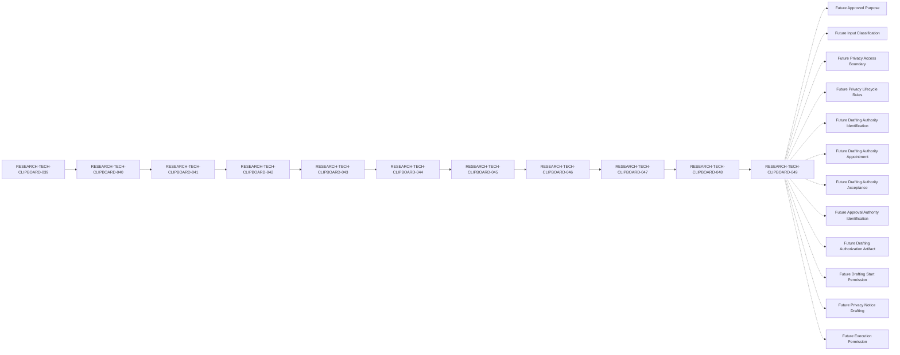

# RESEARCH-TECH-CLIPBOARD-049 — Privacy Notice Drafting Authorization Prerequisite Specification

## Document Control

| Field | Value |
| --- | --- |
| Document ID | RESEARCH-TECH-CLIPBOARD-049 |
| Status | Draft |
| Parent Document | RESEARCH-TECH-CLIPBOARD-048 |
| Document Type | Privacy Notice Drafting Authorization Prerequisite Specification |
| Authorization Prerequisite Conclusion | Not ready to issue Privacy Notice drafting authorization |
| Scope | Documentary prerequisites for a future drafting authorization only |
| Actual Privacy Notice drafting | Not authorized |

## Purpose and Boundary

This document defines the documentary, governance, authority, privacy, placeholder, and start-permission prerequisites that would be required before a future Privacy Notice drafting authorization could be issued.

This document does not identify or appoint actual people, provide actual Notice values, issue Drafting Authorization, create a Drafting Instruction, provide Drafting Start Permission, or begin Privacy Notice drafting. Every prerequisite remains Not ready, and automatic authorization is prohibited.

## 1. Traceability

The controlled documentary traceability chain is:

`039 → 040 → 041 → 042 → 043 → 044 → 045 → 046 → 047 → 048 → 049`

The parent document is used for documentary reference only. No parent review result, control conformance result, placeholder result, ledger result, or prerequisite completeness result authorizes drafting.

## 2. Drafting Authorization Prerequisites

The following 16 prerequisites are required before a future drafting authorization could be considered. No actual value is supplied by this document.

| Prerequisite ID | Authorization prerequisite | Documentary source | Current state | Required future state | Responsible role class | Authorization blocker | Readiness | Automatic authorization permitted | Reason |
| --- | --- | --- | --- | --- | --- | --- | --- | --- | --- |
| CLIP-D1-DRAFTAUTH-PREREQ-001 | Parent controlled drafting closure review complete | RESEARCH-TECH-CLIPBOARD-048, documentary control review | Parent closure conclusion remains Not ready | Closure review complete without changing safety boundaries | Documentation governance role class; holder not identified | Blocking | Not ready | No | Parent closure review cannot be treated as drafting authorization |
| CLIP-D1-DRAFTAUTH-PREREQ-002 | Thirteen content drafting controls conformant | RESEARCH-TECH-CLIPBOARD-048, 13 Content Drafting Control Reviews | Documentary review set exists; authorization not established | All 13 controls conformant and accepted through a future governance process | Technical scope review role class; holder not identified | Blocking | Not ready | No | Control conformance does not appoint a drafter or issue authorization |
| CLIP-D1-DRAFTAUTH-PREREQ-003 | Six placeholder controls remain controlled | RESEARCH-TECH-CLIPBOARD-048, 6 Placeholder Control Reviews | Six placeholders remain unresolved | Placeholder boundary approved for future controlled drafting | Privacy governance role class; holder not identified | Blocking | Not ready | No | Placeholder presence cannot supply an actual value |
| CLIP-D1-DRAFTAUTH-PREREQ-004 | Future approved purpose provided | Future governance record; documentary reference only | Not provided | Future approved purpose recorded by an identified authority | Decision authority role class; holder not identified | Blocking | Not ready | No | No actual purpose is supplied here |
| CLIP-D1-DRAFTAUTH-PREREQ-005 | Required/Optional input classification complete | Future privacy governance record; documentary reference only | Not complete | Future input classification reviewed and accepted | Technical scope review role class; holder not identified | Blocking | Not ready | No | No actual input classification or collected input is supplied |
| CLIP-D1-DRAFTAUTH-PREREQ-006 | Privacy access boundary complete | Future privacy governance record; documentary reference only | Not complete | Future access boundary reviewed and accepted | Privacy governance role class; holder not identified | Blocking | Not ready | No | No actual access holder, account, or boundary is supplied |
| CLIP-D1-DRAFTAUTH-PREREQ-007 | Retention/deletion boundary complete | Future privacy governance record; documentary reference only | Not complete | Future retention and deletion boundary reviewed and accepted | Privacy governance role class; holder not identified | Blocking | Not ready | No | No actual retention period or deletion value is supplied |
| CLIP-D1-DRAFTAUTH-PREREQ-008 | Correction process complete | Future privacy governance record; documentary reference only | Not complete | Future correction process reviewed and accepted | Privacy governance role class; holder not identified | Blocking | Not ready | No | No actual correction process is supplied |
| CLIP-D1-DRAFTAUTH-PREREQ-009 | Withdrawal/replacement process complete | Future privacy governance record; documentary reference only | Not complete | Future withdrawal and replacement process reviewed and accepted | Privacy governance role class; holder not identified | Blocking | Not ready | No | No actual withdrawal or replacement process is supplied |
| CLIP-D1-DRAFTAUTH-PREREQ-010 | Drafting Authority identified through a future governance process | Future governance appointment record | Not identified | Drafting Authority identified by a future governance process | Governance authority role class; holder not identified | Blocking | Not ready | No | Identification is a future prerequisite, not a current appointment |
| CLIP-D1-DRAFTAUTH-PREREQ-011 | Drafting Authority appointment completed | Future governance appointment record | Not performed | Appointment recorded and independently reviewable | Governance authority role class; holder not identified | Blocking | Not ready | No | This document cannot appoint or contact an authority |
| CLIP-D1-DRAFTAUTH-PREREQ-012 | Drafting Authority acceptance collected | Future governance acceptance record | Not collected | Acceptance recorded through a future authorized process | Governance authority role class; holder not identified | Blocking | Not ready | No | No actual person or acceptance is collected here |
| CLIP-D1-DRAFTAUTH-PREREQ-013 | Approval Authority identified through a future governance process | Future governance appointment record | Not identified | Approval Authority identified by a future governance process | Approval authority role class; holder not identified | Blocking | Not ready | No | Approval authority remains unresolved |
| CLIP-D1-DRAFTAUTH-PREREQ-014 | Privacy and data-minimization approval provided | Future privacy approval record | Not provided | Privacy and data-minimization approval recorded and reviewable | Privacy governance role class; holder not identified | Blocking | Not ready | No | No approval, actual value, or authorization is provided here |
| CLIP-D1-DRAFTAUTH-PREREQ-015 | Drafting Authorization Artifact created and approved | Future authorization artifact record | Not created | Future artifact created and approved by identified authorities | Decision authority role class; holder not identified | Blocking | Not ready | No | Artifact creation and approval are separate future stages |
| CLIP-D1-DRAFTAUTH-PREREQ-016 | Drafting Start Permission explicitly provided | Future start-permission record | No | Explicit future start permission provided after all prerequisites pass | Decision authority role class; holder not identified | Blocking | Not ready | No | No start permission is implied by this specification |

## 3. Drafting Authorization Gate

Each gate row maps one-to-one to the 16 prerequisites. A gate review result does not issue authorization.

| Gate ID | Prerequisite ID | Gate condition | Current state | Required future state | Gate effect | Current conclusion | Authorization issued |
| --- | --- | --- | --- | --- | --- | --- | --- |
| CLIP-D1-DRAFTAUTH-GATE-001 | CLIP-D1-DRAFTAUTH-PREREQ-001 | Parent controlled drafting closure review complete | Not verified | Verified without changing safety state | Blocks authorization | Not ready | No |
| CLIP-D1-DRAFTAUTH-GATE-002 | CLIP-D1-DRAFTAUTH-PREREQ-002 | Thirteen content drafting controls conformant | Not verified | All 13 controls conformant | Blocks authorization | Not ready | No |
| CLIP-D1-DRAFTAUTH-GATE-003 | CLIP-D1-DRAFTAUTH-PREREQ-003 | Six placeholder controls remain controlled | Not verified | All six placeholders controlled | Blocks authorization | Not ready | No |
| CLIP-D1-DRAFTAUTH-GATE-004 | CLIP-D1-DRAFTAUTH-PREREQ-004 | Future approved purpose provided | Not provided | Future approved purpose recorded | Blocks authorization | Not ready | No |
| CLIP-D1-DRAFTAUTH-GATE-005 | CLIP-D1-DRAFTAUTH-PREREQ-005 | Required/Optional input classification complete | Not complete | Classification reviewed and accepted | Blocks authorization | Not ready | No |
| CLIP-D1-DRAFTAUTH-GATE-006 | CLIP-D1-DRAFTAUTH-PREREQ-006 | Privacy access boundary complete | Not complete | Boundary reviewed and accepted | Blocks authorization | Not ready | No |
| CLIP-D1-DRAFTAUTH-GATE-007 | CLIP-D1-DRAFTAUTH-PREREQ-007 | Retention/deletion boundary complete | Not complete | Boundary reviewed and accepted | Blocks authorization | Not ready | No |
| CLIP-D1-DRAFTAUTH-GATE-008 | CLIP-D1-DRAFTAUTH-PREREQ-008 | Correction process complete | Not complete | Process reviewed and accepted | Blocks authorization | Not ready | No |
| CLIP-D1-DRAFTAUTH-GATE-009 | CLIP-D1-DRAFTAUTH-PREREQ-009 | Withdrawal/replacement process complete | Not complete | Process reviewed and accepted | Blocks authorization | Not ready | No |
| CLIP-D1-DRAFTAUTH-GATE-010 | CLIP-D1-DRAFTAUTH-PREREQ-010 | Drafting Authority identified through a future governance process | Not identified | Future identification recorded | Blocks authorization | Not ready | No |
| CLIP-D1-DRAFTAUTH-GATE-011 | CLIP-D1-DRAFTAUTH-PREREQ-011 | Drafting Authority appointment completed | Not performed | Future appointment recorded | Blocks authorization | Not ready | No |
| CLIP-D1-DRAFTAUTH-GATE-012 | CLIP-D1-DRAFTAUTH-PREREQ-012 | Drafting Authority acceptance collected | Not collected | Future acceptance recorded | Blocks authorization | Not ready | No |
| CLIP-D1-DRAFTAUTH-GATE-013 | CLIP-D1-DRAFTAUTH-PREREQ-013 | Approval Authority identified through a future governance process | Not identified | Future identification recorded | Blocks authorization | Not ready | No |
| CLIP-D1-DRAFTAUTH-GATE-014 | CLIP-D1-DRAFTAUTH-PREREQ-014 | Privacy and data-minimization approval provided | Not provided | Future approval recorded | Blocks authorization | Not ready | No |
| CLIP-D1-DRAFTAUTH-GATE-015 | CLIP-D1-DRAFTAUTH-PREREQ-015 | Drafting Authorization Artifact created and approved | Not created | Future artifact created and approved | Blocks authorization | Not ready | No |
| CLIP-D1-DRAFTAUTH-GATE-016 | CLIP-D1-DRAFTAUTH-PREREQ-016 | Drafting Start Permission explicitly provided | No | Explicit future permission recorded | Blocks authorization | Not ready | No |

**Overall gate conclusion:** Not ready to issue Privacy Notice drafting authorization.

The terms `Open`, `Ready`, `Authorized`, `Approved to draft`, and `Permission granted` are not valid states for this document.

## 4. Drafting Authorization Artifact State

| Artifact or permission | Required current state |
| --- | --- |
| Drafting Authorization Artifact | Not created |
| Drafting Authorization Approval | Not provided |
| Drafting Instruction | Not created |
| Drafting Start Permission | No |
| Privacy Notice Draft | Not created |
| Privacy Notice Artifact | Not created |

The following boundaries are explicit:

- Prerequisite completeness ≠ Drafting Authorization Artifact
- Drafting Authorization Artifact ≠ Drafting Authorization Approval
- Drafting Authorization Approval ≠ Drafting Instruction
- Drafting Instruction ≠ Drafting Start Permission
- Drafting Start Permission ≠ Privacy Notice Draft

## 5. Fixed Roles and Authority State

| Fixed role | Actual Holder | Appointment | Acceptance | Authorization implication |
| --- | --- | --- | --- | --- |
| Request Preparer | Not identified | Not performed | Not collected | None |
| Technical Scope Reviewer | Not identified | Not performed | Not collected | None |
| Decision Authority | Not identified | Not performed | Not collected | None |
| Execution Operator | Not identified | Not performed | Not collected | None |
| Observation and Evidence Custodian | Not identified | Not performed | Not collected | None |

| Authority state | Current state |
| --- | --- |
| Drafting Authority | Not identified |
| Drafting Authority Appointment | Not performed |
| Drafting Authority Acceptance | Not collected |
| Approval Authority | Not identified |
| Notice Recipient | Not identified |

No actual person is identified, contacted, appointed, or asked to accept a role by this document.

## 6. Parent Control References

| Parent reference set | Count | Reference use | Actual value | Authorization implication |
| --- | --- | --- | --- | --- |
| Content Drafting Controls | 13 | Documentary only | Not provided | None |
| Placeholder Controls | 6 | Documentary only | Not provided | None |
| Content Drafting Gate rows | 16 | Documentary only | Not provided | None |
| Controlled Drafting Closure ledger values | 16 | Documentary only | Not provided | None |

Parent references are not copied into actual Privacy Notice wording and do not provide authorization.

## 7. Placeholder Authorization Boundary

| Placeholder ID | Placeholder | Current state | Actual value permitted | Replacement authority | Replacement approval | Authorization use | Failure response |
| --- | --- | --- | --- | --- | --- | --- | --- |
| CLIP-D1-DRAFTAUTH-PLACEHOLDER-001 | `<FUTURE_APPROVED_PURPOSE>` | Unresolved | No | Not identified | Not provided | Not permitted | Stop and reject actual value |
| CLIP-D1-DRAFTAUTH-PLACEHOLDER-002 | `<FUTURE_INPUT_CLASSIFICATION>` | Unresolved | No | Not identified | Not provided | Not permitted | Stop and reject actual value |
| CLIP-D1-DRAFTAUTH-PLACEHOLDER-003 | `<FUTURE_ACCESS_BOUNDARY>` | Unresolved | No | Not identified | Not provided | Not permitted | Stop and reject actual value |
| CLIP-D1-DRAFTAUTH-PLACEHOLDER-004 | `<FUTURE_RETENTION_RULE>` | Unresolved | No | Not identified | Not provided | Not permitted | Stop and reject actual value |
| CLIP-D1-DRAFTAUTH-PLACEHOLDER-005 | `<FUTURE_CORRECTION_PROCESS>` | Unresolved | No | Not identified | Not provided | Not permitted | Stop and reject actual value |
| CLIP-D1-DRAFTAUTH-PLACEHOLDER-006 | `<FUTURE_WITHDRAWAL_PROCESS>` | Unresolved | No | Not identified | Not provided | Not permitted | Stop and reject actual value |

Placeholder presence does not satisfy an authorization prerequisite.

## 8. Explicit Exclusions

| Exclusion ID | Exclusion category | Required state | Authorization input permitted | Placeholder conversion permitted | Example/test-data conversion permitted | Failure response |
| --- | --- | --- | --- | --- | --- | --- |
| CLIP-D1-DRAFTAUTH-EX-001 | Actual name | Absent | No | No | No | Stop and reject |
| CLIP-D1-DRAFTAUTH-EX-002 | Email address | Absent | No | No | No | Stop and reject |
| CLIP-D1-DRAFTAUTH-EX-003 | Department | Absent | No | No | No | Stop and reject |
| CLIP-D1-DRAFTAUTH-EX-004 | Job title | Absent | No | No | No | Stop and reject |
| CLIP-D1-DRAFTAUTH-EX-005 | Account | Absent | No | No | No | Stop and reject |
| CLIP-D1-DRAFTAUTH-EX-006 | SID | Absent | No | No | No | Stop and reject |
| CLIP-D1-DRAFTAUTH-EX-007 | Computer name | Absent | No | No | No | Stop and reject |
| CLIP-D1-DRAFTAUTH-EX-008 | Credential | Absent | No | No | No | Stop and reject |
| CLIP-D1-DRAFTAUTH-EX-009 | Token | Absent | No | No | No | Stop and reject |
| CLIP-D1-DRAFTAUTH-EX-010 | Private key | Absent | No | No | No | Stop and reject |
| CLIP-D1-DRAFTAUTH-EX-011 | Clipboard content | Absent | No | No | No | Stop and reject |
| CLIP-D1-DRAFTAUTH-EX-012 | Screenshot content | Absent | No | No | No | Stop and reject |
| CLIP-D1-DRAFTAUTH-EX-013 | Desktop content | Absent | No | No | No | Stop and reject |
| CLIP-D1-DRAFTAUTH-EX-014 | Operational Observation | Absent | No | No | No | Stop and do not persist |
| CLIP-D1-DRAFTAUTH-EX-015 | Persistent Evidence | Absent | No | No | No | Stop and do not persist |

## 9. Separation Rules

| Separation ID | Separation rule | Current state | Automatic transition |
| --- | --- | --- | --- |
| CLIP-D1-DRAFTAUTH-SEP-001 | Drafting Authorization Prerequisite Specification ≠ Drafting Authorization | Documentarily satisfied | Prohibited |
| CLIP-D1-DRAFTAUTH-SEP-002 | Prerequisite Completeness ≠ Authorization Readiness | Documentarily satisfied | Prohibited |
| CLIP-D1-DRAFTAUTH-SEP-003 | Authorization Readiness ≠ Drafting Authorization Artifact | Documentarily satisfied | Prohibited |
| CLIP-D1-DRAFTAUTH-SEP-004 | Drafting Authorization Artifact ≠ Drafting Authorization Approval | Documentarily satisfied | Prohibited |
| CLIP-D1-DRAFTAUTH-SEP-005 | Drafting Authorization Approval ≠ Drafting Instruction | Documentarily satisfied | Prohibited |
| CLIP-D1-DRAFTAUTH-SEP-006 | Drafting Instruction ≠ Drafting Start Permission | Documentarily satisfied | Prohibited |
| CLIP-D1-DRAFTAUTH-SEP-007 | Drafting Start Permission ≠ Privacy Notice Draft | Documentarily satisfied | Prohibited |
| CLIP-D1-DRAFTAUTH-SEP-008 | Privacy Notice Draft ≠ Privacy Notice Artifact | Documentarily satisfied | Prohibited |
| CLIP-D1-DRAFTAUTH-SEP-009 | Privacy Notice Artifact ≠ Artifact Approval | Documentarily satisfied | Prohibited |
| CLIP-D1-DRAFTAUTH-SEP-010 | Artifact Approval ≠ Notice Delivery | Documentarily satisfied | Prohibited |
| CLIP-D1-DRAFTAUTH-SEP-011 | Notice Delivery ≠ Notice Acknowledgement | Documentarily satisfied | Prohibited |
| CLIP-D1-DRAFTAUTH-SEP-012 | Notice Acknowledgement ≠ Human Input Collection | Documentarily satisfied | Prohibited |
| CLIP-D1-DRAFTAUTH-SEP-013 | Privacy Notice Artifact ≠ Submission Instruction | Documentarily satisfied | Prohibited |
| CLIP-D1-DRAFTAUTH-SEP-014 | Privacy Notice Artifact ≠ Collection Authorization | Documentarily satisfied | Prohibited |
| CLIP-D1-DRAFTAUTH-SEP-015 | Human Governance Input ≠ Execution Permission | Documentarily satisfied | Prohibited |

## 10. Validation Rules

| Validation ID | Validation rule | Current evaluation | Failure response |
| --- | --- | --- | --- |
| CLIP-D1-DRAFTAUTH-VAL-001 | All 16 prerequisite IDs are complete and unique | Not evaluated | Stop and reject |
| CLIP-D1-DRAFTAUTH-VAL-002 | All 16 gate IDs are complete and unique | Not evaluated | Stop and reject |
| CLIP-D1-DRAFTAUTH-VAL-003 | Every prerequisite Readiness value is Not ready | Not evaluated | Stop and preserve state |
| CLIP-D1-DRAFTAUTH-VAL-004 | Every Authorization issued value is No | Not evaluated | Stop and reject |
| CLIP-D1-DRAFTAUTH-VAL-005 | Drafting Authority remains not identified | Not evaluated | Stop and preserve state |
| CLIP-D1-DRAFTAUTH-VAL-006 | Drafting Authority Appointment remains not performed | Not evaluated | Stop and preserve state |
| CLIP-D1-DRAFTAUTH-VAL-007 | Drafting Authority Acceptance remains not collected | Not evaluated | Stop and preserve state |
| CLIP-D1-DRAFTAUTH-VAL-008 | Approval Authority remains not identified | Not evaluated | Stop and preserve state |
| CLIP-D1-DRAFTAUTH-VAL-009 | Drafting Authorization Artifact remains not created | Not evaluated | Stop and preserve state |
| CLIP-D1-DRAFTAUTH-VAL-010 | Drafting Authorization Approval remains not provided | Not evaluated | Stop and preserve state |
| CLIP-D1-DRAFTAUTH-VAL-011 | Drafting Instruction remains not created | Not evaluated | Stop and preserve state |
| CLIP-D1-DRAFTAUTH-VAL-012 | Drafting Start Permission remains No | Not evaluated | Stop and preserve state |
| CLIP-D1-DRAFTAUTH-VAL-013 | Placeholders contain no actual values | Not evaluated | Stop and reject actual value |
| CLIP-D1-DRAFTAUTH-VAL-014 | No actual Notice wording or privacy values are present | Not evaluated | Stop and remove |
| CLIP-D1-DRAFTAUTH-VAL-015 | Document completion must not imply drafting, approval, submission, collection authorization, or execution | Not evaluated | Stop and preserve separation |

## 11. Stop Conditions

| Stop ID | Stop condition | Current trigger state | Required response |
| --- | --- | --- | --- |
| CLIP-D1-DRAFTAUTH-STOP-001 | The document is treated as Drafting Authorization | Not evaluated | Stop and preserve separation |
| CLIP-D1-DRAFTAUTH-STOP-002 | Prerequisite completeness is treated as authorization readiness | Not evaluated | Stop and preserve separation |
| CLIP-D1-DRAFTAUTH-STOP-003 | Drafting Authority is identified | Not evaluated | Stop and reject |
| CLIP-D1-DRAFTAUTH-STOP-004 | Drafting Authority is appointed | Not evaluated | Stop and reject |
| CLIP-D1-DRAFTAUTH-STOP-005 | Drafting Authority Acceptance is collected | Not evaluated | Stop and reject |
| CLIP-D1-DRAFTAUTH-STOP-006 | Approval Authority is identified | Not evaluated | Stop and reject |
| CLIP-D1-DRAFTAUTH-STOP-007 | Drafting Authorization Artifact is created | Not evaluated | Stop and preserve separation |
| CLIP-D1-DRAFTAUTH-STOP-008 | Drafting Authorization Approval is inferred | Not evaluated | Stop and preserve separation |
| CLIP-D1-DRAFTAUTH-STOP-009 | Drafting Instruction is created | Not evaluated | Stop and preserve separation |
| CLIP-D1-DRAFTAUTH-STOP-010 | Drafting Start Permission is inferred | Not evaluated | Stop and preserve separation |
| CLIP-D1-DRAFTAUTH-STOP-011 | A placeholder is replaced with an actual value | Not evaluated | Stop and reject |
| CLIP-D1-DRAFTAUTH-STOP-012 | Actual Notice wording or a privacy value is added | Not evaluated | Stop and remove |
| CLIP-D1-DRAFTAUTH-STOP-013 | Request Submission is inferred | Not evaluated | Stop and preserve separation |
| CLIP-D1-DRAFTAUTH-STOP-014 | Collection Authorization is inferred | Not evaluated | Stop and preserve separation |
| CLIP-D1-DRAFTAUTH-STOP-015 | Execution Permission does not exist | Not evaluated | Stop; never collect or execute |

## 12. Prohibited Transitions

| Transition ID | Prohibited transition | Rule preserved | Transition performed | Result |
| --- | --- | --- | --- | --- |
| CLIP-D1-DRAFTAUTH-TRANS-001 | Drafting Authorization Prerequisite Specification → Drafting Authorization Issued | Yes | No | No |
| CLIP-D1-DRAFTAUTH-TRANS-002 | Prerequisite Completeness → Authorization Readiness | Yes | No | No |
| CLIP-D1-DRAFTAUTH-TRANS-003 | Authorization Readiness → Drafting Authorization Artifact Created | Yes | No | No |
| CLIP-D1-DRAFTAUTH-TRANS-004 | Drafting Authority Identified → Drafting Authority Appointed | Yes | No | No |
| CLIP-D1-DRAFTAUTH-TRANS-005 | Drafting Authority Appointed → Drafting Authority Accepted | Yes | No | No |
| CLIP-D1-DRAFTAUTH-TRANS-006 | Drafting Authority Accepted → Drafting Authorization Approved | Yes | No | No |
| CLIP-D1-DRAFTAUTH-TRANS-007 | Placeholder Control → Actual Value Supplied | Yes | No | No |
| CLIP-D1-DRAFTAUTH-TRANS-008 | Drafting Authorization Approval → Drafting Instruction Created | Yes | No | No |
| CLIP-D1-DRAFTAUTH-TRANS-009 | Drafting Instruction → Drafting Start Permission | Yes | No | No |
| CLIP-D1-DRAFTAUTH-TRANS-010 | Drafting Start Permission → Privacy Notice Draft Created | Yes | No | No |
| CLIP-D1-DRAFTAUTH-TRANS-011 | Privacy Notice Draft → Privacy Notice Artifact Created | Yes | No | No |
| CLIP-D1-DRAFTAUTH-TRANS-012 | Privacy Notice Artifact Created → Artifact Approved | Yes | No | No |
| CLIP-D1-DRAFTAUTH-TRANS-013 | Privacy Notice Artifact → Submission Instruction | Yes | No | No |
| CLIP-D1-DRAFTAUTH-TRANS-014 | Privacy Notice Artifact → Request Submitted | Yes | No | No |
| CLIP-D1-DRAFTAUTH-TRANS-015 | Privacy Notice Artifact → Collection Authorized | Yes | No | No |
| CLIP-D1-DRAFTAUTH-TRANS-016 | Human Input → Execution Permission | Yes | No | No |

## 13. Unresolved-value Ledger

Every value below is a unique unresolved future value. No actual value is supplied.

| Ledger ID | Unresolved future value | Current state | Actual value | Resolution authority | Authorization implication | Review result |
| --- | --- | --- | --- | --- | --- | --- |
| CLIP-D1-DRAFTAUTH-LEDGER-001 | Approved purpose | Unresolved | Not provided | Not identified | None | Not evaluated |
| CLIP-D1-DRAFTAUTH-LEDGER-002 | Input classification | Unresolved | Not provided | Not identified | None | Not evaluated |
| CLIP-D1-DRAFTAUTH-LEDGER-003 | Access boundary | Unresolved | Not provided | Not identified | None | Not evaluated |
| CLIP-D1-DRAFTAUTH-LEDGER-004 | Retention and deletion boundary | Unresolved | Not provided | Not identified | None | Not evaluated |
| CLIP-D1-DRAFTAUTH-LEDGER-005 | Correction process | Unresolved | Not provided | Not identified | None | Not evaluated |
| CLIP-D1-DRAFTAUTH-LEDGER-006 | Withdrawal or replacement process | Unresolved | Not provided | Not identified | None | Not evaluated |
| CLIP-D1-DRAFTAUTH-LEDGER-007 | Drafting Authority | Unresolved | Not provided | Not identified | None | Not evaluated |
| CLIP-D1-DRAFTAUTH-LEDGER-008 | Drafting Authority Appointment | Unresolved | Not provided | Not identified | None | Not evaluated |
| CLIP-D1-DRAFTAUTH-LEDGER-009 | Drafting Authority Acceptance | Unresolved | Not provided | Not identified | None | Not evaluated |
| CLIP-D1-DRAFTAUTH-LEDGER-010 | Approval Authority | Unresolved | Not provided | Not identified | None | Not evaluated |
| CLIP-D1-DRAFTAUTH-LEDGER-011 | Privacy and data-minimization approval | Unresolved | Not provided | Not identified | None | Not evaluated |
| CLIP-D1-DRAFTAUTH-LEDGER-012 | Drafting Authorization Artifact | Unresolved | Not provided | Not identified | None | Not evaluated |
| CLIP-D1-DRAFTAUTH-LEDGER-013 | Drafting Authorization Approval | Unresolved | Not provided | Not identified | None | Not evaluated |
| CLIP-D1-DRAFTAUTH-LEDGER-014 | Drafting Instruction | Unresolved | Not provided | Not identified | None | Not evaluated |
| CLIP-D1-DRAFTAUTH-LEDGER-015 | Drafting Start Permission | Unresolved | Not provided | Not identified | None | Not evaluated |
| CLIP-D1-DRAFTAUTH-LEDGER-016 | Privacy Notice Draft | Unresolved | Not provided | Not identified | None | Not evaluated |
| CLIP-D1-DRAFTAUTH-LEDGER-017 | Privacy Notice Artifact | Unresolved | Not provided | Not identified | None | Not evaluated |
| CLIP-D1-DRAFTAUTH-LEDGER-018 | Execution Permission | Unresolved | Not provided | Not identified | None | Not evaluated |

Ledger controls:

- Ledger rows: 18
- Unique values: 18
- Drafting Authority rows: 1
- Approval Authority rows: 1

## 14. Submission, Authorization, and Execution Separation

| Stage ID | Stage | Current state | Automatic transition prohibited |
| --- | --- | --- | --- |
| CLIP-D1-DRAFTAUTH-STAGE-001 | Drafting authorization prerequisite specification | Not executed | Yes |
| CLIP-D1-DRAFTAUTH-STAGE-002 | Drafting Authorization Artifact | Not created | Yes |
| CLIP-D1-DRAFTAUTH-STAGE-003 | Drafting Authorization Approval | Not provided | Yes |
| CLIP-D1-DRAFTAUTH-STAGE-004 | Drafting Instruction | Not created | Yes |
| CLIP-D1-DRAFTAUTH-STAGE-005 | Drafting Start Permission | No | Yes |
| CLIP-D1-DRAFTAUTH-STAGE-006 | Privacy Notice Draft | Not created | Yes |
| CLIP-D1-DRAFTAUTH-STAGE-007 | Privacy Notice Artifact | Not created | Yes |
| CLIP-D1-DRAFTAUTH-STAGE-008 | Privacy Notice Approval | Not provided | Yes |
| CLIP-D1-DRAFTAUTH-STAGE-009 | Notice Recipient Identification | Not identified | Yes |
| CLIP-D1-DRAFTAUTH-STAGE-010 | Delivery Channel Selection | Not selected | Yes |
| CLIP-D1-DRAFTAUTH-STAGE-011 | Platform Assessment | Not identified | Yes |
| CLIP-D1-DRAFTAUTH-STAGE-012 | Notice Delivery | Not performed | Yes |
| CLIP-D1-DRAFTAUTH-STAGE-013 | Request Submission | No | Yes |
| CLIP-D1-DRAFTAUTH-STAGE-014 | Collection Authorization | Not provided | Yes |
| CLIP-D1-DRAFTAUTH-STAGE-015 | Collection-start Permission | No | Yes |
| CLIP-D1-DRAFTAUTH-STAGE-016 | Execution Permission | Not provided | Yes |

## 15. Completeness Matrix

| Completeness area | Result | Boundary note |
| --- | --- | --- |
| Traceability | Yes | 039 through 049 chain is recorded |
| Drafting authorization prerequisites | Yes | 16 prerequisite rows are defined |
| Authorization gate | Yes | 16 gate rows map one-to-one to prerequisites |
| Authorization artifact states | Yes | Artifact and permission states remain not created or not provided |
| Fixed roles and authorities | Yes | Five fixed role classes remain without actual holders |
| Parent control references | Yes | Parent references are documentary only |
| Placeholder boundary | Yes | Six placeholders remain unresolved and cannot be replaced |
| Explicit exclusions | Yes | Fifteen exclusion categories remain excluded |
| Separation rules | Yes | Fifteen automatic transitions are prohibited |
| Validation rules | Yes | Fifteen validation rules remain not evaluated |
| Stop conditions | Yes | Fifteen stop conditions remain not evaluated |
| Prohibited transitions | Yes | Sixteen transitions remain Yes/No/No |
| Unresolved-value ledger | Yes | Eighteen unique future values remain unresolved |
| Submission/Authorization/Execution separation | Yes | Sixteen stages remain unexecuted |
| Safety state | Yes | No drafting, collection, inspection, or execution state is authorized |
| Overall authorization prerequisite specification | Yes | Conclusion remains Not ready |

## 16. Mermaid Traceability

The diagram contains no operational solid transition.

## 17. Required Safety State

| Safety state | Required current state |
| --- | --- |
| Authorization Prerequisite Conclusion | Not ready to issue Privacy Notice drafting authorization |
| Drafting Authority | Not identified |
| Drafting Authority Appointment | Not performed |
| Drafting Authority Acceptance | Not collected |
| Approval Authority | Not identified |
| Drafting Authorization Artifact | Not created |
| Drafting Authorization Approval | Not provided |
| Drafting Instruction | Not created |
| Drafting Start Permission | No |
| Privacy Notice Draft | Not created |
| Privacy Notice Artifact | Not created |
| Privacy Notice Approval | Not provided |
| Privacy Notice Delivery | Not performed |
| Notice Acknowledgement | Not collected |
| Notice Recipient | Not identified |
| Delivery Channel | Not selected |
| Actual Platform | Not identified |
| Request Submitted | No |
| Submission Instruction | Not created |
| Actual Role Holders | Not identified |
| Role Appointment | Not performed |
| Role Acceptance | Not collected |
| Collection Authorization | Not provided |
| Collection-start Permission | No |
| Worksheet Distribution | Not performed |
| Human Governance Input | Not collected |
| Personal Data | Not collected |
| D1 Inspection | Not authorized |
| Execution Permission | Not provided |
| Operational Observation | Not created |
| Persistent Evidence | Not created |

## 18. Prohibited Actions

- Do not issue Drafting Authorization.
- Do not create a Drafting Authorization Artifact or Drafting Instruction.
- Do not provide Drafting Start Permission.
- Do not write or create a Privacy Notice Draft or Privacy Notice Artifact.
- Do not identify, contact, appoint, or collect actual authority or role-holder data.
- Do not replace a placeholder with an actual value.
- Do not create a Submission Instruction or submit a Request.
- Do not select a Channel or Platform.
- Do not distribute a Worksheet or collect Human Input.
- Do not read Clipboard, Screenshot, or Desktop content.
- Do not create Operational Observation or Persistent Evidence.
- Do not perform D1 Inspection, coding, Build, Test, or Run.
- Do not modify any existing document.

## 19. Mechanical Final Status

| Check | Required status |
| --- | --- |
| Document ID | RESEARCH-TECH-CLIPBOARD-049 |
| Status | Draft |
| Parent | RESEARCH-TECH-CLIPBOARD-048 |
| Authorization prerequisite rows | 16 |
| Readiness=Not ready | 16/16 |
| Authorization issued=No | 16/16 |
| Authorization gate rows | 16 |
| Fixed roles | 5 |
| Parent control references | 13 / 6 / 16 / 16 |
| Placeholder boundary rows | 6 |
| Explicit exclusions | 15 |
| Separation rules | 15 |
| Validation rules | 15 |
| Stop conditions | 15 |
| Prohibited transitions | 16 |
| Transition Yes/No/No | 16/16 |
| Ledger rows | 18 |
| Unique ledger values | 18 |
| Stage separation rows | 16 |
| Completeness Matrix values | Yes / Partially / No only |
| Authorization Prerequisite Conclusion | Not ready to issue Privacy Notice drafting authorization |
| Mermaid solid chain | 039 → 040 → 041 → 042 → 043 → 044 → 045 → 046 → 047 → 048 → 049 |
| Mermaid Future dashed links | 12 |

This specification remains documentary only. It does not issue authorization and does not permit Privacy Notice drafting, collection, inspection, or execution.
