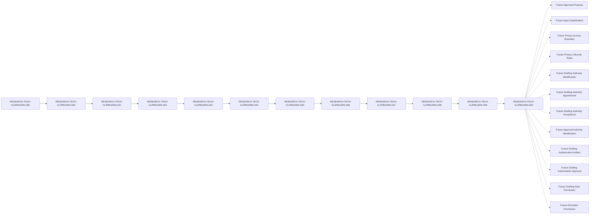

# RESEARCH-TECH-CLIPBOARD-050 — Privacy Notice Drafting Authorization Prerequisite Closure Review Specification

## Document Control

| Field | Value |
| --- | --- |
| Document ID | RESEARCH-TECH-CLIPBOARD-050 |
| Status | Draft |
| Parent Document | RESEARCH-TECH-CLIPBOARD-049 |
| Document Type | Privacy Notice Drafting Authorization Prerequisite Closure Review Specification |
| Closure Review Conclusion | Not ready to issue Privacy Notice drafting authorization |
| Review scope | Documentary closure review only |
| Actual Privacy Notice drafting | Not authorized |

## Purpose and Boundary

This document reviews the drafting authorization prerequisites, authorization gates, authority states, artifact states, placeholder boundaries, exclusions, prohibited transitions, and safety states defined by RESEARCH-TECH-CLIPBOARD-049.

This document provides a documentary closure review only. It does not issue Drafting Authorization, create or approve a Drafting Authorization Artifact, create a Drafting Instruction, provide Drafting Start Permission, or begin Privacy Notice drafting.

The review result `Yes` means that the corresponding documentary review row is complete. It never means authorization readiness, approval, permission, submission, collection authorization, or execution permission.

## 1. Traceability

The controlled documentary traceability chain is:

`039 → 040 → 041 → 042 → 043 → 044 → 045 → 046 → 047 → 048 → 049 → 050`

The parent document is used for documentary reference only. Review completion does not change the parent safety state and does not authorize any operational activity.

## 2. Authorization Prerequisite Review

The following 16 rows review the prerequisites defined in RESEARCH-TECH-CLIPBOARD-049.

| Review ID | Parent Prerequisite ID | Authorization prerequisite | Documentary source status | Parent current state | Required future state | Parent readiness | Automatic authorization permitted | Documentary conformance | Review result | Remains blocking | Reason |
| --- | --- | --- | --- | --- | --- | --- | --- | --- | --- | --- | --- |
| CLIP-D1-DRAFTAUTH-PREREQREVIEW-001 | CLIP-D1-DRAFTAUTH-PREREQ-001 | Parent controlled drafting closure review complete | Present in parent document | Parent closure conclusion remains Not ready | Closure review complete without changing safety boundaries | Not ready | No | Yes | Yes | Yes | Documentary presence cannot issue authorization |
| CLIP-D1-DRAFTAUTH-PREREQREVIEW-002 | CLIP-D1-DRAFTAUTH-PREREQ-002 | Thirteen content drafting controls conformant | Present in parent document | Controls are documentary references only | All 13 controls accepted through a future governance process | Not ready | No | Yes | Yes | Yes | Control conformance does not appoint a drafter |
| CLIP-D1-DRAFTAUTH-PREREQREVIEW-003 | CLIP-D1-DRAFTAUTH-PREREQ-003 | Six placeholder controls remain controlled | Present in parent document | Six placeholders remain unresolved | Placeholder boundary approved through a future process | Not ready | No | Yes | Yes | Yes | Placeholder control cannot provide an actual value |
| CLIP-D1-DRAFTAUTH-PREREQREVIEW-004 | CLIP-D1-DRAFTAUTH-PREREQ-004 | Future approved purpose provided | Present as unresolved future value | Not provided | Future approved purpose recorded by an identified authority | Not ready | No | Yes | Yes | Yes | No actual purpose is reviewed or supplied |
| CLIP-D1-DRAFTAUTH-PREREQREVIEW-005 | CLIP-D1-DRAFTAUTH-PREREQ-005 | Required/Optional input classification complete | Present as unresolved future value | Not complete | Future classification reviewed and accepted | Not ready | No | Yes | Yes | Yes | No actual input classification is supplied |
| CLIP-D1-DRAFTAUTH-PREREQREVIEW-006 | CLIP-D1-DRAFTAUTH-PREREQ-006 | Privacy access boundary complete | Present as unresolved future value | Not complete | Future boundary reviewed and accepted | Not ready | No | Yes | Yes | Yes | No access holder or actual boundary is supplied |
| CLIP-D1-DRAFTAUTH-PREREQREVIEW-007 | CLIP-D1-DRAFTAUTH-PREREQ-007 | Retention/deletion boundary complete | Present as unresolved future value | Not complete | Future boundary reviewed and accepted | Not ready | No | Yes | Yes | Yes | No actual retention or deletion value is supplied |
| CLIP-D1-DRAFTAUTH-PREREQREVIEW-008 | CLIP-D1-DRAFTAUTH-PREREQ-008 | Correction process complete | Present as unresolved future value | Not complete | Future process reviewed and accepted | Not ready | No | Yes | Yes | Yes | No actual correction process is supplied |
| CLIP-D1-DRAFTAUTH-PREREQREVIEW-009 | CLIP-D1-DRAFTAUTH-PREREQ-009 | Withdrawal/replacement process complete | Present as unresolved future value | Not complete | Future process reviewed and accepted | Not ready | No | Yes | Yes | Yes | No actual withdrawal or replacement process is supplied |
| CLIP-D1-DRAFTAUTH-PREREQREVIEW-010 | CLIP-D1-DRAFTAUTH-PREREQ-010 | Drafting Authority identified | Present as unresolved authority state | Not identified | Future identification recorded through governance | Not ready | No | Yes | Yes | Yes | This review does not identify an authority |
| CLIP-D1-DRAFTAUTH-PREREQREVIEW-011 | CLIP-D1-DRAFTAUTH-PREREQ-011 | Drafting Authority appointment completed | Present as unresolved authority state | Not performed | Future appointment recorded and reviewable | Not ready | No | Yes | Yes | Yes | This review does not appoint an authority |
| CLIP-D1-DRAFTAUTH-PREREQREVIEW-012 | CLIP-D1-DRAFTAUTH-PREREQ-012 | Drafting Authority acceptance collected | Present as unresolved authority state | Not collected | Future acceptance recorded through governance | Not ready | No | Yes | Yes | Yes | This review does not collect acceptance |
| CLIP-D1-DRAFTAUTH-PREREQREVIEW-013 | CLIP-D1-DRAFTAUTH-PREREQ-013 | Approval Authority identified | Present as unresolved authority state | Not identified | Future identification recorded through governance | Not ready | No | Yes | Yes | Yes | This review does not identify an approval authority |
| CLIP-D1-DRAFTAUTH-PREREQREVIEW-014 | CLIP-D1-DRAFTAUTH-PREREQ-014 | Privacy and data-minimization approval provided | Present as unresolved approval state | Not provided | Future approval recorded and reviewable | Not ready | No | Yes | Yes | Yes | Review completion is not approval |
| CLIP-D1-DRAFTAUTH-PREREQREVIEW-015 | CLIP-D1-DRAFTAUTH-PREREQ-015 | Drafting Authorization Artifact created and approved | Present as unresolved artifact state | Not created | Future artifact created and approved | Not ready | No | Yes | Yes | Yes | The artifact remains not created |
| CLIP-D1-DRAFTAUTH-PREREQREVIEW-016 | CLIP-D1-DRAFTAUTH-PREREQ-016 | Drafting Start Permission explicitly provided | Present as unresolved permission state | No | Explicit future permission provided after all gates pass | Not ready | No | Yes | Yes | Yes | No start permission is implied |

## 3. Authorization Gate Review

The following 16 rows review the parent gate rows one-to-one.

| Gate Review ID | Parent Gate ID | Parent Prerequisite ID | Gate condition | Parent current state | Required future state | Gate effect | Parent conclusion | Authorization issued | Review result | Remains blocking | Reason |
| --- | --- | --- | --- | --- | --- | --- | --- | --- | --- | --- | --- |
| CLIP-D1-DRAFTAUTH-GATEREVIEW-001 | CLIP-D1-DRAFTAUTH-GATE-001 | CLIP-D1-DRAFTAUTH-PREREQ-001 | Parent closure review complete | Not verified | Verified without changing safety state | Blocks authorization | Not ready | No | Yes | Yes | Gate review does not issue authorization |
| CLIP-D1-DRAFTAUTH-GATEREVIEW-002 | CLIP-D1-DRAFTAUTH-GATE-002 | CLIP-D1-DRAFTAUTH-PREREQ-002 | Thirteen controls conformant | Not verified | All 13 controls accepted | Blocks authorization | Not ready | No | Yes | Yes | Conformance is not authorization |
| CLIP-D1-DRAFTAUTH-GATEREVIEW-003 | CLIP-D1-DRAFTAUTH-GATE-003 | CLIP-D1-DRAFTAUTH-PREREQ-003 | Six placeholders controlled | Not verified | All six placeholders remain controlled | Blocks authorization | Not ready | No | Yes | Yes | Placeholder review does not supply values |
| CLIP-D1-DRAFTAUTH-GATEREVIEW-004 | CLIP-D1-DRAFTAUTH-GATE-004 | CLIP-D1-DRAFTAUTH-PREREQ-004 | Future approved purpose provided | Not provided | Future purpose recorded | Blocks authorization | Not ready | No | Yes | Yes | No actual purpose is present |
| CLIP-D1-DRAFTAUTH-GATEREVIEW-005 | CLIP-D1-DRAFTAUTH-GATE-005 | CLIP-D1-DRAFTAUTH-PREREQ-005 | Input classification complete | Not complete | Classification accepted | Blocks authorization | Not ready | No | Yes | Yes | No actual classification is present |
| CLIP-D1-DRAFTAUTH-GATEREVIEW-006 | CLIP-D1-DRAFTAUTH-GATE-006 | CLIP-D1-DRAFTAUTH-PREREQ-006 | Access boundary complete | Not complete | Boundary accepted | Blocks authorization | Not ready | No | Yes | Yes | No actual boundary is present |
| CLIP-D1-DRAFTAUTH-GATEREVIEW-007 | CLIP-D1-DRAFTAUTH-GATE-007 | CLIP-D1-DRAFTAUTH-PREREQ-007 | Retention/deletion boundary complete | Not complete | Boundary accepted | Blocks authorization | Not ready | No | Yes | Yes | No actual lifecycle value is present |
| CLIP-D1-DRAFTAUTH-GATEREVIEW-008 | CLIP-D1-DRAFTAUTH-GATE-008 | CLIP-D1-DRAFTAUTH-PREREQ-008 | Correction process complete | Not complete | Process accepted | Blocks authorization | Not ready | No | Yes | Yes | No actual process is present |
| CLIP-D1-DRAFTAUTH-GATEREVIEW-009 | CLIP-D1-DRAFTAUTH-GATE-009 | CLIP-D1-DRAFTAUTH-PREREQ-009 | Withdrawal/replacement process complete | Not complete | Process accepted | Blocks authorization | Not ready | No | Yes | Yes | No actual process is present |
| CLIP-D1-DRAFTAUTH-GATEREVIEW-010 | CLIP-D1-DRAFTAUTH-GATE-010 | CLIP-D1-DRAFTAUTH-PREREQ-010 | Drafting Authority identified | Not identified | Future identification recorded | Blocks authorization | Not ready | No | Yes | Yes | No authority is identified |
| CLIP-D1-DRAFTAUTH-GATEREVIEW-011 | CLIP-D1-DRAFTAUTH-GATE-011 | CLIP-D1-DRAFTAUTH-PREREQ-011 | Drafting Authority appointment completed | Not performed | Future appointment recorded | Blocks authorization | Not ready | No | Yes | Yes | No appointment is performed |
| CLIP-D1-DRAFTAUTH-GATEREVIEW-012 | CLIP-D1-DRAFTAUTH-GATE-012 | CLIP-D1-DRAFTAUTH-PREREQ-012 | Drafting Authority acceptance collected | Not collected | Future acceptance recorded | Blocks authorization | Not ready | No | Yes | Yes | No acceptance is collected |
| CLIP-D1-DRAFTAUTH-GATEREVIEW-013 | CLIP-D1-DRAFTAUTH-GATE-013 | CLIP-D1-DRAFTAUTH-PREREQ-013 | Approval Authority identified | Not identified | Future identification recorded | Blocks authorization | Not ready | No | Yes | Yes | No authority is identified |
| CLIP-D1-DRAFTAUTH-GATEREVIEW-014 | CLIP-D1-DRAFTAUTH-GATE-014 | CLIP-D1-DRAFTAUTH-PREREQ-014 | Privacy and data-minimization approval provided | Not provided | Future approval recorded | Blocks authorization | Not ready | No | Yes | Yes | Review completion is not approval |
| CLIP-D1-DRAFTAUTH-GATEREVIEW-015 | CLIP-D1-DRAFTAUTH-GATE-015 | CLIP-D1-DRAFTAUTH-PREREQ-015 | Drafting Authorization Artifact created and approved | Not created | Future artifact created and approved | Blocks authorization | Not ready | No | Yes | Yes | Artifact remains not created |
| CLIP-D1-DRAFTAUTH-GATEREVIEW-016 | CLIP-D1-DRAFTAUTH-GATE-016 | CLIP-D1-DRAFTAUTH-PREREQ-016 | Drafting Start Permission explicitly provided | No | Explicit future permission recorded | Blocks authorization | Not ready | No | Yes | Yes | No permission is implied |

**Overall gate conclusion:** Not ready to issue Privacy Notice drafting authorization.

The states `Open`, `Ready`, `Authorized`, `Approved to draft`, and `Permission granted` are not valid conclusions for this review.

## 4. Authorization Artifact State Review

| State Review ID | Artifact or permission | Parent current state | Required current state | Documentary conformance | Review result | Automatic transition permitted | Reason |
| --- | --- | --- | --- | --- | --- | --- | --- |
| CLIP-D1-DRAFTAUTH-ARTREVIEW-001 | Drafting Authorization Artifact | Not created | Not created | Yes | Yes | No | Closure review does not create an artifact |
| CLIP-D1-DRAFTAUTH-ARTREVIEW-002 | Drafting Authorization Approval | Not provided | Not provided | Yes | Yes | No | Closure review does not provide approval |
| CLIP-D1-DRAFTAUTH-ARTREVIEW-003 | Drafting Instruction | Not created | Not created | Yes | Yes | No | Closure review does not create an instruction |
| CLIP-D1-DRAFTAUTH-ARTREVIEW-004 | Drafting Start Permission | No | No | Yes | Yes | No | Closure review does not provide permission |
| CLIP-D1-DRAFTAUTH-ARTREVIEW-005 | Privacy Notice Draft | Not created | Not created | Yes | Yes | No | No actual Notice drafting is performed |
| CLIP-D1-DRAFTAUTH-ARTREVIEW-006 | Privacy Notice Artifact | Not created | Not created | Yes | Yes | No | No actual artifact is created |

## 5. Authority State Review

| Authority Review ID | Authority item | Parent current state | Required current state | Identification performed | Appointment performed | Acceptance collected | Authorization implication | Review result |
| --- | --- | --- | --- | --- | --- | --- | --- | --- |
| CLIP-D1-DRAFTAUTH-AUTHREVIEW-001 | Drafting Authority | Not identified | Not identified | No | Not applicable | Not applicable | None | Yes |
| CLIP-D1-DRAFTAUTH-AUTHREVIEW-002 | Drafting Authority Appointment | Not performed | Not performed | Not applicable | No | Not applicable | None | Yes |
| CLIP-D1-DRAFTAUTH-AUTHREVIEW-003 | Drafting Authority Acceptance | Not collected | Not collected | Not applicable | Not applicable | No | None | Yes |
| CLIP-D1-DRAFTAUTH-AUTHREVIEW-004 | Approval Authority | Not identified | Not identified | No | Not applicable | Not applicable | None | Yes |
| CLIP-D1-DRAFTAUTH-AUTHREVIEW-005 | Notice Recipient | Not identified | Not identified | No | Not applicable | Not applicable | None | Yes |

No actual person is identified, contacted, appointed, or asked to accept a role by this review.

## 6. Fixed Role State Review

| Role Review ID | Fixed role | Actual Holder | Appointment | Acceptance | Authorization implication | Review result |
| --- | --- | --- | --- | --- | --- | --- |
| CLIP-D1-DRAFTAUTH-ROLEREVIEW-001 | Request Preparer | Not identified | Not performed | Not collected | None | Yes |
| CLIP-D1-DRAFTAUTH-ROLEREVIEW-002 | Technical Scope Reviewer | Not identified | Not performed | Not collected | None | Yes |
| CLIP-D1-DRAFTAUTH-ROLEREVIEW-003 | Decision Authority | Not identified | Not performed | Not collected | None | Yes |
| CLIP-D1-DRAFTAUTH-ROLEREVIEW-004 | Execution Operator | Not identified | Not performed | Not collected | None | Yes |
| CLIP-D1-DRAFTAUTH-ROLEREVIEW-005 | Observation and Evidence Custodian | Not identified | Not performed | Not collected | None | Yes |

## 7. Parent Reference Review

| Parent reference set | Required count | Reference use | Actual value | Authorization implication | Review result |
| --- | --- | --- | --- | --- | --- |
| Content Drafting Controls | 13 | Documentary only | Not provided | None | Yes |
| Placeholder Controls | 6 | Documentary only | Not provided | None | Yes |
| Content Drafting Gate rows | 16 | Documentary only | Not provided | None | Yes |
| Controlled Drafting Closure ledger values | 16 | Documentary only | Not provided | None | Yes |

Parent references remain documentary only and cannot issue authorization.

## 8. Placeholder Boundary Review

| Placeholder Review ID | Parent Placeholder ID | Placeholder | Parent current state | Actual value permitted | Replacement authority | Replacement approval | Authorization use | Actual-value absence | Review result | Failure response |
| --- | --- | --- | --- | --- | --- | --- | --- | --- | --- | --- |
| CLIP-D1-DRAFTAUTH-PLACEHOLDERREVIEW-001 | CLIP-D1-DRAFTAUTH-PLACEHOLDER-001 | `<FUTURE_APPROVED_PURPOSE>` | Unresolved | No | Not identified | Not provided | Not permitted | Yes | Yes | Stop and reject actual value |
| CLIP-D1-DRAFTAUTH-PLACEHOLDERREVIEW-002 | CLIP-D1-DRAFTAUTH-PLACEHOLDER-002 | `<FUTURE_INPUT_CLASSIFICATION>` | Unresolved | No | Not identified | Not provided | Not permitted | Yes | Yes | Stop and reject actual value |
| CLIP-D1-DRAFTAUTH-PLACEHOLDERREVIEW-003 | CLIP-D1-DRAFTAUTH-PLACEHOLDER-003 | `<FUTURE_ACCESS_BOUNDARY>` | Unresolved | No | Not identified | Not provided | Not permitted | Yes | Yes | Stop and reject actual value |
| CLIP-D1-DRAFTAUTH-PLACEHOLDERREVIEW-004 | CLIP-D1-DRAFTAUTH-PLACEHOLDER-004 | `<FUTURE_RETENTION_RULE>` | Unresolved | No | Not identified | Not provided | Not permitted | Yes | Yes | Stop and reject actual value |
| CLIP-D1-DRAFTAUTH-PLACEHOLDERREVIEW-005 | CLIP-D1-DRAFTAUTH-PLACEHOLDER-005 | `<FUTURE_CORRECTION_PROCESS>` | Unresolved | No | Not identified | Not provided | Not permitted | Yes | Yes | Stop and reject actual value |
| CLIP-D1-DRAFTAUTH-PLACEHOLDERREVIEW-006 | CLIP-D1-DRAFTAUTH-PLACEHOLDER-006 | `<FUTURE_WITHDRAWAL_PROCESS>` | Unresolved | No | Not identified | Not provided | Not permitted | Yes | Yes | Stop and reject actual value |

## 9. Explicit Exclusion Review

| Exclusion Review ID | Exclusion category | Required state | Authorization input permitted | Placeholder conversion permitted | Example/test-data conversion permitted | Review result | Failure response |
| --- | --- | --- | --- | --- | --- | --- | --- |
| CLIP-D1-DRAFTAUTH-EXREVIEW-001 | Actual name | Absent | No | No | No | Yes | Stop and reject |
| CLIP-D1-DRAFTAUTH-EXREVIEW-002 | Email address | Absent | No | No | No | Yes | Stop and reject |
| CLIP-D1-DRAFTAUTH-EXREVIEW-003 | Department | Absent | No | No | No | Yes | Stop and reject |
| CLIP-D1-DRAFTAUTH-EXREVIEW-004 | Job title | Absent | No | No | No | Yes | Stop and reject |
| CLIP-D1-DRAFTAUTH-EXREVIEW-005 | Account | Absent | No | No | No | Yes | Stop and reject |
| CLIP-D1-DRAFTAUTH-EXREVIEW-006 | SID | Absent | No | No | No | Yes | Stop and reject |
| CLIP-D1-DRAFTAUTH-EXREVIEW-007 | Computer name | Absent | No | No | No | Yes | Stop and reject |
| CLIP-D1-DRAFTAUTH-EXREVIEW-008 | Credential | Absent | No | No | No | Yes | Stop and reject |
| CLIP-D1-DRAFTAUTH-EXREVIEW-009 | Token | Absent | No | No | No | Yes | Stop and reject |
| CLIP-D1-DRAFTAUTH-EXREVIEW-010 | Private key | Absent | No | No | No | Yes | Stop and reject |
| CLIP-D1-DRAFTAUTH-EXREVIEW-011 | Clipboard content | Absent | No | No | No | Yes | Stop and reject |
| CLIP-D1-DRAFTAUTH-EXREVIEW-012 | Screenshot content | Absent | No | No | No | Yes | Stop and reject |
| CLIP-D1-DRAFTAUTH-EXREVIEW-013 | Desktop content | Absent | No | No | No | Yes | Stop and reject |
| CLIP-D1-DRAFTAUTH-EXREVIEW-014 | Operational Observation | Absent | No | No | No | Yes | Stop and do not persist |
| CLIP-D1-DRAFTAUTH-EXREVIEW-015 | Persistent Evidence | Absent | No | No | No | Yes | Stop and do not persist |

## 10. Separation Rules

| Separation ID | Separation rule | Current state | Automatic transition |
| --- | --- | --- | --- |
| CLIP-D1-DRAFTAUTH-CLOSURESEP-001 | Authorization Prerequisite Closure Review ≠ Drafting Authorization | Documentarily satisfied | Prohibited |
| CLIP-D1-DRAFTAUTH-CLOSURESEP-002 | Review Result ≠ Authorization Readiness | Documentarily satisfied | Prohibited |
| CLIP-D1-DRAFTAUTH-CLOSURESEP-003 | Prerequisite Completeness ≠ Authorization Readiness | Documentarily satisfied | Prohibited |
| CLIP-D1-DRAFTAUTH-CLOSURESEP-004 | Authorization Readiness ≠ Drafting Authorization Artifact | Documentarily satisfied | Prohibited |
| CLIP-D1-DRAFTAUTH-CLOSURESEP-005 | Drafting Authorization Artifact ≠ Drafting Authorization Approval | Documentarily satisfied | Prohibited |
| CLIP-D1-DRAFTAUTH-CLOSURESEP-006 | Drafting Authorization Approval ≠ Drafting Instruction | Documentarily satisfied | Prohibited |
| CLIP-D1-DRAFTAUTH-CLOSURESEP-007 | Drafting Instruction ≠ Drafting Start Permission | Documentarily satisfied | Prohibited |
| CLIP-D1-DRAFTAUTH-CLOSURESEP-008 | Drafting Start Permission ≠ Privacy Notice Draft | Documentarily satisfied | Prohibited |
| CLIP-D1-DRAFTAUTH-CLOSURESEP-009 | Privacy Notice Draft ≠ Privacy Notice Artifact | Documentarily satisfied | Prohibited |
| CLIP-D1-DRAFTAUTH-CLOSURESEP-010 | Privacy Notice Artifact ≠ Artifact Approval | Documentarily satisfied | Prohibited |
| CLIP-D1-DRAFTAUTH-CLOSURESEP-011 | Artifact Approval ≠ Notice Delivery | Documentarily satisfied | Prohibited |
| CLIP-D1-DRAFTAUTH-CLOSURESEP-012 | Notice Delivery ≠ Notice Acknowledgement | Documentarily satisfied | Prohibited |
| CLIP-D1-DRAFTAUTH-CLOSURESEP-013 | Notice Acknowledgement ≠ Human Input Collection | Documentarily satisfied | Prohibited |
| CLIP-D1-DRAFTAUTH-CLOSURESEP-014 | Privacy Notice Artifact ≠ Submission Instruction | Documentarily satisfied | Prohibited |
| CLIP-D1-DRAFTAUTH-CLOSURESEP-015 | Privacy Notice Artifact ≠ Collection Authorization | Documentarily satisfied | Prohibited |
| CLIP-D1-DRAFTAUTH-CLOSURESEP-016 | Human Governance Input ≠ Execution Permission | Documentarily satisfied | Prohibited |

## 11. Validation Rules

| Validation ID | Validation rule | Current evaluation | Failure response |
| --- | --- | --- | --- |
| CLIP-D1-DRAFTAUTH-CLOSUREVAL-001 | All 16 parent prerequisite IDs are complete and unique | Not evaluated | Stop and reject |
| CLIP-D1-DRAFTAUTH-CLOSUREVAL-002 | All 16 parent gate IDs are complete and unique | Not evaluated | Stop and reject |
| CLIP-D1-DRAFTAUTH-CLOSUREVAL-003 | All 6 artifact-state review IDs are complete and unique | Not evaluated | Stop and reject |
| CLIP-D1-DRAFTAUTH-CLOSUREVAL-004 | Every parent readiness value is Not ready | Not evaluated | Stop and preserve state |
| CLIP-D1-DRAFTAUTH-CLOSUREVAL-005 | Every Authorization issued value is No | Not evaluated | Stop and reject |
| CLIP-D1-DRAFTAUTH-CLOSUREVAL-006 | Drafting Authority remains not identified | Not evaluated | Stop and preserve state |
| CLIP-D1-DRAFTAUTH-CLOSUREVAL-007 | Drafting Authority Appointment remains not performed | Not evaluated | Stop and preserve state |
| CLIP-D1-DRAFTAUTH-CLOSUREVAL-008 | Drafting Authority Acceptance remains not collected | Not evaluated | Stop and preserve state |
| CLIP-D1-DRAFTAUTH-CLOSUREVAL-009 | Approval Authority remains not identified | Not evaluated | Stop and preserve state |
| CLIP-D1-DRAFTAUTH-CLOSUREVAL-010 | Drafting Authorization Artifact remains not created | Not evaluated | Stop and preserve state |
| CLIP-D1-DRAFTAUTH-CLOSUREVAL-011 | Drafting Authorization Approval remains not provided | Not evaluated | Stop and preserve state |
| CLIP-D1-DRAFTAUTH-CLOSUREVAL-012 | Drafting Instruction remains not created | Not evaluated | Stop and preserve state |
| CLIP-D1-DRAFTAUTH-CLOSUREVAL-013 | Drafting Start Permission remains No | Not evaluated | Stop and preserve state |
| CLIP-D1-DRAFTAUTH-CLOSUREVAL-014 | Placeholders contain no actual values | Not evaluated | Stop and reject actual value |
| CLIP-D1-DRAFTAUTH-CLOSUREVAL-015 | No actual Notice wording or privacy values are present | Not evaluated | Stop and remove |
| CLIP-D1-DRAFTAUTH-CLOSUREVAL-016 | Review completion must not imply drafting, approval, submission, collection authorization, or execution | Not evaluated | Stop and preserve separation |

## 12. Stop Conditions

| Stop ID | Stop condition | Current trigger state | Required response |
| --- | --- | --- | --- |
| CLIP-D1-DRAFTAUTH-CLOSURESTOP-001 | Closure review is treated as Drafting Authorization | Not evaluated | Stop and preserve separation |
| CLIP-D1-DRAFTAUTH-CLOSURESTOP-002 | Review result is treated as authorization readiness | Not evaluated | Stop and preserve separation |
| CLIP-D1-DRAFTAUTH-CLOSURESTOP-003 | Prerequisite completeness is treated as authorization readiness | Not evaluated | Stop and preserve separation |
| CLIP-D1-DRAFTAUTH-CLOSURESTOP-004 | Drafting Authority is identified | Not evaluated | Stop and reject |
| CLIP-D1-DRAFTAUTH-CLOSURESTOP-005 | Drafting Authority is appointed | Not evaluated | Stop and reject |
| CLIP-D1-DRAFTAUTH-CLOSURESTOP-006 | Drafting Authority Acceptance is collected | Not evaluated | Stop and reject |
| CLIP-D1-DRAFTAUTH-CLOSURESTOP-007 | Approval Authority is identified | Not evaluated | Stop and reject |
| CLIP-D1-DRAFTAUTH-CLOSURESTOP-008 | Drafting Authorization Artifact is created | Not evaluated | Stop and preserve separation |
| CLIP-D1-DRAFTAUTH-CLOSURESTOP-009 | Drafting Authorization Approval is inferred | Not evaluated | Stop and preserve separation |
| CLIP-D1-DRAFTAUTH-CLOSURESTOP-010 | Drafting Instruction is created | Not evaluated | Stop and preserve separation |
| CLIP-D1-DRAFTAUTH-CLOSURESTOP-011 | Drafting Start Permission is inferred | Not evaluated | Stop and preserve separation |
| CLIP-D1-DRAFTAUTH-CLOSURESTOP-012 | A placeholder is replaced with an actual value | Not evaluated | Stop and reject |
| CLIP-D1-DRAFTAUTH-CLOSURESTOP-013 | Actual Notice wording or a privacy value is added | Not evaluated | Stop and remove |
| CLIP-D1-DRAFTAUTH-CLOSURESTOP-014 | Request Submission is inferred | Not evaluated | Stop and preserve separation |
| CLIP-D1-DRAFTAUTH-CLOSURESTOP-015 | Collection Authorization is inferred | Not evaluated | Stop and preserve separation |
| CLIP-D1-DRAFTAUTH-CLOSURESTOP-016 | Execution Permission does not exist | Not evaluated | Stop; never collect or execute |

## 13. Prohibited Transitions

| Transition ID | Prohibited transition | Rule preserved | Transition performed | Result |
| --- | --- | --- | --- | --- |
| CLIP-D1-DRAFTAUTH-CLOSURETRANS-001 | Authorization Prerequisite Closure Review → Drafting Authorization Issued | Yes | No | No |
| CLIP-D1-DRAFTAUTH-CLOSURETRANS-002 | Review Result → Authorization Readiness | Yes | No | No |
| CLIP-D1-DRAFTAUTH-CLOSURETRANS-003 | Prerequisite Completeness → Authorization Readiness | Yes | No | No |
| CLIP-D1-DRAFTAUTH-CLOSURETRANS-004 | Authorization Readiness → Drafting Authorization Artifact Created | Yes | No | No |
| CLIP-D1-DRAFTAUTH-CLOSURETRANS-005 | Drafting Authority Identified → Drafting Authority Appointed | Yes | No | No |
| CLIP-D1-DRAFTAUTH-CLOSURETRANS-006 | Drafting Authority Appointed → Drafting Authority Accepted | Yes | No | No |
| CLIP-D1-DRAFTAUTH-CLOSURETRANS-007 | Drafting Authority Accepted → Drafting Authorization Approved | Yes | No | No |
| CLIP-D1-DRAFTAUTH-CLOSURETRANS-008 | Placeholder Review → Actual Value Supplied | Yes | No | No |
| CLIP-D1-DRAFTAUTH-CLOSURETRANS-009 | Drafting Authorization Approval → Drafting Instruction Created | Yes | No | No |
| CLIP-D1-DRAFTAUTH-CLOSURETRANS-010 | Drafting Instruction → Drafting Start Permission | Yes | No | No |
| CLIP-D1-DRAFTAUTH-CLOSURETRANS-011 | Drafting Start Permission → Privacy Notice Draft Created | Yes | No | No |
| CLIP-D1-DRAFTAUTH-CLOSURETRANS-012 | Privacy Notice Draft → Privacy Notice Artifact Created | Yes | No | No |
| CLIP-D1-DRAFTAUTH-CLOSURETRANS-013 | Privacy Notice Artifact Created → Artifact Approved | Yes | No | No |
| CLIP-D1-DRAFTAUTH-CLOSURETRANS-014 | Privacy Notice Artifact → Submission Instruction | Yes | No | No |
| CLIP-D1-DRAFTAUTH-CLOSURETRANS-015 | Privacy Notice Artifact → Request Submitted | Yes | No | No |
| CLIP-D1-DRAFTAUTH-CLOSURETRANS-016 | Privacy Notice Artifact → Collection Authorized | Yes | No | No |
| CLIP-D1-DRAFTAUTH-CLOSURETRANS-017 | Human Input → Execution Permission | Yes | No | No |

## 14. Unresolved-value Ledger Review

The following 18 rows review the unique unresolved future values from RESEARCH-TECH-CLIPBOARD-049.

| Ledger Review ID | Parent Ledger ID | Parent unresolved value | Parent current state | Actual-value absence | Unique value | Review result | Failure response |
| --- | --- | --- | --- | --- | --- | --- | --- |
| CLIP-D1-DRAFTAUTH-LEDGERREVIEW-001 | CLIP-D1-DRAFTAUTH-LEDGER-001 | Approved purpose | Unresolved | Yes | Yes | Yes | Stop and reject actual value |
| CLIP-D1-DRAFTAUTH-LEDGERREVIEW-002 | CLIP-D1-DRAFTAUTH-LEDGER-002 | Input classification | Unresolved | Yes | Yes | Yes | Stop and reject actual value |
| CLIP-D1-DRAFTAUTH-LEDGERREVIEW-003 | CLIP-D1-DRAFTAUTH-LEDGER-003 | Access boundary | Unresolved | Yes | Yes | Yes | Stop and reject actual value |
| CLIP-D1-DRAFTAUTH-LEDGERREVIEW-004 | CLIP-D1-DRAFTAUTH-LEDGER-004 | Retention and deletion boundary | Unresolved | Yes | Yes | Yes | Stop and reject actual value |
| CLIP-D1-DRAFTAUTH-LEDGERREVIEW-005 | CLIP-D1-DRAFTAUTH-LEDGER-005 | Correction process | Unresolved | Yes | Yes | Yes | Stop and reject actual value |
| CLIP-D1-DRAFTAUTH-LEDGERREVIEW-006 | CLIP-D1-DRAFTAUTH-LEDGER-006 | Withdrawal or replacement process | Unresolved | Yes | Yes | Yes | Stop and reject actual value |
| CLIP-D1-DRAFTAUTH-LEDGERREVIEW-007 | CLIP-D1-DRAFTAUTH-LEDGER-007 | Drafting Authority | Unresolved | Yes | Yes | Yes | Stop and reject actual value |
| CLIP-D1-DRAFTAUTH-LEDGERREVIEW-008 | CLIP-D1-DRAFTAUTH-LEDGER-008 | Drafting Authority Appointment | Unresolved | Yes | Yes | Yes | Stop and reject actual value |
| CLIP-D1-DRAFTAUTH-LEDGERREVIEW-009 | CLIP-D1-DRAFTAUTH-LEDGER-009 | Drafting Authority Acceptance | Unresolved | Yes | Yes | Yes | Stop and reject actual value |
| CLIP-D1-DRAFTAUTH-LEDGERREVIEW-010 | CLIP-D1-DRAFTAUTH-LEDGER-010 | Approval Authority | Unresolved | Yes | Yes | Yes | Stop and reject actual value |
| CLIP-D1-DRAFTAUTH-LEDGERREVIEW-011 | CLIP-D1-DRAFTAUTH-LEDGER-011 | Privacy and data-minimization approval | Unresolved | Yes | Yes | Yes | Stop and reject actual value |
| CLIP-D1-DRAFTAUTH-LEDGERREVIEW-012 | CLIP-D1-DRAFTAUTH-LEDGER-012 | Drafting Authorization Artifact | Unresolved | Yes | Yes | Yes | Stop and reject actual value |
| CLIP-D1-DRAFTAUTH-LEDGERREVIEW-013 | CLIP-D1-DRAFTAUTH-LEDGER-013 | Drafting Authorization Approval | Unresolved | Yes | Yes | Yes | Stop and reject actual value |
| CLIP-D1-DRAFTAUTH-LEDGERREVIEW-014 | CLIP-D1-DRAFTAUTH-LEDGER-014 | Drafting Instruction | Unresolved | Yes | Yes | Yes | Stop and reject actual value |
| CLIP-D1-DRAFTAUTH-LEDGERREVIEW-015 | CLIP-D1-DRAFTAUTH-LEDGER-015 | Drafting Start Permission | Unresolved | Yes | Yes | Yes | Stop and reject actual value |
| CLIP-D1-DRAFTAUTH-LEDGERREVIEW-016 | CLIP-D1-DRAFTAUTH-LEDGER-016 | Privacy Notice Draft | Unresolved | Yes | Yes | Yes | Stop and reject actual value |
| CLIP-D1-DRAFTAUTH-LEDGERREVIEW-017 | CLIP-D1-DRAFTAUTH-LEDGER-017 | Privacy Notice Artifact | Unresolved | Yes | Yes | Yes | Stop and reject actual value |
| CLIP-D1-DRAFTAUTH-LEDGERREVIEW-018 | CLIP-D1-DRAFTAUTH-LEDGER-018 | Execution Permission | Unresolved | Yes | Yes | Yes | Stop and reject actual value |

Ledger controls:

- Ledger review rows: 18
- Unique unresolved values: 18
- Drafting Authority rows: 1
- Approval Authority rows: 1

## 15. Submission, Authorization, and Execution Separation

| Stage ID | Stage | Current state | Automatic transition prohibited | Review result |
| --- | --- | --- | --- | --- |
| CLIP-D1-DRAFTAUTH-CLOSURESTAGE-001 | Authorization prerequisite closure review | Not executed | Yes | Yes |
| CLIP-D1-DRAFTAUTH-CLOSURESTAGE-002 | Drafting Authorization Artifact | Not created | Yes | Yes |
| CLIP-D1-DRAFTAUTH-CLOSURESTAGE-003 | Drafting Authorization Approval | Not provided | Yes | Yes |
| CLIP-D1-DRAFTAUTH-CLOSURESTAGE-004 | Drafting Instruction | Not created | Yes | Yes |
| CLIP-D1-DRAFTAUTH-CLOSURESTAGE-005 | Drafting Start Permission | No | Yes | Yes |
| CLIP-D1-DRAFTAUTH-CLOSURESTAGE-006 | Privacy Notice Draft | Not created | Yes | Yes |
| CLIP-D1-DRAFTAUTH-CLOSURESTAGE-007 | Privacy Notice Artifact | Not created | Yes | Yes |
| CLIP-D1-DRAFTAUTH-CLOSURESTAGE-008 | Privacy Notice Approval | Not provided | Yes | Yes |
| CLIP-D1-DRAFTAUTH-CLOSURESTAGE-009 | Notice Recipient Identification | Not identified | Yes | Yes |
| CLIP-D1-DRAFTAUTH-CLOSURESTAGE-010 | Delivery Channel Selection | Not selected | Yes | Yes |
| CLIP-D1-DRAFTAUTH-CLOSURESTAGE-011 | Platform Assessment | Not identified | Yes | Yes |
| CLIP-D1-DRAFTAUTH-CLOSURESTAGE-012 | Notice Delivery | Not performed | Yes | Yes |
| CLIP-D1-DRAFTAUTH-CLOSURESTAGE-013 | Request Submission | No | Yes | Yes |
| CLIP-D1-DRAFTAUTH-CLOSURESTAGE-014 | Collection Authorization | Not provided | Yes | Yes |
| CLIP-D1-DRAFTAUTH-CLOSURESTAGE-015 | Collection-start Permission | No | Yes | Yes |
| CLIP-D1-DRAFTAUTH-CLOSURESTAGE-016 | Execution Permission | Not provided | Yes | Yes |

## 16. Completeness Matrix

| Completeness area | Result | Review boundary |
| --- | --- | --- |
| Traceability | Yes | 039 through 050 chain is recorded |
| Authorization prerequisite review | Yes | 16 parent prerequisites are reviewed |
| Authorization gate review | Yes | 16 parent gates are reviewed |
| Authorization artifact-state review | Yes | Six artifact and permission states are reviewed |
| Authority-state review | Yes | Five authority items are reviewed |
| Fixed roles | Yes | Five fixed role states remain without actual holders |
| Parent references | Yes | Four parent reference sets remain documentary only |
| Placeholder boundary review | Yes | Six placeholders remain unresolved and absent of actual values |
| Explicit exclusion review | Yes | Fifteen exclusion categories remain excluded |
| Separation rules | Yes | Sixteen automatic transitions are prohibited |
| Validation rules | Yes | Sixteen validation rules remain not evaluated |
| Stop conditions | Yes | Sixteen stop conditions remain not evaluated |
| Prohibited transitions | Yes | Seventeen transitions remain Yes/No/No |
| Unresolved-value ledger review | Yes | Eighteen unique future values remain unresolved |
| Submission/Authorization/Execution separation | Yes | Sixteen stages remain unexecuted |
| Safety state | Yes | No authorization, drafting, collection, inspection, or execution is enabled |
| Overall prerequisite closure review | Yes | Closure conclusion remains Not ready |

The Result column uses only `Yes`, `Partially`, or `No`.

## 17. Mermaid Traceability

The diagram contains no operational solid transition.

## 18. Required Safety State

| Safety state | Required current state |
| --- | --- |
| Closure Review Conclusion | Not ready to issue Privacy Notice drafting authorization |
| Drafting Authority | Not identified |
| Drafting Authority Appointment | Not performed |
| Drafting Authority Acceptance | Not collected |
| Approval Authority | Not identified |
| Drafting Authorization Artifact | Not created |
| Drafting Authorization Approval | Not provided |
| Drafting Instruction | Not created |
| Drafting Start Permission | No |
| Privacy Notice Draft | Not created |
| Privacy Notice Artifact | Not created |
| Privacy Notice Approval | Not provided |
| Privacy Notice Delivery | Not performed |
| Notice Acknowledgement | Not collected |
| Notice Recipient | Not identified |
| Delivery Channel | Not selected |
| Actual Platform | Not identified |
| Request Submitted | No |
| Submission Instruction | Not created |
| Actual Role Holders | Not identified |
| Role Appointment | Not performed |
| Role Acceptance | Not collected |
| Collection Authorization | Not provided |
| Collection-start Permission | No |
| Worksheet Distribution | Not performed |
| Human Governance Input | Not collected |
| Personal Data | Not collected |
| D1 Inspection | Not authorized |
| Execution Permission | Not provided |
| Operational Observation | Not created |
| Persistent Evidence | Not created |

## 19. Prohibited Actions

- Do not issue Drafting Authorization.
- Do not create or approve a Drafting Authorization Artifact.
- Do not create a Drafting Instruction.
- Do not provide Drafting Start Permission.
- Do not write or create a Privacy Notice Draft or Privacy Notice Artifact.
- Do not identify, contact, appoint, or collect Authority or role-holder data.
- Do not replace a placeholder with an actual value.
- Do not create a Submission Instruction or submit a Request.
- Do not select a Channel or Platform.
- Do not distribute a Worksheet or collect Human Input.
- Do not read Clipboard, Screenshot, or Desktop content.
- Do not create Operational Observation or Persistent Evidence.
- Do not perform D1 Inspection, coding, Build, Test, or Run.
- Do not modify any existing document.

## 20. Mechanical Final Status

| Check | Required status |
| --- | --- |
| Document ID | RESEARCH-TECH-CLIPBOARD-050 |
| Status | Draft |
| Parent | RESEARCH-TECH-CLIPBOARD-049 |
| Prerequisite review rows | 16 |
| Parent readiness=Not ready | 16/16 |
| Automatic authorization permitted=No | 16/16 |
| Gate review rows | 16 |
| Authorization issued=No | 16/16 |
| Artifact-state review rows | 6 |
| Authority-state review rows | 5 |
| Fixed roles | 5 |
| Parent reference sets | 4 |
| Parent reference counts | 13 / 6 / 16 / 16 |
| Placeholder review rows | 6 |
| Explicit exclusions | 15 |
| Separation rules | 16 |
| Validation rules | 16 |
| Stop conditions | 16 |
| Prohibited transitions | 17 |
| Transition Yes/No/No | 17/17 |
| Ledger review rows | 18 |
| Unique ledger values | 18 |
| Stage separation rows | 16 |
| Completeness Matrix values | Yes / Partially / No only |
| Closure Review Conclusion | Not ready to issue Privacy Notice drafting authorization |
| Mermaid solid chain | 039 → 040 → 041 → 042 → 043 → 044 → 045 → 046 → 047 → 048 → 049 → 050 |
| Mermaid Future dashed links | 12 |

This closure review remains documentary only. It does not issue authorization and does not permit drafting, collection, inspection, or execution.
