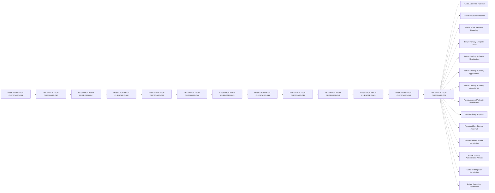

# RESEARCH-TECH-CLIPBOARD-051 — Privacy Notice Drafting Authorization Artifact Creation Control Specification

## Document Control

| Field | Value |
| --- | --- |
| Document ID | RESEARCH-TECH-CLIPBOARD-051 |
| Status | Draft |
| Parent Document | RESEARCH-TECH-CLIPBOARD-050 |
| Document Type | Privacy Notice Drafting Authorization Artifact Creation Control Specification |
| Artifact Creation Control Conclusion | Not ready to create actual Privacy Notice Drafting Authorization Artifact |
| Scope | Documentary controls for a future artifact-creation decision only |
| Actual Drafting Authorization Artifact | Not created |

## Purpose and Boundary

This document defines the documentary source, artifact schema, authority, placeholder, privacy, approval, creation-permission, validation, stop-condition, and prohibited-transition controls that would be required before a future Privacy Notice Drafting Authorization Artifact could be created.

This document does not create or approve an actual Drafting Authorization Artifact, create a Drafting Instruction, provide Drafting Start Permission, begin Privacy Notice drafting, or provide any actual person, privacy, or operational value.

The control result `Yes` means only that the documentary control row is defined and reviewed. It does not mean Artifact Creation Readiness, Artifact Schema Approval, Artifact Creation Permission, authorization, approval, submission, collection authorization, or execution permission.

## 1. Traceability

The controlled documentary traceability chain is:

`039 → 040 → 041 → 042 → 043 → 044 → 045 → 046 → 047 → 048 → 049 → 050 → 051`

RESEARCH-TECH-CLIPBOARD-050 is the direct Parent.

The Parent closure review is a documentary reference only. Parent Review result=Yes does not represent Artifact Creation Readiness, and Parent completion does not provide Artifact Creation Permission.

## 2. Artifact Creation Controls

The following 18 controls define the future conditions for artifact creation without supplying actual values.

| Control ID | Controlled subject | Parent documentary source | Current state | Required future state | Allowed documentary input | Prohibited actual value | Creation blocker | Creation readiness | Automatic creation permitted | Reason |
| --- | --- | --- | --- | --- | --- | --- | --- | --- | --- | --- |
| CLIP-D1-ARTCREATE-CONTROL-001 | Parent authorization prerequisite closure review is present | RESEARCH-TECH-CLIPBOARD-050 | Present as documentary reference | Parent review retained as traceable source | Parent review reference only | Actual authorization value | Blocking | Not ready | No | Parent review cannot create the artifact |
| CLIP-D1-ARTCREATE-CONTROL-002 | Parent closure conclusion remains Not ready | RESEARCH-TECH-CLIPBOARD-050 | Not ready | Closure conclusion remains Not ready until future authority decision | Parent conclusion text only | Ready or authorized state | Blocking | Not ready | No | A Not ready conclusion prevents creation |
| CLIP-D1-ARTCREATE-CONTROL-003 | Approved purpose remains unresolved | RESEARCH-TECH-CLIPBOARD-050 | Unresolved | Future purpose approved by an identified authority | Future placeholder reference only | Actual purpose | Blocking | Not ready | No | No actual purpose is supplied |
| CLIP-D1-ARTCREATE-CONTROL-004 | Input classification remains unresolved | RESEARCH-TECH-CLIPBOARD-050 | Unresolved | Future classification reviewed and accepted | Documentary classification reference only | Actual input classification | Blocking | Not ready | No | No actual input value is supplied |
| CLIP-D1-ARTCREATE-CONTROL-005 | Privacy access boundary remains unresolved | RESEARCH-TECH-CLIPBOARD-050 | Unresolved | Future access boundary reviewed and accepted | Documentary boundary reference only | Actual access holder or account | Blocking | Not ready | No | No actual access value is supplied |
| CLIP-D1-ARTCREATE-CONTROL-006 | Retention and deletion boundary remains unresolved | RESEARCH-TECH-CLIPBOARD-050 | Unresolved | Future lifecycle boundary reviewed and accepted | Documentary lifecycle reference only | Actual retention period | Blocking | Not ready | No | No actual lifecycle value is supplied |
| CLIP-D1-ARTCREATE-CONTROL-007 | Correction process remains unresolved | RESEARCH-TECH-CLIPBOARD-050 | Unresolved | Future correction process reviewed and accepted | Documentary process reference only | Actual correction process value | Blocking | Not ready | No | No actual process is supplied |
| CLIP-D1-ARTCREATE-CONTROL-008 | Withdrawal or replacement process remains unresolved | RESEARCH-TECH-CLIPBOARD-050 | Unresolved | Future process reviewed and accepted | Documentary process reference only | Actual withdrawal or replacement value | Blocking | Not ready | No | No actual process is supplied |
| CLIP-D1-ARTCREATE-CONTROL-009 | Drafting Authority remains not identified | RESEARCH-TECH-CLIPBOARD-050 | Not identified | Future authority identified through governance | Authority reference only | Actual authority holder | Blocking | Not ready | No | This document cannot identify a person |
| CLIP-D1-ARTCREATE-CONTROL-010 | Drafting Authority Appointment remains not performed | RESEARCH-TECH-CLIPBOARD-050 | Not performed | Future appointment recorded and reviewable | Appointment record reference only | Actual appointment | Blocking | Not ready | No | This document cannot appoint an authority |
| CLIP-D1-ARTCREATE-CONTROL-011 | Drafting Authority Acceptance remains not collected | RESEARCH-TECH-CLIPBOARD-050 | Not collected | Future acceptance recorded through governance | Acceptance record reference only | Actual acceptance | Blocking | Not ready | No | This document collects no acceptance |
| CLIP-D1-ARTCREATE-CONTROL-012 | Approval Authority remains not identified | RESEARCH-TECH-CLIPBOARD-050 | Not identified | Future authority identified through governance | Authority reference only | Actual approval holder | Blocking | Not ready | No | This document cannot identify a person |
| CLIP-D1-ARTCREATE-CONTROL-013 | Privacy and data-minimization approval remains not provided | RESEARCH-TECH-CLIPBOARD-050 | Not provided | Future approval recorded and reviewable | Approval reference only | Actual approval | Blocking | Not ready | No | Documentary control is not approval |
| CLIP-D1-ARTCREATE-CONTROL-014 | Artifact schema remains documentary only | RESEARCH-TECH-CLIPBOARD-051 | Documentary schema only | Future schema approved by an identified authority | Schema field definitions only | Actual artifact identifier or value | Blocking | Not ready | No | Schema definition cannot create an artifact |
| CLIP-D1-ARTCREATE-CONTROL-015 | Drafting Authorization Artifact remains not created | RESEARCH-TECH-CLIPBOARD-050 | Not created | Future artifact creation explicitly permitted | Artifact state reference only | Actual artifact | Blocking | Not ready | No | No artifact is created here |
| CLIP-D1-ARTCREATE-CONTROL-016 | Drafting Authorization Approval remains not provided | RESEARCH-TECH-CLIPBOARD-050 | Not provided | Future approval recorded separately | Approval state reference only | Actual approval | Blocking | Not ready | No | Artifact creation and approval are separate |
| CLIP-D1-ARTCREATE-CONTROL-017 | Drafting Instruction remains not created | RESEARCH-TECH-CLIPBOARD-050 | Not created | Future instruction created after separate approval | Instruction state reference only | Actual instruction | Blocking | Not ready | No | Artifact controls do not create instructions |
| CLIP-D1-ARTCREATE-CONTROL-018 | Drafting Start Permission remains No | RESEARCH-TECH-CLIPBOARD-050 | No | Future permission explicitly provided after all gates pass | Permission dependency reference only | Actual permission | Blocking | Not ready | No | No start permission is implied |

## 3. Artifact Content Schema Controls

Schema rows define field boundaries and future sources only. They do not constitute an actual Drafting Authorization Artifact.

| Schema Control ID | Artifact field | Allowed schema definition | Parent source | Current value | Actual value permitted | Source authority | Schema approval | Creation readiness | Failure response |
| --- | --- | --- | --- | --- | --- | --- | --- | --- | --- |
| CLIP-D1-ARTCREATE-SCHEMA-001 | Artifact Identifier | Future identifier reference field only | Parent closure review | Not provided | No | Not identified | Not provided | Not ready | Stop and reject actual value |
| CLIP-D1-ARTCREATE-SCHEMA-002 | Parent Closure Review Reference | Documentary parent reference field only | RESEARCH-TECH-CLIPBOARD-050 | Not provided | No | Not identified | Not provided | Not ready | Stop and reject actual value |
| CLIP-D1-ARTCREATE-SCHEMA-003 | Authorized Drafting Scope | Future scope reference field only | Future governance record | Not provided | No | Not identified | Not provided | Not ready | Stop and reject actual value |
| CLIP-D1-ARTCREATE-SCHEMA-004 | Approved Purpose Reference | Future purpose reference field only | Future governance record | Not provided | No | Not identified | Not provided | Not ready | Stop and reject actual value |
| CLIP-D1-ARTCREATE-SCHEMA-005 | Input Classification Reference | Future classification reference field only | Future governance record | Not provided | No | Not identified | Not provided | Not ready | Stop and reject actual value |
| CLIP-D1-ARTCREATE-SCHEMA-006 | Privacy Access Boundary Reference | Future boundary reference field only | Future governance record | Not provided | No | Not identified | Not provided | Not ready | Stop and reject actual value |
| CLIP-D1-ARTCREATE-SCHEMA-007 | Retention and Deletion Reference | Future lifecycle reference field only | Future governance record | Not provided | No | Not identified | Not provided | Not ready | Stop and reject actual value |
| CLIP-D1-ARTCREATE-SCHEMA-008 | Correction and Withdrawal Process Reference | Future process reference field only | Future governance record | Not provided | No | Not identified | Not provided | Not ready | Stop and reject actual value |
| CLIP-D1-ARTCREATE-SCHEMA-009 | Drafting Authority Governance Reference | Future governance reference field only | Future governance record | Not provided | No | Not identified | Not provided | Not ready | Stop and reject actual value |
| CLIP-D1-ARTCREATE-SCHEMA-010 | Approval Authority Governance Reference | Future governance reference field only | Future governance record | Not provided | No | Not identified | Not provided | Not ready | Stop and reject actual value |
| CLIP-D1-ARTCREATE-SCHEMA-011 | Privacy and Data-minimization Approval Reference | Future approval reference field only | Future approval record | Not provided | No | Not identified | Not provided | Not ready | Stop and reject actual value |
| CLIP-D1-ARTCREATE-SCHEMA-012 | Drafting Start Permission Dependency | Future permission dependency field only | Future start-permission record | Not provided | No | Not identified | Not provided | Not ready | Stop and reject actual value |

Parent references must not be directly converted into artifact field values.

## 4. Artifact Creation Gate

Each gate row maps one-to-one to one of the 18 creation controls.

| Gate ID | Control ID | Gate condition | Current state | Required future state | Gate effect | Current conclusion | Artifact creation permitted |
| --- | --- | --- | --- | --- | --- | --- | --- |
| CLIP-D1-ARTCREATE-GATE-001 | CLIP-D1-ARTCREATE-CONTROL-001 | Parent closure review is present | Present as reference | Documentary source verified | Blocks artifact creation | Not ready | No |
| CLIP-D1-ARTCREATE-GATE-002 | CLIP-D1-ARTCREATE-CONTROL-002 | Parent closure conclusion remains Not ready | Not ready | Conclusion remains Not ready until future decision | Blocks artifact creation | Not ready | No |
| CLIP-D1-ARTCREATE-GATE-003 | CLIP-D1-ARTCREATE-CONTROL-003 | Approved purpose remains unresolved | Unresolved | Future approved purpose recorded | Blocks artifact creation | Not ready | No |
| CLIP-D1-ARTCREATE-GATE-004 | CLIP-D1-ARTCREATE-CONTROL-004 | Input classification remains unresolved | Unresolved | Future classification recorded | Blocks artifact creation | Not ready | No |
| CLIP-D1-ARTCREATE-GATE-005 | CLIP-D1-ARTCREATE-CONTROL-005 | Privacy access boundary remains unresolved | Unresolved | Future boundary recorded | Blocks artifact creation | Not ready | No |
| CLIP-D1-ARTCREATE-GATE-006 | CLIP-D1-ARTCREATE-CONTROL-006 | Retention and deletion boundary remains unresolved | Unresolved | Future lifecycle boundary recorded | Blocks artifact creation | Not ready | No |
| CLIP-D1-ARTCREATE-GATE-007 | CLIP-D1-ARTCREATE-CONTROL-007 | Correction process remains unresolved | Unresolved | Future process recorded | Blocks artifact creation | Not ready | No |
| CLIP-D1-ARTCREATE-GATE-008 | CLIP-D1-ARTCREATE-CONTROL-008 | Withdrawal or replacement process remains unresolved | Unresolved | Future process recorded | Blocks artifact creation | Not ready | No |
| CLIP-D1-ARTCREATE-GATE-009 | CLIP-D1-ARTCREATE-CONTROL-009 | Drafting Authority remains not identified | Not identified | Future identification recorded | Blocks artifact creation | Not ready | No |
| CLIP-D1-ARTCREATE-GATE-010 | CLIP-D1-ARTCREATE-CONTROL-010 | Drafting Authority Appointment remains not performed | Not performed | Future appointment recorded | Blocks artifact creation | Not ready | No |
| CLIP-D1-ARTCREATE-GATE-011 | CLIP-D1-ARTCREATE-CONTROL-011 | Drafting Authority Acceptance remains not collected | Not collected | Future acceptance recorded | Blocks artifact creation | Not ready | No |
| CLIP-D1-ARTCREATE-GATE-012 | CLIP-D1-ARTCREATE-CONTROL-012 | Approval Authority remains not identified | Not identified | Future identification recorded | Blocks artifact creation | Not ready | No |
| CLIP-D1-ARTCREATE-GATE-013 | CLIP-D1-ARTCREATE-CONTROL-013 | Privacy and data-minimization approval remains not provided | Not provided | Future approval recorded | Blocks artifact creation | Not ready | No |
| CLIP-D1-ARTCREATE-GATE-014 | CLIP-D1-ARTCREATE-CONTROL-014 | Artifact schema remains documentary only | Documentary only | Future schema approved separately | Blocks artifact creation | Not ready | No |
| CLIP-D1-ARTCREATE-GATE-015 | CLIP-D1-ARTCREATE-CONTROL-015 | Drafting Authorization Artifact remains not created | Not created | Future creation explicitly permitted | Blocks artifact creation | Not ready | No |
| CLIP-D1-ARTCREATE-GATE-016 | CLIP-D1-ARTCREATE-CONTROL-016 | Drafting Authorization Approval remains not provided | Not provided | Future approval recorded | Blocks artifact creation | Not ready | No |
| CLIP-D1-ARTCREATE-GATE-017 | CLIP-D1-ARTCREATE-CONTROL-017 | Drafting Instruction remains not created | Not created | Future instruction handled separately | Blocks artifact creation | Not ready | No |
| CLIP-D1-ARTCREATE-GATE-018 | CLIP-D1-ARTCREATE-CONTROL-018 | Drafting Start Permission remains No | No | Future permission recorded separately | Blocks artifact creation | Not ready | No |

**Overall gate conclusion:** Not ready to create actual Privacy Notice Drafting Authorization Artifact.

## 5. Artifact Creation Permission State

| Artifact or permission | Required current state |
| --- | --- |
| Artifact Schema Approval | Not provided |
| Artifact Creation Permission | No |
| Drafting Authorization Artifact | Not created |
| Drafting Authorization Approval | Not provided |
| Drafting Instruction | Not created |
| Drafting Start Permission | No |
| Privacy Notice Draft | Not created |
| Privacy Notice Artifact | Not created |

The following boundaries are explicit:

- Schema completeness ≠ Artifact Schema Approval
- Artifact Schema Approval ≠ Artifact Creation Permission
- Artifact Creation Permission ≠ Drafting Authorization Artifact
- Drafting Authorization Artifact ≠ Drafting Authorization Approval
- Drafting Authorization Approval ≠ Drafting Instruction
- Drafting Instruction ≠ Drafting Start Permission
- Drafting Start Permission ≠ Privacy Notice Draft

## 6. Authority and Fixed Role State

### 6.1 Authority States

| Authority state | Current state |
| --- | --- |
| Drafting Authority | Not identified |
| Drafting Authority Appointment | Not performed |
| Drafting Authority Acceptance | Not collected |
| Approval Authority | Not identified |
| Notice Recipient | Not identified |

No actual Authority data is identified, contacted, appointed, or collected.

### 6.2 Fixed Roles

| Role | Actual Holder | Appointment | Acceptance | Authorization implication |
| --- | --- | --- | --- | --- |
| Request Preparer | Not identified | Not performed | Not collected | None |
| Technical Scope Reviewer | Not identified | Not performed | Not collected | None |
| Decision Authority | Not identified | Not performed | Not collected | None |
| Execution Operator | Not identified | Not performed | Not collected | None |
| Observation and Evidence Custodian | Not identified | Not performed | Not collected | None |

Fixed roles must not be automatically converted into Drafting Authority or Approval Authority.

## 7. Parent Reference Controls

| Parent reference set | Required count | Reference use | Actual value | Creation implication | Authorization implication | Review result |
| --- | --- | --- | --- | --- | --- | --- |
| Authorization prerequisite reviews | 16 | Documentary only | Not provided | None | None | Yes |
| Authorization gate reviews | 16 | Documentary only | Not provided | None | None | Yes |
| Artifact-state reviews | 6 | Documentary only | Not provided | None | None | Yes |
| Authority-state reviews | 5 | Documentary only | Not provided | None | None | Yes |
| Unresolved-value ledger reviews | 18 | Documentary only | Not provided | None | None | Yes |

Parent references must not be directly converted into artifact field values.

## 8. Placeholder Creation Boundary

| Placeholder ID | Placeholder | Applicable artifact field | Current state | Actual value permitted | Replacement authority | Replacement approval | Artifact creation use | Failure response |
| --- | --- | --- | --- | --- | --- | --- | --- | --- |
| CLIP-D1-ARTCREATE-PLACEHOLDER-001 | `<FUTURE_AUTH_ARTIFACT_ID>` | Artifact Identifier | Unresolved | No | Not identified | Not provided | Not permitted | Stop and reject actual value |
| CLIP-D1-ARTCREATE-PLACEHOLDER-002 | `<FUTURE_APPROVED_PURPOSE_REFERENCE>` | Approved Purpose Reference | Unresolved | No | Not identified | Not provided | Not permitted | Stop and reject actual value |
| CLIP-D1-ARTCREATE-PLACEHOLDER-003 | `<FUTURE_INPUT_CLASSIFICATION_REFERENCE>` | Input Classification Reference | Unresolved | No | Not identified | Not provided | Not permitted | Stop and reject actual value |
| CLIP-D1-ARTCREATE-PLACEHOLDER-004 | `<FUTURE_ACCESS_BOUNDARY_REFERENCE>` | Privacy Access Boundary Reference | Unresolved | No | Not identified | Not provided | Not permitted | Stop and reject actual value |
| CLIP-D1-ARTCREATE-PLACEHOLDER-005 | `<FUTURE_LIFECYCLE_REFERENCE>` | Retention and Deletion Reference | Unresolved | No | Not identified | Not provided | Not permitted | Stop and reject actual value |
| CLIP-D1-ARTCREATE-PLACEHOLDER-006 | `<FUTURE_DRAFTING_AUTHORITY_REFERENCE>` | Drafting Authority Governance Reference | Unresolved | No | Not identified | Not provided | Not permitted | Stop and reject actual value |
| CLIP-D1-ARTCREATE-PLACEHOLDER-007 | `<FUTURE_APPROVAL_AUTHORITY_REFERENCE>` | Approval Authority Governance Reference | Unresolved | No | Not identified | Not provided | Not permitted | Stop and reject actual value |
| CLIP-D1-ARTCREATE-PLACEHOLDER-008 | `<FUTURE_PRIVACY_APPROVAL_REFERENCE>` | Privacy and Data-minimization Approval Reference | Unresolved | No | Not identified | Not provided | Not permitted | Stop and reject actual value |

Placeholder presence does not satisfy an Artifact Creation Gate.

## 9. Explicit Exclusions

| Exclusion ID | Exclusion category | Required state | Artifact input permitted | Placeholder conversion permitted | Example/test-data conversion permitted | Review result | Failure response |
| --- | --- | --- | --- | --- | --- | --- | --- |
| CLIP-D1-ARTCREATE-EX-001 | Actual name | Absent | No | No | No | Yes | Stop and reject |
| CLIP-D1-ARTCREATE-EX-002 | Email address | Absent | No | No | No | Yes | Stop and reject |
| CLIP-D1-ARTCREATE-EX-003 | Department | Absent | No | No | No | Yes | Stop and reject |
| CLIP-D1-ARTCREATE-EX-004 | Job title | Absent | No | No | No | Yes | Stop and reject |
| CLIP-D1-ARTCREATE-EX-005 | Account | Absent | No | No | No | Yes | Stop and reject |
| CLIP-D1-ARTCREATE-EX-006 | SID | Absent | No | No | No | Yes | Stop and reject |
| CLIP-D1-ARTCREATE-EX-007 | Computer name | Absent | No | No | No | Yes | Stop and reject |
| CLIP-D1-ARTCREATE-EX-008 | Credential | Absent | No | No | No | Yes | Stop and reject |
| CLIP-D1-ARTCREATE-EX-009 | Token | Absent | No | No | No | Yes | Stop and reject |
| CLIP-D1-ARTCREATE-EX-010 | Private key | Absent | No | No | No | Yes | Stop and reject |
| CLIP-D1-ARTCREATE-EX-011 | Clipboard content | Absent | No | No | No | Yes | Stop and reject |
| CLIP-D1-ARTCREATE-EX-012 | Screenshot content | Absent | No | No | No | Yes | Stop and reject |
| CLIP-D1-ARTCREATE-EX-013 | Desktop content | Absent | No | No | No | Yes | Stop and reject |
| CLIP-D1-ARTCREATE-EX-014 | Operational Observation | Absent | No | No | No | Yes | Stop and do not persist |
| CLIP-D1-ARTCREATE-EX-015 | Persistent Evidence | Absent | No | No | No | Yes | Stop and do not persist |

An exclusion category must not be converted into a schema sample, mock value, or test content.

## 10. Separation Rules

| Separation ID | Separation rule | Current state | Automatic transition |
| --- | --- | --- | --- |
| CLIP-D1-ARTCREATE-SEP-001 | Artifact Creation Control Specification ≠ Drafting Authorization Artifact | Documentarily satisfied | Prohibited |
| CLIP-D1-ARTCREATE-SEP-002 | Control Conformance ≠ Artifact Creation Readiness | Documentarily satisfied | Prohibited |
| CLIP-D1-ARTCREATE-SEP-003 | Schema Completeness ≠ Artifact Schema Approval | Documentarily satisfied | Prohibited |
| CLIP-D1-ARTCREATE-SEP-004 | Parent Closure Review ≠ Artifact Creation Permission | Documentarily satisfied | Prohibited |
| CLIP-D1-ARTCREATE-SEP-005 | Artifact Schema Approval ≠ Artifact Creation Permission | Documentarily satisfied | Prohibited |
| CLIP-D1-ARTCREATE-SEP-006 | Artifact Creation Permission ≠ Drafting Authorization Artifact | Documentarily satisfied | Prohibited |
| CLIP-D1-ARTCREATE-SEP-007 | Placeholder Definition ≠ Actual Value | Documentarily satisfied | Prohibited |
| CLIP-D1-ARTCREATE-SEP-008 | Drafting Authorization Artifact ≠ Drafting Authorization Approval | Documentarily satisfied | Prohibited |
| CLIP-D1-ARTCREATE-SEP-009 | Drafting Authorization Approval ≠ Drafting Instruction | Documentarily satisfied | Prohibited |
| CLIP-D1-ARTCREATE-SEP-010 | Drafting Instruction ≠ Drafting Start Permission | Documentarily satisfied | Prohibited |
| CLIP-D1-ARTCREATE-SEP-011 | Drafting Start Permission ≠ Privacy Notice Draft | Documentarily satisfied | Prohibited |
| CLIP-D1-ARTCREATE-SEP-012 | Privacy Notice Draft ≠ Privacy Notice Artifact | Documentarily satisfied | Prohibited |
| CLIP-D1-ARTCREATE-SEP-013 | Privacy Notice Artifact ≠ Artifact Approval | Documentarily satisfied | Prohibited |
| CLIP-D1-ARTCREATE-SEP-014 | Artifact Approval ≠ Notice Delivery | Documentarily satisfied | Prohibited |
| CLIP-D1-ARTCREATE-SEP-015 | Privacy Notice Artifact ≠ Submission Instruction | Documentarily satisfied | Prohibited |
| CLIP-D1-ARTCREATE-SEP-016 | Privacy Notice Artifact ≠ Collection Authorization | Documentarily satisfied | Prohibited |
| CLIP-D1-ARTCREATE-SEP-017 | Human Governance Input ≠ Execution Permission | Documentarily satisfied | Prohibited |

## 11. Validation Rules

| Validation ID | Validation rule | Current evaluation | Failure response |
| --- | --- | --- | --- |
| CLIP-D1-ARTCREATE-VAL-001 | All 18 creation control IDs are complete and unique | Not evaluated | Stop and reject |
| CLIP-D1-ARTCREATE-VAL-002 | All 12 schema control IDs are complete and unique | Not evaluated | Stop and reject |
| CLIP-D1-ARTCREATE-VAL-003 | All 18 creation gate IDs are complete and unique | Not evaluated | Stop and reject |
| CLIP-D1-ARTCREATE-VAL-004 | Every Creation readiness value is Not ready | Not evaluated | Stop and preserve state |
| CLIP-D1-ARTCREATE-VAL-005 | Every Automatic creation permitted value is No | Not evaluated | Stop and reject |
| CLIP-D1-ARTCREATE-VAL-006 | Every Artifact creation permitted value is No | Not evaluated | Stop and reject |
| CLIP-D1-ARTCREATE-VAL-007 | Artifact Schema Approval remains not provided | Not evaluated | Stop and preserve state |
| CLIP-D1-ARTCREATE-VAL-008 | Artifact Creation Permission remains No | Not evaluated | Stop and preserve state |
| CLIP-D1-ARTCREATE-VAL-009 | Drafting Authority remains not identified | Not evaluated | Stop and preserve state |
| CLIP-D1-ARTCREATE-VAL-010 | Drafting Authority Appointment remains not performed | Not evaluated | Stop and preserve state |
| CLIP-D1-ARTCREATE-VAL-011 | Drafting Authority Acceptance remains not collected | Not evaluated | Stop and preserve state |
| CLIP-D1-ARTCREATE-VAL-012 | Approval Authority remains not identified | Not evaluated | Stop and preserve state |
| CLIP-D1-ARTCREATE-VAL-013 | Drafting Authorization Artifact remains not created | Not evaluated | Stop and preserve state |
| CLIP-D1-ARTCREATE-VAL-014 | Drafting Authorization Approval remains not provided | Not evaluated | Stop and preserve state |
| CLIP-D1-ARTCREATE-VAL-015 | Drafting Instruction remains not created | Not evaluated | Stop and preserve state |
| CLIP-D1-ARTCREATE-VAL-016 | Drafting Start Permission remains No | Not evaluated | Stop and preserve state |
| CLIP-D1-ARTCREATE-VAL-017 | Document completion must not imply artifact creation, approval, instruction, drafting, submission, collection authorization, or execution | Not evaluated | Stop and preserve separation |

## 12. Stop Conditions

| Stop ID | Stop condition | Current trigger state | Required response |
| --- | --- | --- | --- |
| CLIP-D1-ARTCREATE-STOP-001 | The document is treated as an actual Drafting Authorization Artifact | Not evaluated | Stop and preserve separation |
| CLIP-D1-ARTCREATE-STOP-002 | Control conformance is treated as Artifact Creation Readiness | Not evaluated | Stop and preserve separation |
| CLIP-D1-ARTCREATE-STOP-003 | Schema completeness is treated as Artifact Schema Approval | Not evaluated | Stop and preserve separation |
| CLIP-D1-ARTCREATE-STOP-004 | Parent closure review is treated as Artifact Creation Permission | Not evaluated | Stop and preserve separation |
| CLIP-D1-ARTCREATE-STOP-005 | Artifact Schema Approval is inferred | Not evaluated | Stop and preserve separation |
| CLIP-D1-ARTCREATE-STOP-006 | Artifact Creation Permission is inferred | Not evaluated | Stop and preserve separation |
| CLIP-D1-ARTCREATE-STOP-007 | Drafting Authority is identified | Not evaluated | Stop and reject |
| CLIP-D1-ARTCREATE-STOP-008 | Drafting Authority Appointment is performed | Not evaluated | Stop and reject |
| CLIP-D1-ARTCREATE-STOP-009 | Drafting Authority Acceptance is collected | Not evaluated | Stop and reject |
| CLIP-D1-ARTCREATE-STOP-010 | Approval Authority is identified | Not evaluated | Stop and reject |
| CLIP-D1-ARTCREATE-STOP-011 | A placeholder is replaced with an actual value | Not evaluated | Stop and reject |
| CLIP-D1-ARTCREATE-STOP-012 | Drafting Authorization Artifact is created | Not evaluated | Stop and preserve separation |
| CLIP-D1-ARTCREATE-STOP-013 | Drafting Authorization Approval is inferred | Not evaluated | Stop and preserve separation |
| CLIP-D1-ARTCREATE-STOP-014 | Drafting Instruction is created | Not evaluated | Stop and preserve separation |
| CLIP-D1-ARTCREATE-STOP-015 | Drafting Start Permission is inferred | Not evaluated | Stop and preserve separation |
| CLIP-D1-ARTCREATE-STOP-016 | Request Submission or Collection Authorization is inferred | Not evaluated | Stop and preserve separation |
| CLIP-D1-ARTCREATE-STOP-017 | Execution Permission does not exist | Not evaluated | Stop; never collect or execute |

## 13. Prohibited Transitions

| Transition ID | Prohibited transition | Rule preserved | Transition performed | Result |
| --- | --- | --- | --- | --- |
| CLIP-D1-ARTCREATE-TRANS-001 | Artifact Creation Control Specification → Drafting Authorization Artifact Created | Yes | No | No |
| CLIP-D1-ARTCREATE-TRANS-002 | Control Conformance → Artifact Creation Readiness | Yes | No | No |
| CLIP-D1-ARTCREATE-TRANS-003 | Schema Completeness → Artifact Schema Approval | Yes | No | No |
| CLIP-D1-ARTCREATE-TRANS-004 | Parent Closure Review → Artifact Creation Permission | Yes | No | No |
| CLIP-D1-ARTCREATE-TRANS-005 | Artifact Creation Readiness → Drafting Authorization Artifact Created | Yes | No | No |
| CLIP-D1-ARTCREATE-TRANS-006 | Drafting Authority Identified → Drafting Authority Appointed | Yes | No | No |
| CLIP-D1-ARTCREATE-TRANS-007 | Drafting Authority Appointed → Drafting Authority Accepted | Yes | No | No |
| CLIP-D1-ARTCREATE-TRANS-008 | Approval Authority Identified → Privacy Approval Provided | Yes | No | No |
| CLIP-D1-ARTCREATE-TRANS-009 | Placeholder Definition → Actual Value Supplied | Yes | No | No |
| CLIP-D1-ARTCREATE-TRANS-010 | Drafting Authorization Artifact Created → Drafting Authorization Approved | Yes | No | No |
| CLIP-D1-ARTCREATE-TRANS-011 | Drafting Authorization Approval → Drafting Instruction Created | Yes | No | No |
| CLIP-D1-ARTCREATE-TRANS-012 | Drafting Instruction → Drafting Start Permission | Yes | No | No |
| CLIP-D1-ARTCREATE-TRANS-013 | Drafting Start Permission → Privacy Notice Draft Created | Yes | No | No |
| CLIP-D1-ARTCREATE-TRANS-014 | Privacy Notice Draft → Privacy Notice Artifact Created | Yes | No | No |
| CLIP-D1-ARTCREATE-TRANS-015 | Privacy Notice Artifact → Submission Instruction | Yes | No | No |
| CLIP-D1-ARTCREATE-TRANS-016 | Privacy Notice Artifact → Request Submitted | Yes | No | No |
| CLIP-D1-ARTCREATE-TRANS-017 | Privacy Notice Artifact → Collection Authorized | Yes | No | No |
| CLIP-D1-ARTCREATE-TRANS-018 | Human Input → Execution Permission | Yes | No | No |

## 14. Unresolved-value Ledger

The following 20 values are unique unresolved future values. No actual value is supplied.

| Ledger ID | Unresolved future value | Current state | Actual value | Resolution authority | Creation implication | Authorization implication |
| --- | --- | --- | --- | --- | --- | --- |
| CLIP-D1-ARTCREATE-LEDGER-001 | Approved purpose | Unresolved | Not provided | Not identified | None | None |
| CLIP-D1-ARTCREATE-LEDGER-002 | Input classification | Unresolved | Not provided | Not identified | None | None |
| CLIP-D1-ARTCREATE-LEDGER-003 | Access boundary | Unresolved | Not provided | Not identified | None | None |
| CLIP-D1-ARTCREATE-LEDGER-004 | Retention and deletion boundary | Unresolved | Not provided | Not identified | None | None |
| CLIP-D1-ARTCREATE-LEDGER-005 | Correction process | Unresolved | Not provided | Not identified | None | None |
| CLIP-D1-ARTCREATE-LEDGER-006 | Withdrawal or replacement process | Unresolved | Not provided | Not identified | None | None |
| CLIP-D1-ARTCREATE-LEDGER-007 | Drafting Authority | Not identified | Not provided | Not identified | None | None |
| CLIP-D1-ARTCREATE-LEDGER-008 | Drafting Authority Appointment | Not performed | Not provided | Not identified | None | None |
| CLIP-D1-ARTCREATE-LEDGER-009 | Drafting Authority Acceptance | Not collected | Not provided | Not identified | None | None |
| CLIP-D1-ARTCREATE-LEDGER-010 | Approval Authority | Not identified | Not provided | Not identified | None | None |
| CLIP-D1-ARTCREATE-LEDGER-011 | Privacy and data-minimization approval | Not provided | Not provided | Not identified | None | None |
| CLIP-D1-ARTCREATE-LEDGER-012 | Artifact schema definition | Unresolved | Not provided | Not identified | None | None |
| CLIP-D1-ARTCREATE-LEDGER-013 | Artifact Schema Approval | Not provided | Not provided | Not identified | None | None |
| CLIP-D1-ARTCREATE-LEDGER-014 | Artifact Creation Permission | No | Not provided | Not identified | None | None |
| CLIP-D1-ARTCREATE-LEDGER-015 | Drafting Authorization Artifact | Not created | Not provided | Not identified | None | None |
| CLIP-D1-ARTCREATE-LEDGER-016 | Drafting Authorization Approval | Not provided | Not provided | Not identified | None | None |
| CLIP-D1-ARTCREATE-LEDGER-017 | Drafting Instruction | Not created | Not provided | Not identified | None | None |
| CLIP-D1-ARTCREATE-LEDGER-018 | Drafting Start Permission | No | Not provided | Not identified | None | None |
| CLIP-D1-ARTCREATE-LEDGER-019 | Privacy Notice Draft | Not created | Not provided | Not identified | None | None |
| CLIP-D1-ARTCREATE-LEDGER-020 | Execution Permission | Not provided | Not provided | Not identified | None | None |

Ledger controls:

- Ledger rows: 20
- Unique values: 20
- Drafting Authority rows: 1
- Approval Authority rows: 1
- Artifact Schema Approval rows: 1
- Artifact Creation Permission rows: 1

## 15. Submission, Authorization, and Execution Separation

| Stage ID | Stage | Current state | Automatic transition prohibited | Review result |
| --- | --- | --- | --- | --- |
| CLIP-D1-ARTCREATE-STAGE-001 | Artifact creation control specification | Not executed | Yes | Yes |
| CLIP-D1-ARTCREATE-STAGE-002 | Artifact schema definition | Not executed | Yes | Yes |
| CLIP-D1-ARTCREATE-STAGE-003 | Artifact Schema Approval | Not provided | Yes | Yes |
| CLIP-D1-ARTCREATE-STAGE-004 | Artifact Creation Permission | No | Yes | Yes |
| CLIP-D1-ARTCREATE-STAGE-005 | Drafting Authorization Artifact | Not created | Yes | Yes |
| CLIP-D1-ARTCREATE-STAGE-006 | Drafting Authorization Approval | Not provided | Yes | Yes |
| CLIP-D1-ARTCREATE-STAGE-007 | Drafting Instruction | Not created | Yes | Yes |
| CLIP-D1-ARTCREATE-STAGE-008 | Drafting Start Permission | No | Yes | Yes |
| CLIP-D1-ARTCREATE-STAGE-009 | Privacy Notice Draft | Not created | Yes | Yes |
| CLIP-D1-ARTCREATE-STAGE-010 | Privacy Notice Artifact | Not created | Yes | Yes |
| CLIP-D1-ARTCREATE-STAGE-011 | Privacy Notice Approval | Not provided | Yes | Yes |
| CLIP-D1-ARTCREATE-STAGE-012 | Notice Delivery | Not performed | Yes | Yes |
| CLIP-D1-ARTCREATE-STAGE-013 | Request Submission | No | Yes | Yes |
| CLIP-D1-ARTCREATE-STAGE-014 | Collection Authorization | Not provided | Yes | Yes |
| CLIP-D1-ARTCREATE-STAGE-015 | Collection-start Permission | No | Yes | Yes |
| CLIP-D1-ARTCREATE-STAGE-016 | Human Input Collection | Not collected | Yes | Yes |
| CLIP-D1-ARTCREATE-STAGE-017 | Execution Permission | Not provided | Yes | Yes |

## 16. Completeness Matrix

| Coverage area | Result | Boundary note |
| --- | --- | --- |
| Traceability | Yes | 039 through 051 chain is recorded |
| Artifact creation controls | Yes | 18 creation controls are defined |
| Artifact content schema controls | Yes | 12 schema controls are defined |
| Artifact creation gate | Yes | 18 gate rows map to creation controls |
| Artifact creation permission states | Yes | Permission and artifact states remain blocked |
| Authority states | Yes | Five authority states remain unresolved |
| Fixed roles | Yes | Five fixed role states have no actual holders |
| Parent references | Yes | Five reference sets remain documentary only |
| Placeholder creation boundary | Yes | Eight placeholders remain unresolved |
| Explicit exclusions | Yes | Fifteen exclusion categories remain excluded |
| Separation rules | Yes | Seventeen automatic transitions are prohibited |
| Validation rules | Yes | Seventeen validation rules remain not evaluated |
| Stop conditions | Yes | Seventeen stop conditions remain not evaluated |
| Prohibited transitions | Yes | Eighteen transitions remain Yes/No/No |
| Unresolved-value ledger | Yes | Twenty unique future values remain unresolved |
| Submission/Authorization/Execution separation | Yes | Seventeen stages remain unexecuted |
| Overall artifact creation control specification | Yes | Conclusion remains Not ready |

The Result column uses only `Yes`, `Partially`, or `No`.

## 17. Mermaid Traceability

The diagram contains no operational solid transition.

## 18. Required Safety State

| Safety state | Required current state |
| --- | --- |
| Artifact Creation Control Conclusion | Not ready to create actual Privacy Notice Drafting Authorization Artifact |
| Artifact Schema Approval | Not provided |
| Artifact Creation Permission | No |
| Drafting Authority | Not identified |
| Drafting Authority Appointment | Not performed |
| Drafting Authority Acceptance | Not collected |
| Approval Authority | Not identified |
| Drafting Authorization Artifact | Not created |
| Drafting Authorization Approval | Not provided |
| Drafting Instruction | Not created |
| Drafting Start Permission | No |
| Privacy Notice Draft | Not created |
| Privacy Notice Artifact | Not created |
| Privacy Notice Approval | Not provided |
| Privacy Notice Delivery | Not performed |
| Notice Acknowledgement | Not collected |
| Notice Recipient | Not identified |
| Delivery Channel | Not selected |
| Actual Platform | Not identified |
| Request Submitted | No |
| Submission Instruction | Not created |
| Actual Role Holders | Not identified |
| Role Appointment | Not performed |
| Role Acceptance | Not collected |
| Collection Authorization | Not provided |
| Collection-start Permission | No |
| Worksheet Distribution | Not performed |
| Human Governance Input | Not collected |
| Personal Data | Not collected |
| D1 Inspection | Not authorized |
| Execution Permission | Not provided |
| Operational Observation | Not created |
| Persistent Evidence | Not created |

## 19. Prohibited Actions

- Do not create an actual Drafting Authorization Artifact.
- Do not provide Artifact Schema Approval.
- Do not provide Artifact Creation Permission.
- Do not approve a Drafting Authorization Artifact.
- Do not create a Drafting Instruction.
- Do not provide Drafting Start Permission.
- Do not write or create a Privacy Notice Draft or Privacy Notice Artifact.
- Do not identify, contact, appoint, or collect Authority or role-holder data.
- Do not replace a placeholder with an actual value.
- Do not create a Submission Instruction or submit a Request.
- Do not provide Collection Authorization.
- Do not select a Channel or Platform.
- Do not distribute a Worksheet or collect Human Input.
- Do not read Clipboard, Screenshot, or Desktop content.
- Do not create Operational Observation or Persistent Evidence.
- Do not perform D1 Inspection, coding, Build, Test, or Run.
- Do not modify any existing document.

## 20. Mechanical Final Status

| Check | Required status |
| --- | --- |
| Document ID | RESEARCH-TECH-CLIPBOARD-051 |
| Status | Draft |
| Parent | RESEARCH-TECH-CLIPBOARD-050 |
| Artifact creation controls | 18 |
| Creation readiness=Not ready | 18/18 |
| Automatic creation permitted=No | 18/18 |
| Artifact schema controls | 12 |
| Actual value permitted=No | 12/12 |
| Artifact creation gate rows | 18 |
| Artifact creation permitted=No | 18/18 |
| Authority states | 5 |
| Fixed roles | 5 |
| Parent reference sets | 5 |
| Parent reference counts | 16 / 16 / 6 / 5 / 18 |
| Placeholder rows | 8 |
| Explicit exclusions | 15 |
| Separation rules | 17 |
| Validation rules | 17 |
| Stop conditions | 17 |
| Prohibited transitions | 18 |
| Transition Yes/No/No | 18/18 |
| Ledger rows | 20 |
| Unique ledger values | 20 |
| Stage separation rows | 17 |
| Completeness Matrix rows | 17 |
| Completeness Matrix values | Yes / Partially / No only |
| Artifact Creation Control Conclusion | Not ready to create actual Privacy Notice Drafting Authorization Artifact |
| Mermaid solid chain | 039 → 040 → 041 → 042 → 043 → 044 → 045 → 046 → 047 → 048 → 049 → 050 → 051 |
| Mermaid Future dashed links | 14 |

This specification remains documentary only. It does not create an artifact and does not permit drafting, collection, inspection, or execution.
