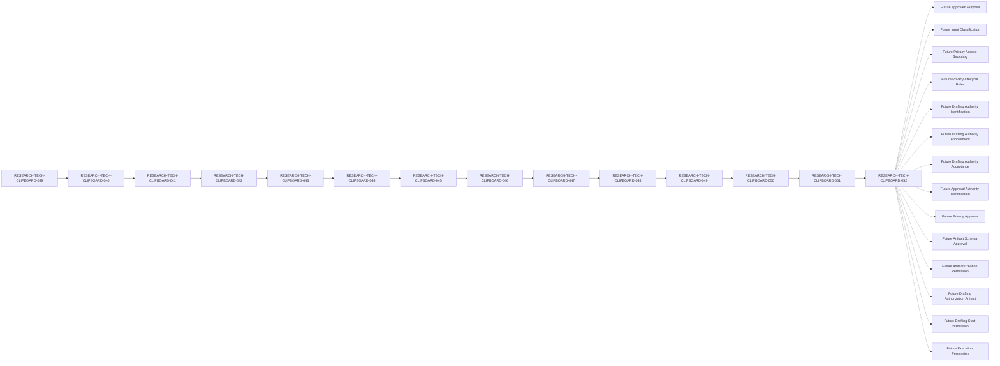

# RESEARCH-TECH-CLIPBOARD-052 — Privacy Notice Drafting Authorization Artifact Creation Control Closure Review Specification

## Document Control

| Field | Value |
| --- | --- |
| Document ID | RESEARCH-TECH-CLIPBOARD-052 |
| Status | Draft |
| Parent Document | RESEARCH-TECH-CLIPBOARD-051 |
| Document Type | Privacy Notice Drafting Authorization Artifact Creation Control Closure Review Specification |
| Closure Review Conclusion | Not ready to authorize creation of actual Privacy Notice Drafting Authorization Artifact |
| Scope | Documentary closure review only |
| Actual Drafting Authorization Artifact | Not created |

## Purpose and Boundary

This document reviews the Artifact Creation Controls, Artifact Content Schema Controls, Artifact Creation Gate, Artifact Creation Permission State, Authority and Fixed Role State, Parent References, Placeholder Boundary, Exclusions, Ledger, Stage Separation, and safety state defined by RESEARCH-TECH-CLIPBOARD-051.

This document performs a documentary closure review only. It does not create or approve a Drafting Authorization Artifact, provide Artifact Schema Approval, provide Artifact Creation Permission, create a Drafting Instruction, provide Drafting Start Permission, begin Privacy Notice drafting, or provide any actual person, privacy, artifact, or operational value.

The review result `Yes` means only that the documentary review row is complete. It does not mean Artifact Creation Readiness, Artifact Schema Approval, Artifact Creation Permission, approval, submission, collection authorization, or execution permission.

## 1. Traceability

The controlled documentary traceability chain is:

`039 → 040 → 041 → 042 → 043 → 044 → 045 → 046 → 047 → 048 → 049 → 050 → 051 → 052`

RESEARCH-TECH-CLIPBOARD-051 is the direct Parent.

Parent control result represents documentary conformance only. Parent completion does not represent Artifact Creation Readiness and does not provide Artifact Schema Approval or Artifact Creation Permission.

## 2. Artifact Creation Control Review

The following 18 rows review the creation controls defined by RESEARCH-TECH-CLIPBOARD-051.

| Review ID | Parent Control ID | Controlled subject | Parent documentary source | Parent current state | Required future state | Parent creation readiness | Automatic creation permitted | Documentary conformance | Review result | Remains blocking | Reason |
| --- | --- | --- | --- | --- | --- | --- | --- | --- | --- | --- | --- |
| CLIP-D1-ARTCREATE-CLOSUREREVIEW-001 | CLIP-D1-ARTCREATE-CONTROL-001 | Parent authorization prerequisite closure review is present | RESEARCH-TECH-CLIPBOARD-051 | Present as documentary reference | Parent reference retained | Not ready | No | Yes | Yes | Yes | Parent review cannot create an artifact |
| CLIP-D1-ARTCREATE-CLOSUREREVIEW-002 | CLIP-D1-ARTCREATE-CONTROL-002 | Parent closure conclusion remains Not ready | RESEARCH-TECH-CLIPBOARD-051 | Not ready | Conclusion remains Not ready until future decision | Not ready | No | Yes | Yes | Yes | Not ready blocks creation |
| CLIP-D1-ARTCREATE-CLOSUREREVIEW-003 | CLIP-D1-ARTCREATE-CONTROL-003 | Approved purpose remains unresolved | RESEARCH-TECH-CLIPBOARD-051 | Unresolved | Future purpose approved separately | Not ready | No | Yes | Yes | Yes | No actual purpose is present |
| CLIP-D1-ARTCREATE-CLOSUREREVIEW-004 | CLIP-D1-ARTCREATE-CONTROL-004 | Input classification remains unresolved | RESEARCH-TECH-CLIPBOARD-051 | Unresolved | Future classification accepted separately | Not ready | No | Yes | Yes | Yes | No actual classification is present |
| CLIP-D1-ARTCREATE-CLOSUREREVIEW-005 | CLIP-D1-ARTCREATE-CONTROL-005 | Privacy access boundary remains unresolved | RESEARCH-TECH-CLIPBOARD-051 | Unresolved | Future boundary accepted separately | Not ready | No | Yes | Yes | Yes | No actual access value is present |
| CLIP-D1-ARTCREATE-CLOSUREREVIEW-006 | CLIP-D1-ARTCREATE-CONTROL-006 | Retention and deletion boundary remains unresolved | RESEARCH-TECH-CLIPBOARD-051 | Unresolved | Future lifecycle boundary accepted separately | Not ready | No | Yes | Yes | Yes | No actual lifecycle value is present |
| CLIP-D1-ARTCREATE-CLOSUREREVIEW-007 | CLIP-D1-ARTCREATE-CONTROL-007 | Correction process remains unresolved | RESEARCH-TECH-CLIPBOARD-051 | Unresolved | Future process accepted separately | Not ready | No | Yes | Yes | Yes | No actual process is present |
| CLIP-D1-ARTCREATE-CLOSUREREVIEW-008 | CLIP-D1-ARTCREATE-CONTROL-008 | Withdrawal or replacement process remains unresolved | RESEARCH-TECH-CLIPBOARD-051 | Unresolved | Future process accepted separately | Not ready | No | Yes | Yes | Yes | No actual process is present |
| CLIP-D1-ARTCREATE-CLOSUREREVIEW-009 | CLIP-D1-ARTCREATE-CONTROL-009 | Drafting Authority remains not identified | RESEARCH-TECH-CLIPBOARD-051 | Not identified | Future authority identification recorded | Not ready | No | Yes | Yes | Yes | This review does not identify a person |
| CLIP-D1-ARTCREATE-CLOSUREREVIEW-010 | CLIP-D1-ARTCREATE-CONTROL-010 | Drafting Authority Appointment remains not performed | RESEARCH-TECH-CLIPBOARD-051 | Not performed | Future appointment recorded | Not ready | No | Yes | Yes | Yes | This review does not appoint an authority |
| CLIP-D1-ARTCREATE-CLOSUREREVIEW-011 | CLIP-D1-ARTCREATE-CONTROL-011 | Drafting Authority Acceptance remains not collected | RESEARCH-TECH-CLIPBOARD-051 | Not collected | Future acceptance recorded | Not ready | No | Yes | Yes | Yes | This review collects no acceptance |
| CLIP-D1-ARTCREATE-CLOSUREREVIEW-012 | CLIP-D1-ARTCREATE-CONTROL-012 | Approval Authority remains not identified | RESEARCH-TECH-CLIPBOARD-051 | Not identified | Future authority identification recorded | Not ready | No | Yes | Yes | Yes | This review does not identify a person |
| CLIP-D1-ARTCREATE-CLOSUREREVIEW-013 | CLIP-D1-ARTCREATE-CONTROL-013 | Privacy and data-minimization approval remains not provided | RESEARCH-TECH-CLIPBOARD-051 | Not provided | Future approval recorded | Not ready | No | Yes | Yes | Yes | Review completion is not approval |
| CLIP-D1-ARTCREATE-CLOSUREREVIEW-014 | CLIP-D1-ARTCREATE-CONTROL-014 | Artifact schema remains documentary only | RESEARCH-TECH-CLIPBOARD-051 | Documentary only | Future schema approved separately | Not ready | No | Yes | Yes | Yes | Schema review cannot create a field value |
| CLIP-D1-ARTCREATE-CLOSUREREVIEW-015 | CLIP-D1-ARTCREATE-CONTROL-015 | Drafting Authorization Artifact remains not created | RESEARCH-TECH-CLIPBOARD-051 | Not created | Future creation explicitly permitted | Not ready | No | Yes | Yes | Yes | No artifact is created here |
| CLIP-D1-ARTCREATE-CLOSUREREVIEW-016 | CLIP-D1-ARTCREATE-CONTROL-016 | Drafting Authorization Approval remains not provided | RESEARCH-TECH-CLIPBOARD-051 | Not provided | Future approval recorded separately | Not ready | No | Yes | Yes | Yes | Review completion is not approval |
| CLIP-D1-ARTCREATE-CLOSUREREVIEW-017 | CLIP-D1-ARTCREATE-CONTROL-017 | Drafting Instruction remains not created | RESEARCH-TECH-CLIPBOARD-051 | Not created | Future instruction handled separately | Not ready | No | Yes | Yes | Yes | Control review does not create instructions |
| CLIP-D1-ARTCREATE-CLOSUREREVIEW-018 | CLIP-D1-ARTCREATE-CONTROL-018 | Drafting Start Permission remains No | RESEARCH-TECH-CLIPBOARD-051 | No | Future permission provided separately | Not ready | No | Yes | Yes | Yes | No start permission is implied |

## 3. Artifact Schema Control Review

Schema review rows define no artifact field value.

| Schema Review ID | Parent Schema Control ID | Artifact field | Allowed schema definition | Parent current value | Actual value permitted | Source authority | Schema approval | Parent creation readiness | Documentary conformance | Review result | Failure response |
| --- | --- | --- | --- | --- | --- | --- | --- | --- | --- | --- | --- |
| CLIP-D1-ARTCREATE-SCHEMAREVIEW-001 | CLIP-D1-ARTCREATE-SCHEMA-001 | Artifact Identifier | Future identifier reference field only | Not provided | No | Not identified | Not provided | Not ready | Yes | Yes | Stop and reject actual value |
| CLIP-D1-ARTCREATE-SCHEMAREVIEW-002 | CLIP-D1-ARTCREATE-SCHEMA-002 | Parent Closure Review Reference | Documentary parent reference field only | Not provided | No | Not identified | Not provided | Not ready | Yes | Yes | Stop and reject actual value |
| CLIP-D1-ARTCREATE-SCHEMAREVIEW-003 | CLIP-D1-ARTCREATE-SCHEMA-003 | Authorized Drafting Scope | Future scope reference field only | Not provided | No | Not identified | Not provided | Not ready | Yes | Yes | Stop and reject actual value |
| CLIP-D1-ARTCREATE-SCHEMAREVIEW-004 | CLIP-D1-ARTCREATE-SCHEMA-004 | Approved Purpose Reference | Future purpose reference field only | Not provided | No | Not identified | Not provided | Not ready | Yes | Yes | Stop and reject actual value |
| CLIP-D1-ARTCREATE-SCHEMAREVIEW-005 | CLIP-D1-ARTCREATE-SCHEMA-005 | Input Classification Reference | Future classification reference field only | Not provided | No | Not identified | Not provided | Not ready | Yes | Yes | Stop and reject actual value |
| CLIP-D1-ARTCREATE-SCHEMAREVIEW-006 | CLIP-D1-ARTCREATE-SCHEMA-006 | Privacy Access Boundary Reference | Future boundary reference field only | Not provided | No | Not identified | Not provided | Not ready | Yes | Yes | Stop and reject actual value |
| CLIP-D1-ARTCREATE-SCHEMAREVIEW-007 | CLIP-D1-ARTCREATE-SCHEMA-007 | Retention and Deletion Reference | Future lifecycle reference field only | Not provided | No | Not identified | Not provided | Not ready | Yes | Yes | Stop and reject actual value |
| CLIP-D1-ARTCREATE-SCHEMAREVIEW-008 | CLIP-D1-ARTCREATE-SCHEMA-008 | Correction and Withdrawal Process Reference | Future process reference field only | Not provided | No | Not identified | Not provided | Not ready | Yes | Yes | Stop and reject actual value |
| CLIP-D1-ARTCREATE-SCHEMAREVIEW-009 | CLIP-D1-ARTCREATE-SCHEMA-009 | Drafting Authority Governance Reference | Future governance reference field only | Not provided | No | Not identified | Not provided | Not ready | Yes | Yes | Stop and reject actual value |
| CLIP-D1-ARTCREATE-SCHEMAREVIEW-010 | CLIP-D1-ARTCREATE-SCHEMA-010 | Approval Authority Governance Reference | Future governance reference field only | Not provided | No | Not identified | Not provided | Not ready | Yes | Yes | Stop and reject actual value |
| CLIP-D1-ARTCREATE-SCHEMAREVIEW-011 | CLIP-D1-ARTCREATE-SCHEMA-011 | Privacy and Data-minimization Approval Reference | Future approval reference field only | Not provided | No | Not identified | Not provided | Not ready | Yes | Yes | Stop and reject actual value |
| CLIP-D1-ARTCREATE-SCHEMAREVIEW-012 | CLIP-D1-ARTCREATE-SCHEMA-012 | Drafting Start Permission Dependency | Future permission dependency field only | Not provided | No | Not identified | Not provided | Not ready | Yes | Yes | Stop and reject actual value |

## 4. Artifact Creation Gate Review

The following 18 rows review the gate rows defined by RESEARCH-TECH-CLIPBOARD-051.

| Gate Review ID | Parent Gate ID | Parent Control ID | Gate condition | Parent current state | Required future state | Gate effect | Parent conclusion | Artifact creation permitted | Review result | Remains blocking | Reason |
| --- | --- | --- | --- | --- | --- | --- | --- | --- | --- | --- | --- |
| CLIP-D1-ARTCREATE-GATEREVIEW-001 | CLIP-D1-ARTCREATE-GATE-001 | CLIP-D1-ARTCREATE-CONTROL-001 | Parent closure review is present | Present as reference | Source verified | Blocks artifact creation | Not ready | No | Yes | Yes | Gate review does not create an artifact |
| CLIP-D1-ARTCREATE-GATEREVIEW-002 | CLIP-D1-ARTCREATE-GATE-002 | CLIP-D1-ARTCREATE-CONTROL-002 | Parent closure conclusion remains Not ready | Not ready | Conclusion remains Not ready | Blocks artifact creation | Not ready | No | Yes | Yes | Not ready remains blocking |
| CLIP-D1-ARTCREATE-GATEREVIEW-003 | CLIP-D1-ARTCREATE-GATE-003 | CLIP-D1-ARTCREATE-CONTROL-003 | Approved purpose remains unresolved | Unresolved | Future purpose approved | Blocks artifact creation | Not ready | No | Yes | Yes | No actual purpose is present |
| CLIP-D1-ARTCREATE-GATEREVIEW-004 | CLIP-D1-ARTCREATE-GATE-004 | CLIP-D1-ARTCREATE-CONTROL-004 | Input classification remains unresolved | Unresolved | Future classification accepted | Blocks artifact creation | Not ready | No | Yes | Yes | No actual classification is present |
| CLIP-D1-ARTCREATE-GATEREVIEW-005 | CLIP-D1-ARTCREATE-GATE-005 | CLIP-D1-ARTCREATE-CONTROL-005 | Privacy access boundary remains unresolved | Unresolved | Future boundary accepted | Blocks artifact creation | Not ready | No | Yes | Yes | No actual boundary is present |
| CLIP-D1-ARTCREATE-GATEREVIEW-006 | CLIP-D1-ARTCREATE-GATE-006 | CLIP-D1-ARTCREATE-CONTROL-006 | Retention and deletion boundary remains unresolved | Unresolved | Future lifecycle boundary accepted | Blocks artifact creation | Not ready | No | Yes | Yes | No actual lifecycle value is present |
| CLIP-D1-ARTCREATE-GATEREVIEW-007 | CLIP-D1-ARTCREATE-GATE-007 | CLIP-D1-ARTCREATE-CONTROL-007 | Correction process remains unresolved | Unresolved | Future process accepted | Blocks artifact creation | Not ready | No | Yes | Yes | No actual process is present |
| CLIP-D1-ARTCREATE-GATEREVIEW-008 | CLIP-D1-ARTCREATE-GATE-008 | CLIP-D1-ARTCREATE-CONTROL-008 | Withdrawal or replacement process remains unresolved | Unresolved | Future process accepted | Blocks artifact creation | Not ready | No | Yes | Yes | No actual process is present |
| CLIP-D1-ARTCREATE-GATEREVIEW-009 | CLIP-D1-ARTCREATE-GATE-009 | CLIP-D1-ARTCREATE-CONTROL-009 | Drafting Authority remains not identified | Not identified | Future identification recorded | Blocks artifact creation | Not ready | No | Yes | Yes | No authority is identified |
| CLIP-D1-ARTCREATE-GATEREVIEW-010 | CLIP-D1-ARTCREATE-GATE-010 | CLIP-D1-ARTCREATE-CONTROL-010 | Drafting Authority Appointment remains not performed | Not performed | Future appointment recorded | Blocks artifact creation | Not ready | No | Yes | Yes | No appointment is performed |
| CLIP-D1-ARTCREATE-GATEREVIEW-011 | CLIP-D1-ARTCREATE-GATE-011 | CLIP-D1-ARTCREATE-CONTROL-011 | Drafting Authority Acceptance remains not collected | Not collected | Future acceptance recorded | Blocks artifact creation | Not ready | No | Yes | Yes | No acceptance is collected |
| CLIP-D1-ARTCREATE-GATEREVIEW-012 | CLIP-D1-ARTCREATE-GATE-012 | CLIP-D1-ARTCREATE-CONTROL-012 | Approval Authority remains not identified | Not identified | Future identification recorded | Blocks artifact creation | Not ready | No | Yes | Yes | No authority is identified |
| CLIP-D1-ARTCREATE-GATEREVIEW-013 | CLIP-D1-ARTCREATE-GATE-013 | CLIP-D1-ARTCREATE-CONTROL-013 | Privacy and data-minimization approval remains not provided | Not provided | Future approval recorded | Blocks artifact creation | Not ready | No | Yes | Yes | Review completion is not approval |
| CLIP-D1-ARTCREATE-GATEREVIEW-014 | CLIP-D1-ARTCREATE-GATE-014 | CLIP-D1-ARTCREATE-CONTROL-014 | Artifact schema remains documentary only | Documentary only | Future schema approved separately | Blocks artifact creation | Not ready | No | Yes | Yes | Schema review creates no value |
| CLIP-D1-ARTCREATE-GATEREVIEW-015 | CLIP-D1-ARTCREATE-GATE-015 | CLIP-D1-ARTCREATE-CONTROL-015 | Drafting Authorization Artifact remains not created | Not created | Future creation explicitly permitted | Blocks artifact creation | Not ready | No | Yes | Yes | No artifact is created |
| CLIP-D1-ARTCREATE-GATEREVIEW-016 | CLIP-D1-ARTCREATE-GATE-016 | CLIP-D1-ARTCREATE-CONTROL-016 | Drafting Authorization Approval remains not provided | Not provided | Future approval recorded | Blocks artifact creation | Not ready | No | Yes | Yes | Approval remains separate |
| CLIP-D1-ARTCREATE-GATEREVIEW-017 | CLIP-D1-ARTCREATE-GATE-017 | CLIP-D1-ARTCREATE-CONTROL-017 | Drafting Instruction remains not created | Not created | Future instruction handled separately | Blocks artifact creation | Not ready | No | Yes | Yes | Gate review creates no instruction |
| CLIP-D1-ARTCREATE-GATEREVIEW-018 | CLIP-D1-ARTCREATE-GATE-018 | CLIP-D1-ARTCREATE-CONTROL-018 | Drafting Start Permission remains No | No | Future permission recorded separately | Blocks artifact creation | Not ready | No | Yes | Yes | No permission is implied |

**Overall gate conclusion:** Not ready to authorize creation of actual Privacy Notice Drafting Authorization Artifact.

The states `Open`, `Ready`, `Authorized`, `Approved`, `Creation permitted`, and `Artifact created` are not valid conclusions for this review.

## 5. Artifact Creation Permission State Review

| State Review ID | Artifact or permission | Parent current state | Required current state | Documentary conformance | Review result | Automatic transition permitted | Reason |
| --- | --- | --- | --- | --- | --- | --- | --- |
| CLIP-D1-ARTCREATE-STATEREVIEW-001 | Artifact Schema Approval | Not provided | Not provided | Yes | Yes | No | Closure review does not provide schema approval |
| CLIP-D1-ARTCREATE-STATEREVIEW-002 | Artifact Creation Permission | No | No | Yes | Yes | No | Closure review does not provide creation permission |
| CLIP-D1-ARTCREATE-STATEREVIEW-003 | Drafting Authorization Artifact | Not created | Not created | Yes | Yes | No | No artifact is created |
| CLIP-D1-ARTCREATE-STATEREVIEW-004 | Drafting Authorization Approval | Not provided | Not provided | Yes | Yes | No | No approval is provided |
| CLIP-D1-ARTCREATE-STATEREVIEW-005 | Drafting Instruction | Not created | Not created | Yes | Yes | No | No instruction is created |
| CLIP-D1-ARTCREATE-STATEREVIEW-006 | Drafting Start Permission | No | No | Yes | Yes | No | No start permission is provided |
| CLIP-D1-ARTCREATE-STATEREVIEW-007 | Privacy Notice Draft | Not created | Not created | Yes | Yes | No | No actual drafting occurs |
| CLIP-D1-ARTCREATE-STATEREVIEW-008 | Privacy Notice Artifact | Not created | Not created | Yes | Yes | No | No actual artifact is created |

## 6. Authority State Review

| Authority Review ID | Authority item | Parent current state | Required current state | Identification performed | Appointment performed | Acceptance collected | Creation implication | Authorization implication | Review result |
| --- | --- | --- | --- | --- | --- | --- | --- | --- | --- |
| CLIP-D1-ARTCREATE-AUTHREVIEW-001 | Drafting Authority | Not identified | Not identified | No | Not applicable | Not applicable | None | None | Yes |
| CLIP-D1-ARTCREATE-AUTHREVIEW-002 | Drafting Authority Appointment | Not performed | Not performed | Not applicable | No | Not applicable | None | None | Yes |
| CLIP-D1-ARTCREATE-AUTHREVIEW-003 | Drafting Authority Acceptance | Not collected | Not collected | Not applicable | Not applicable | No | None | None | Yes |
| CLIP-D1-ARTCREATE-AUTHREVIEW-004 | Approval Authority | Not identified | Not identified | No | Not applicable | Not applicable | None | None | Yes |
| CLIP-D1-ARTCREATE-AUTHREVIEW-005 | Notice Recipient | Not identified | Not identified | No | Not applicable | Not applicable | None | None | Yes |

No actual person is identified, contacted, appointed, or asked to accept a role by this review.

## 7. Fixed Role State Review

| Role Review ID | Fixed role | Actual Holder | Appointment | Acceptance | Creation implication | Authorization implication | Review result |
| --- | --- | --- | --- | --- | --- | --- | --- |
| CLIP-D1-ARTCREATE-ROLEREVIEW-001 | Request Preparer | Not identified | Not performed | Not collected | None | None | Yes |
| CLIP-D1-ARTCREATE-ROLEREVIEW-002 | Technical Scope Reviewer | Not identified | Not performed | Not collected | None | None | Yes |
| CLIP-D1-ARTCREATE-ROLEREVIEW-003 | Decision Authority | Not identified | Not performed | Not collected | None | None | Yes |
| CLIP-D1-ARTCREATE-ROLEREVIEW-004 | Execution Operator | Not identified | Not performed | Not collected | None | None | Yes |
| CLIP-D1-ARTCREATE-ROLEREVIEW-005 | Observation and Evidence Custodian | Not identified | Not performed | Not collected | None | None | Yes |

Fixed roles must not be automatically converted into Drafting Authority, Approval Authority, or Artifact Creator.

## 8. Parent Reference Review

| Parent reference set | Required count | Reference use | Actual value | Creation implication | Authorization implication | Review result |
| --- | --- | --- | --- | --- | --- | --- |
| Authorization prerequisite reviews | 16 | Documentary only | Not provided | None | None | Yes |
| Authorization gate reviews | 16 | Documentary only | Not provided | None | None | Yes |
| Artifact-state reviews | 6 | Documentary only | Not provided | None | None | Yes |
| Authority-state reviews | 5 | Documentary only | Not provided | None | None | Yes |
| Unresolved-value ledger reviews | 18 | Documentary only | Not provided | None | None | Yes |

## 9. Placeholder Creation Boundary Review

| Placeholder Review ID | Parent Placeholder ID | Placeholder | Applicable artifact field | Parent current state | Actual value permitted | Replacement authority | Replacement approval | Artifact creation use | Actual-value absence | Review result | Failure response |
| --- | --- | --- | --- | --- | --- | --- | --- | --- | --- | --- | --- |
| CLIP-D1-ARTCREATE-PLACEHOLDERREVIEW-001 | CLIP-D1-ARTCREATE-PLACEHOLDER-001 | `<FUTURE_AUTH_ARTIFACT_ID>` | Artifact Identifier | Unresolved | No | Not identified | Not provided | Not permitted | Yes | Yes | Stop and reject actual value |
| CLIP-D1-ARTCREATE-PLACEHOLDERREVIEW-002 | CLIP-D1-ARTCREATE-PLACEHOLDER-002 | `<FUTURE_APPROVED_PURPOSE_REFERENCE>` | Approved Purpose Reference | Unresolved | No | Not identified | Not provided | Not permitted | Yes | Yes | Stop and reject actual value |
| CLIP-D1-ARTCREATE-PLACEHOLDERREVIEW-003 | CLIP-D1-ARTCREATE-PLACEHOLDER-003 | `<FUTURE_INPUT_CLASSIFICATION_REFERENCE>` | Input Classification Reference | Unresolved | No | Not identified | Not provided | Not permitted | Yes | Yes | Stop and reject actual value |
| CLIP-D1-ARTCREATE-PLACEHOLDERREVIEW-004 | CLIP-D1-ARTCREATE-PLACEHOLDER-004 | `<FUTURE_ACCESS_BOUNDARY_REFERENCE>` | Privacy Access Boundary Reference | Unresolved | No | Not identified | Not provided | Not permitted | Yes | Yes | Stop and reject actual value |
| CLIP-D1-ARTCREATE-PLACEHOLDERREVIEW-005 | CLIP-D1-ARTCREATE-PLACEHOLDER-005 | `<FUTURE_LIFECYCLE_REFERENCE>` | Retention and Deletion Reference | Unresolved | No | Not identified | Not provided | Not permitted | Yes | Yes | Stop and reject actual value |
| CLIP-D1-ARTCREATE-PLACEHOLDERREVIEW-006 | CLIP-D1-ARTCREATE-PLACEHOLDER-006 | `<FUTURE_DRAFTING_AUTHORITY_REFERENCE>` | Drafting Authority Governance Reference | Unresolved | No | Not identified | Not provided | Not permitted | Yes | Yes | Stop and reject actual value |
| CLIP-D1-ARTCREATE-PLACEHOLDERREVIEW-007 | CLIP-D1-ARTCREATE-PLACEHOLDER-007 | `<FUTURE_APPROVAL_AUTHORITY_REFERENCE>` | Approval Authority Governance Reference | Unresolved | No | Not identified | Not provided | Not permitted | Yes | Yes | Stop and reject actual value |
| CLIP-D1-ARTCREATE-PLACEHOLDERREVIEW-008 | CLIP-D1-ARTCREATE-PLACEHOLDER-008 | `<FUTURE_PRIVACY_APPROVAL_REFERENCE>` | Privacy and Data-minimization Approval Reference | Unresolved | No | Not identified | Not provided | Not permitted | Yes | Yes | Stop and reject actual value |

## 10. Explicit Exclusion Review

| Exclusion Review ID | Exclusion category | Required state | Artifact input permitted | Placeholder conversion permitted | Example/test-data conversion permitted | Review result | Failure response |
| --- | --- | --- | --- | --- | --- | --- | --- |
| CLIP-D1-ARTCREATE-EXREVIEW-001 | Actual name | Absent | No | No | No | Yes | Stop and reject |
| CLIP-D1-ARTCREATE-EXREVIEW-002 | Email address | Absent | No | No | No | Yes | Stop and reject |
| CLIP-D1-ARTCREATE-EXREVIEW-003 | Department | Absent | No | No | No | Yes | Stop and reject |
| CLIP-D1-ARTCREATE-EXREVIEW-004 | Job title | Absent | No | No | No | Yes | Stop and reject |
| CLIP-D1-ARTCREATE-EXREVIEW-005 | Account | Absent | No | No | No | Yes | Stop and reject |
| CLIP-D1-ARTCREATE-EXREVIEW-006 | SID | Absent | No | No | No | Yes | Stop and reject |
| CLIP-D1-ARTCREATE-EXREVIEW-007 | Computer name | Absent | No | No | No | Yes | Stop and reject |
| CLIP-D1-ARTCREATE-EXREVIEW-008 | Credential | Absent | No | No | No | Yes | Stop and reject |
| CLIP-D1-ARTCREATE-EXREVIEW-009 | Token | Absent | No | No | No | Yes | Stop and reject |
| CLIP-D1-ARTCREATE-EXREVIEW-010 | Private key | Absent | No | No | No | Yes | Stop and reject |
| CLIP-D1-ARTCREATE-EXREVIEW-011 | Clipboard content | Absent | No | No | No | Yes | Stop and reject |
| CLIP-D1-ARTCREATE-EXREVIEW-012 | Screenshot content | Absent | No | No | No | Yes | Stop and reject |
| CLIP-D1-ARTCREATE-EXREVIEW-013 | Desktop content | Absent | No | No | No | Yes | Stop and reject |
| CLIP-D1-ARTCREATE-EXREVIEW-014 | Operational Observation | Absent | No | No | No | Yes | Stop and do not persist |
| CLIP-D1-ARTCREATE-EXREVIEW-015 | Persistent Evidence | Absent | No | No | No | Yes | Stop and do not persist |

## 11. Separation Rules

| Separation ID | Separation rule | Current state | Automatic transition |
| --- | --- | --- | --- |
| CLIP-D1-ARTCREATE-CLOSURESEP-001 | Artifact Creation Control Closure Review ≠ Drafting Authorization Artifact | Documentarily satisfied | Prohibited |
| CLIP-D1-ARTCREATE-CLOSURESEP-002 | Review Result ≠ Artifact Creation Readiness | Documentarily satisfied | Prohibited |
| CLIP-D1-ARTCREATE-CLOSURESEP-003 | Control Conformance ≠ Artifact Creation Readiness | Documentarily satisfied | Prohibited |
| CLIP-D1-ARTCREATE-CLOSURESEP-004 | Schema Completeness ≠ Artifact Schema Approval | Documentarily satisfied | Prohibited |
| CLIP-D1-ARTCREATE-CLOSURESEP-005 | Parent Control Completion ≠ Artifact Creation Permission | Documentarily satisfied | Prohibited |
| CLIP-D1-ARTCREATE-CLOSURESEP-006 | Artifact Schema Approval ≠ Artifact Creation Permission | Documentarily satisfied | Prohibited |
| CLIP-D1-ARTCREATE-CLOSURESEP-007 | Artifact Creation Permission ≠ Drafting Authorization Artifact | Documentarily satisfied | Prohibited |
| CLIP-D1-ARTCREATE-CLOSURESEP-008 | Placeholder Definition ≠ Actual Value | Documentarily satisfied | Prohibited |
| CLIP-D1-ARTCREATE-CLOSURESEP-009 | Drafting Authorization Artifact ≠ Drafting Authorization Approval | Documentarily satisfied | Prohibited |
| CLIP-D1-ARTCREATE-CLOSURESEP-010 | Drafting Authorization Approval ≠ Drafting Instruction | Documentarily satisfied | Prohibited |
| CLIP-D1-ARTCREATE-CLOSURESEP-011 | Drafting Instruction ≠ Drafting Start Permission | Documentarily satisfied | Prohibited |
| CLIP-D1-ARTCREATE-CLOSURESEP-012 | Drafting Start Permission ≠ Privacy Notice Draft | Documentarily satisfied | Prohibited |
| CLIP-D1-ARTCREATE-CLOSURESEP-013 | Privacy Notice Draft ≠ Privacy Notice Artifact | Documentarily satisfied | Prohibited |
| CLIP-D1-ARTCREATE-CLOSURESEP-014 | Privacy Notice Artifact ≠ Artifact Approval | Documentarily satisfied | Prohibited |
| CLIP-D1-ARTCREATE-CLOSURESEP-015 | Artifact Approval ≠ Notice Delivery | Documentarily satisfied | Prohibited |
| CLIP-D1-ARTCREATE-CLOSURESEP-016 | Privacy Notice Artifact ≠ Submission Instruction | Documentarily satisfied | Prohibited |
| CLIP-D1-ARTCREATE-CLOSURESEP-017 | Privacy Notice Artifact ≠ Collection Authorization | Documentarily satisfied | Prohibited |
| CLIP-D1-ARTCREATE-CLOSURESEP-018 | Human Governance Input ≠ Execution Permission | Documentarily satisfied | Prohibited |

## 12. Validation Rules

| Validation ID | Validation rule | Current evaluation | Failure response |
| --- | --- | --- | --- |
| CLIP-D1-ARTCREATE-CLOSUREVAL-001 | All 18 parent creation control IDs are complete and unique | Not evaluated | Stop and reject |
| CLIP-D1-ARTCREATE-CLOSUREVAL-002 | All 12 parent schema control IDs are complete and unique | Not evaluated | Stop and reject |
| CLIP-D1-ARTCREATE-CLOSUREVAL-003 | All 18 parent gate IDs are complete and unique | Not evaluated | Stop and reject |
| CLIP-D1-ARTCREATE-CLOSUREVAL-004 | All 8 permission-state review IDs are complete and unique | Not evaluated | Stop and reject |
| CLIP-D1-ARTCREATE-CLOSUREVAL-005 | Every parent Creation readiness value is Not ready | Not evaluated | Stop and preserve state |
| CLIP-D1-ARTCREATE-CLOSUREVAL-006 | Every Automatic creation permitted value is No | Not evaluated | Stop and reject |
| CLIP-D1-ARTCREATE-CLOSUREVAL-007 | Every Artifact creation permitted value is No | Not evaluated | Stop and reject |
| CLIP-D1-ARTCREATE-CLOSUREVAL-008 | Artifact Schema Approval remains not provided | Not evaluated | Stop and preserve state |
| CLIP-D1-ARTCREATE-CLOSUREVAL-009 | Artifact Creation Permission remains No | Not evaluated | Stop and preserve state |
| CLIP-D1-ARTCREATE-CLOSUREVAL-010 | Drafting Authority remains not identified | Not evaluated | Stop and preserve state |
| CLIP-D1-ARTCREATE-CLOSUREVAL-011 | Drafting Authority Appointment remains not performed | Not evaluated | Stop and preserve state |
| CLIP-D1-ARTCREATE-CLOSUREVAL-012 | Drafting Authority Acceptance remains not collected | Not evaluated | Stop and preserve state |
| CLIP-D1-ARTCREATE-CLOSUREVAL-013 | Approval Authority remains not identified | Not evaluated | Stop and preserve state |
| CLIP-D1-ARTCREATE-CLOSUREVAL-014 | Drafting Authorization Artifact remains not created | Not evaluated | Stop and preserve state |
| CLIP-D1-ARTCREATE-CLOSUREVAL-015 | Drafting Authorization Approval remains not provided | Not evaluated | Stop and preserve state |
| CLIP-D1-ARTCREATE-CLOSUREVAL-016 | Drafting Instruction remains not created | Not evaluated | Stop and preserve state |
| CLIP-D1-ARTCREATE-CLOSUREVAL-017 | Drafting Start Permission remains No | Not evaluated | Stop and preserve state |
| CLIP-D1-ARTCREATE-CLOSUREVAL-018 | Review completion must not imply artifact creation, approval, instruction, drafting, submission, collection authorization, or execution | Not evaluated | Stop and preserve separation |

## 13. Stop Conditions

| Stop ID | Stop condition | Current trigger state | Required response |
| --- | --- | --- | --- |
| CLIP-D1-ARTCREATE-CLOSURESTOP-001 | Closure review is treated as Drafting Authorization Artifact | Not evaluated | Stop and preserve separation |
| CLIP-D1-ARTCREATE-CLOSURESTOP-002 | Review result is treated as Artifact Creation Readiness | Not evaluated | Stop and preserve separation |
| CLIP-D1-ARTCREATE-CLOSURESTOP-003 | Control conformance is treated as Artifact Creation Readiness | Not evaluated | Stop and preserve separation |
| CLIP-D1-ARTCREATE-CLOSURESTOP-004 | Schema completeness is treated as Artifact Schema Approval | Not evaluated | Stop and preserve separation |
| CLIP-D1-ARTCREATE-CLOSURESTOP-005 | Parent control completion is treated as Artifact Creation Permission | Not evaluated | Stop and preserve separation |
| CLIP-D1-ARTCREATE-CLOSURESTOP-006 | Artifact Schema Approval is inferred | Not evaluated | Stop and preserve separation |
| CLIP-D1-ARTCREATE-CLOSURESTOP-007 | Artifact Creation Permission is inferred | Not evaluated | Stop and preserve separation |
| CLIP-D1-ARTCREATE-CLOSURESTOP-008 | Drafting Authority is identified | Not evaluated | Stop and reject |
| CLIP-D1-ARTCREATE-CLOSURESTOP-009 | Drafting Authority Appointment is performed | Not evaluated | Stop and reject |
| CLIP-D1-ARTCREATE-CLOSURESTOP-010 | Drafting Authority Acceptance is collected | Not evaluated | Stop and reject |
| CLIP-D1-ARTCREATE-CLOSURESTOP-011 | Approval Authority is identified | Not evaluated | Stop and reject |
| CLIP-D1-ARTCREATE-CLOSURESTOP-012 | A placeholder is replaced with an actual value | Not evaluated | Stop and reject |
| CLIP-D1-ARTCREATE-CLOSURESTOP-013 | Drafting Authorization Artifact is created | Not evaluated | Stop and preserve separation |
| CLIP-D1-ARTCREATE-CLOSURESTOP-014 | Drafting Authorization Approval is inferred | Not evaluated | Stop and preserve separation |
| CLIP-D1-ARTCREATE-CLOSURESTOP-015 | Drafting Instruction is created | Not evaluated | Stop and preserve separation |
| CLIP-D1-ARTCREATE-CLOSURESTOP-016 | Drafting Start Permission is inferred | Not evaluated | Stop and preserve separation |
| CLIP-D1-ARTCREATE-CLOSURESTOP-017 | Request Submission or Collection Authorization is inferred | Not evaluated | Stop and preserve separation |
| CLIP-D1-ARTCREATE-CLOSURESTOP-018 | Execution Permission does not exist | Not evaluated | Stop; never collect or execute |

## 14. Prohibited Transitions

| Transition ID | Prohibited transition | Rule preserved | Transition performed | Result |
| --- | --- | --- | --- | --- |
| CLIP-D1-ARTCREATE-CLOSURETRANS-001 | Artifact Creation Control Closure Review → Drafting Authorization Artifact Created | Yes | No | No |
| CLIP-D1-ARTCREATE-CLOSURETRANS-002 | Review Result → Artifact Creation Readiness | Yes | No | No |
| CLIP-D1-ARTCREATE-CLOSURETRANS-003 | Control Conformance → Artifact Creation Readiness | Yes | No | No |
| CLIP-D1-ARTCREATE-CLOSURETRANS-004 | Schema Completeness → Artifact Schema Approval | Yes | No | No |
| CLIP-D1-ARTCREATE-CLOSURETRANS-005 | Parent Control Completion → Artifact Creation Permission | Yes | No | No |
| CLIP-D1-ARTCREATE-CLOSURETRANS-006 | Artifact Creation Readiness → Drafting Authorization Artifact Created | Yes | No | No |
| CLIP-D1-ARTCREATE-CLOSURETRANS-007 | Drafting Authority Identified → Drafting Authority Appointed | Yes | No | No |
| CLIP-D1-ARTCREATE-CLOSURETRANS-008 | Drafting Authority Appointed → Drafting Authority Accepted | Yes | No | No |
| CLIP-D1-ARTCREATE-CLOSURETRANS-009 | Approval Authority Identified → Privacy Approval Provided | Yes | No | No |
| CLIP-D1-ARTCREATE-CLOSURETRANS-010 | Placeholder Review → Actual Value Supplied | Yes | No | No |
| CLIP-D1-ARTCREATE-CLOSURETRANS-011 | Drafting Authorization Artifact Created → Drafting Authorization Approved | Yes | No | No |
| CLIP-D1-ARTCREATE-CLOSURETRANS-012 | Drafting Authorization Approval → Drafting Instruction Created | Yes | No | No |
| CLIP-D1-ARTCREATE-CLOSURETRANS-013 | Drafting Instruction → Drafting Start Permission | Yes | No | No |
| CLIP-D1-ARTCREATE-CLOSURETRANS-014 | Drafting Start Permission → Privacy Notice Draft Created | Yes | No | No |
| CLIP-D1-ARTCREATE-CLOSURETRANS-015 | Privacy Notice Draft → Privacy Notice Artifact Created | Yes | No | No |
| CLIP-D1-ARTCREATE-CLOSURETRANS-016 | Privacy Notice Artifact → Submission Instruction | Yes | No | No |
| CLIP-D1-ARTCREATE-CLOSURETRANS-017 | Privacy Notice Artifact → Request Submitted | Yes | No | No |
| CLIP-D1-ARTCREATE-CLOSURETRANS-018 | Privacy Notice Artifact → Collection Authorized | Yes | No | No |
| CLIP-D1-ARTCREATE-CLOSURETRANS-019 | Human Input → Execution Permission | Yes | No | No |

## 15. Unresolved-value Ledger Review

The following 20 rows review the unique unresolved future values from RESEARCH-TECH-CLIPBOARD-051.

| Ledger Review ID | Parent Ledger ID | Parent unresolved value | Parent current state | Actual-value absence | Unique value | Creation implication | Authorization implication | Review result | Failure response |
| --- | --- | --- | --- | --- | --- | --- | --- | --- | --- |
| CLIP-D1-ARTCREATE-LEDGERREVIEW-001 | CLIP-D1-ARTCREATE-LEDGER-001 | Approved purpose | Unresolved | Yes | Yes | None | None | Yes | Stop and reject actual value |
| CLIP-D1-ARTCREATE-LEDGERREVIEW-002 | CLIP-D1-ARTCREATE-LEDGER-002 | Input classification | Unresolved | Yes | Yes | None | None | Yes | Stop and reject actual value |
| CLIP-D1-ARTCREATE-LEDGERREVIEW-003 | CLIP-D1-ARTCREATE-LEDGER-003 | Access boundary | Unresolved | Yes | Yes | None | None | Yes | Stop and reject actual value |
| CLIP-D1-ARTCREATE-LEDGERREVIEW-004 | CLIP-D1-ARTCREATE-LEDGER-004 | Retention and deletion boundary | Unresolved | Yes | Yes | None | None | Yes | Stop and reject actual value |
| CLIP-D1-ARTCREATE-LEDGERREVIEW-005 | CLIP-D1-ARTCREATE-LEDGER-005 | Correction process | Unresolved | Yes | Yes | None | None | Yes | Stop and reject actual value |
| CLIP-D1-ARTCREATE-LEDGERREVIEW-006 | CLIP-D1-ARTCREATE-LEDGER-006 | Withdrawal or replacement process | Unresolved | Yes | Yes | None | None | Yes | Stop and reject actual value |
| CLIP-D1-ARTCREATE-LEDGERREVIEW-007 | CLIP-D1-ARTCREATE-LEDGER-007 | Drafting Authority | Not identified | Yes | Yes | None | None | Yes | Stop and reject actual value |
| CLIP-D1-ARTCREATE-LEDGERREVIEW-008 | CLIP-D1-ARTCREATE-LEDGER-008 | Drafting Authority Appointment | Not performed | Yes | Yes | None | None | Yes | Stop and reject actual value |
| CLIP-D1-ARTCREATE-LEDGERREVIEW-009 | CLIP-D1-ARTCREATE-LEDGER-009 | Drafting Authority Acceptance | Not collected | Yes | Yes | None | None | Yes | Stop and reject actual value |
| CLIP-D1-ARTCREATE-LEDGERREVIEW-010 | CLIP-D1-ARTCREATE-LEDGER-010 | Approval Authority | Not identified | Yes | Yes | None | None | Yes | Stop and reject actual value |
| CLIP-D1-ARTCREATE-LEDGERREVIEW-011 | CLIP-D1-ARTCREATE-LEDGER-011 | Privacy and data-minimization approval | Not provided | Yes | Yes | None | None | Yes | Stop and reject actual value |
| CLIP-D1-ARTCREATE-LEDGERREVIEW-012 | CLIP-D1-ARTCREATE-LEDGER-012 | Artifact schema definition | Unresolved | Yes | Yes | None | None | Yes | Stop and reject actual value |
| CLIP-D1-ARTCREATE-LEDGERREVIEW-013 | CLIP-D1-ARTCREATE-LEDGER-013 | Artifact Schema Approval | Not provided | Yes | Yes | None | None | Yes | Stop and reject actual value |
| CLIP-D1-ARTCREATE-LEDGERREVIEW-014 | CLIP-D1-ARTCREATE-LEDGER-014 | Artifact Creation Permission | No | Yes | Yes | None | None | Yes | Stop and reject actual value |
| CLIP-D1-ARTCREATE-LEDGERREVIEW-015 | CLIP-D1-ARTCREATE-LEDGER-015 | Drafting Authorization Artifact | Not created | Yes | Yes | None | None | Yes | Stop and reject actual value |
| CLIP-D1-ARTCREATE-LEDGERREVIEW-016 | CLIP-D1-ARTCREATE-LEDGER-016 | Drafting Authorization Approval | Not provided | Yes | Yes | None | None | Yes | Stop and reject actual value |
| CLIP-D1-ARTCREATE-LEDGERREVIEW-017 | CLIP-D1-ARTCREATE-LEDGER-017 | Drafting Instruction | Not created | Yes | Yes | None | None | Yes | Stop and reject actual value |
| CLIP-D1-ARTCREATE-LEDGERREVIEW-018 | CLIP-D1-ARTCREATE-LEDGER-018 | Drafting Start Permission | No | Yes | Yes | None | None | Yes | Stop and reject actual value |
| CLIP-D1-ARTCREATE-LEDGERREVIEW-019 | CLIP-D1-ARTCREATE-LEDGER-019 | Privacy Notice Draft | Not created | Yes | Yes | None | None | Yes | Stop and reject actual value |
| CLIP-D1-ARTCREATE-LEDGERREVIEW-020 | CLIP-D1-ARTCREATE-LEDGER-020 | Execution Permission | Not provided | Yes | Yes | None | None | Yes | Stop and reject actual value |

Ledger controls:

- Ledger review rows: 20
- Unique unresolved values: 20
- Drafting Authority rows: 1
- Approval Authority rows: 1
- Artifact Schema Approval rows: 1
- Artifact Creation Permission rows: 1

## 16. Submission, Authorization, and Execution Separation

| Stage ID | Stage | Current state | Automatic transition prohibited | Review result |
| --- | --- | --- | --- | --- |
| CLIP-D1-ARTCREATE-CLOSURESTAGE-001 | Artifact creation control closure review | Not executed | Yes | Yes |
| CLIP-D1-ARTCREATE-CLOSURESTAGE-002 | Artifact schema definition | Not executed | Yes | Yes |
| CLIP-D1-ARTCREATE-CLOSURESTAGE-003 | Artifact Schema Approval | Not provided | Yes | Yes |
| CLIP-D1-ARTCREATE-CLOSURESTAGE-004 | Artifact Creation Permission | No | Yes | Yes |
| CLIP-D1-ARTCREATE-CLOSURESTAGE-005 | Drafting Authorization Artifact | Not created | Yes | Yes |
| CLIP-D1-ARTCREATE-CLOSURESTAGE-006 | Drafting Authorization Approval | Not provided | Yes | Yes |
| CLIP-D1-ARTCREATE-CLOSURESTAGE-007 | Drafting Instruction | Not created | Yes | Yes |
| CLIP-D1-ARTCREATE-CLOSURESTAGE-008 | Drafting Start Permission | No | Yes | Yes |
| CLIP-D1-ARTCREATE-CLOSURESTAGE-009 | Privacy Notice Draft | Not created | Yes | Yes |
| CLIP-D1-ARTCREATE-CLOSURESTAGE-010 | Privacy Notice Artifact | Not created | Yes | Yes |
| CLIP-D1-ARTCREATE-CLOSURESTAGE-011 | Privacy Notice Approval | Not provided | Yes | Yes |
| CLIP-D1-ARTCREATE-CLOSURESTAGE-012 | Notice Delivery | Not performed | Yes | Yes |
| CLIP-D1-ARTCREATE-CLOSURESTAGE-013 | Request Submission | No | Yes | Yes |
| CLIP-D1-ARTCREATE-CLOSURESTAGE-014 | Collection Authorization | Not provided | Yes | Yes |
| CLIP-D1-ARTCREATE-CLOSURESTAGE-015 | Collection-start Permission | No | Yes | Yes |
| CLIP-D1-ARTCREATE-CLOSURESTAGE-016 | Human Input Collection | Not collected | Yes | Yes |
| CLIP-D1-ARTCREATE-CLOSURESTAGE-017 | Execution Permission | Not provided | Yes | Yes |

## 17. Completeness Matrix

| Coverage area | Result | Review boundary |
| --- | --- | --- |
| Traceability | Yes | 039 through 052 chain is recorded |
| Artifact creation control review | Yes | 18 parent controls are reviewed |
| Artifact schema control review | Yes | 12 parent schema controls are reviewed |
| Artifact creation gate review | Yes | 18 parent gates are reviewed |
| Artifact creation permission-state review | Yes | Eight permission and artifact states are reviewed |
| Authority-state review | Yes | Five authority states are reviewed |
| Fixed-role review | Yes | Five fixed roles are reviewed |
| Parent-reference review | Yes | Five parent reference sets remain documentary only |
| Placeholder boundary review | Yes | Eight placeholders remain unresolved |
| Explicit-exclusion review | Yes | Fifteen exclusion categories remain excluded |
| Separation rules | Yes | Eighteen automatic transitions are prohibited |
| Validation rules | Yes | Eighteen validation rules remain not evaluated |
| Stop conditions | Yes | Eighteen stop conditions remain not evaluated |
| Prohibited transitions | Yes | Nineteen transitions remain Yes/No/No |
| Unresolved-value ledger review | Yes | Twenty unique values remain unresolved |
| Submission/Authorization/Execution separation | Yes | Seventeen stages remain unexecuted |
| Safety state | Yes | No artifact creation, drafting, collection, inspection, or execution is enabled |
| Overall artifact creation control closure review | Yes | Closure conclusion remains Not ready |

The Result column uses only `Yes`, `Partially`, or `No`.

## 18. Mermaid Traceability

The diagram contains no operational solid transition.

## 19. Required Safety State

| Safety state | Required current state |
| --- | --- |
| Closure Review Conclusion | Not ready to authorize creation of actual Privacy Notice Drafting Authorization Artifact |
| Artifact Creation Control Conclusion | Not ready to create actual Privacy Notice Drafting Authorization Artifact |
| Artifact Schema Approval | Not provided |
| Artifact Creation Permission | No |
| Drafting Authority | Not identified |
| Drafting Authority Appointment | Not performed |
| Drafting Authority Acceptance | Not collected |
| Approval Authority | Not identified |
| Drafting Authorization Artifact | Not created |
| Drafting Authorization Approval | Not provided |
| Drafting Instruction | Not created |
| Drafting Start Permission | No |
| Privacy Notice Draft | Not created |
| Privacy Notice Artifact | Not created |
| Privacy Notice Approval | Not provided |
| Privacy Notice Delivery | Not performed |
| Notice Acknowledgement | Not collected |
| Notice Recipient | Not identified |
| Delivery Channel | Not selected |
| Actual Platform | Not identified |
| Request Submitted | No |
| Submission Instruction | Not created |
| Actual Role Holders | Not identified |
| Role Appointment | Not performed |
| Role Acceptance | Not collected |
| Collection Authorization | Not provided |
| Collection-start Permission | No |
| Worksheet Distribution | Not performed |
| Human Governance Input | Not collected |
| Personal Data | Not collected |
| D1 Inspection | Not authorized |
| Execution Permission | Not provided |
| Operational Observation | Not created |
| Persistent Evidence | Not created |

## 20. Prohibited Actions

- Do not create or approve a Drafting Authorization Artifact.
- Do not provide Artifact Schema Approval or Artifact Creation Permission.
- Do not create a Drafting Instruction.
- Do not provide Drafting Start Permission.
- Do not write or create a Privacy Notice Draft or Privacy Notice Artifact.
- Do not identify, contact, appoint, or collect Authority or role-holder data.
- Do not replace a placeholder with an actual value.
- Do not create a Submission Instruction or submit a Request.
- Do not provide Collection Authorization.
- Do not select a Channel or Platform.
- Do not distribute a Worksheet or collect Human Input.
- Do not read Clipboard, Screenshot, or Desktop content.
- Do not create Operational Observation or Persistent Evidence.
- Do not perform D1 Inspection, coding, Build, Test, or Run.
- Do not modify any existing document.

## 21. Mechanical Final Status

| Check | Required status |
| --- | --- |
| Document ID | RESEARCH-TECH-CLIPBOARD-052 |
| Status | Draft |
| Parent | RESEARCH-TECH-CLIPBOARD-051 |
| Creation control review rows | 18 |
| Parent Creation readiness=Not ready | 18/18 |
| Automatic creation permitted=No | 18/18 |
| Schema review rows | 12 |
| Schema Actual value permitted=No | 12/12 |
| Gate review rows | 18 |
| Artifact creation permitted=No | 18/18 |
| Permission-state review rows | 8 |
| Authority-state review rows | 5 |
| Fixed-role review rows | 5 |
| Parent reference sets | 5 |
| Parent reference counts | 16 / 16 / 6 / 5 / 18 |
| Placeholder review rows | 8 |
| Explicit exclusion review rows | 15 |
| Separation rules | 18 |
| Validation rules | 18 |
| Stop conditions | 18 |
| Prohibited transitions | 19 |
| Transition Yes/No/No | 19/19 |
| Ledger review rows | 20 |
| Unique ledger values | 20 |
| Stage separation rows | 17 |
| Completeness Matrix rows | 18 |
| Completeness Matrix values | Yes / Partially / No only |
| Closure Review Conclusion | Not ready to authorize creation of actual Privacy Notice Drafting Authorization Artifact |
| Mermaid solid chain | 039 → 040 → 041 → 042 → 043 → 044 → 045 → 046 → 047 → 048 → 049 → 050 → 051 → 052 |
| Mermaid Future dashed links | 14 |

This closure review remains documentary only. It does not authorize artifact creation and does not permit drafting, collection, inspection, or execution.
