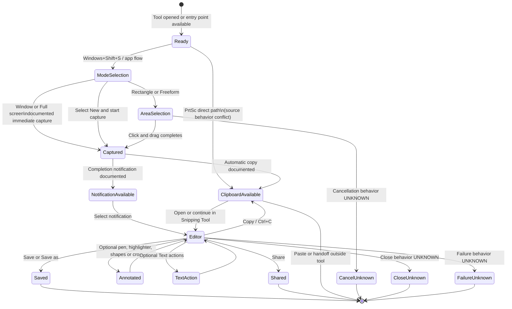

# Windows 11 Snipping Tool — Workflow State Machine

狀態：`Draft`

本圖只表示 [capture workflow](01-capture-workflow.md) 中由官方 Microsoft 文件支持的流程。虛線或 `UNKNOWN` 節點代表文件沒有提供足夠資料，不能當成 SnipPlus 的設計決策。

## Mermaid state machine

## State definitions

| State | Evidence | Status |
| --- | --- | --- |
| `Ready` | Tool can be opened from Start or entry shortcuts are available. | Documented |
| `ModeSelection` | Image capture modes are listed by Microsoft. | Documented |
| `AreaSelection` | Rectangle and Freeform require click-and-drag. | Documented |
| `Captured` | Window and Full screen are described as immediate; selection completion produces a snip. | Documented with source boundary |
| `ClipboardAvailable` | Automatic copy to clipboard is documented. | Documented |
| `NotificationAvailable` | Microsoft documents a completion notification. | Documented |
| `Editor` | Selecting the notification opens the image in the editor. | Documented |
| `Annotated` | Pen, highlighter, shapes, eraser, crop and undo/redo are documented. | Documented at capability level |
| `TextAction` | Text actions and local OCR are documented. | Documented at capability level |
| `Saved` | Save and Save as are documented. | Documented |
| `Shared` | Share is documented. | Documented at capability level |
| `CancelUnknown` | Exact current cancellation transition is not established by the reviewed sources. | `UNKNOWN` |
| `CloseUnknown` | Exact close transition and side effects are not established. | `UNKNOWN` |
| `FailureUnknown` | Failure states and recovery are not established. | `UNKNOWN` |

## Source and verification boundary

- Sources: Microsoft Support pages listed in [01-capture-workflow.md](01-capture-workflow.md#sources).
- Research date: 2026-07-26.
- Runtime verification: not performed.
- Do not interpret this state machine as a SnipPlus state machine or implementation plan.
